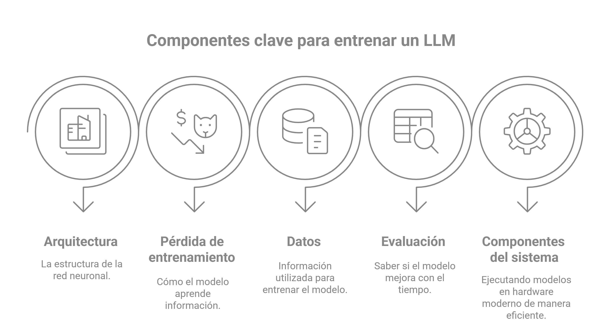

*By Maicel Monzon*

Are LLMs actually thinking, or are they simply creating a magnificent illusion of reasoning? 

From **ChatGPT** to **Gemini**, these tools often seem human, but their "intelligence" is born from an ocean of data and a massive statistical architecture.

Below, we break down how these models are built, trained, and operated.

## I. The Anatomy: Neural Networks and Transformers

At their core, LLMs are neural networks based almost universally on the Transformer architecture (Vaswani et al., 2017).

{} 
Key Fact: Transformers allow for parallel text processing and the ability to capture long-distance relationships between words—something previous technologies could not achieve with the same efficiency.
{}

This architecture relies on four critical pillars: high-quality data, rigorous evaluation, efficient systems, and the architecture itself.

<!-- A menudo, la academia se centra mucho en la arquitectura, pero en la práctica, lo que realmente importa es la **calidad de los datos, la evaluación y los sistemas**, ya que las pequeñas diferencias arquitectónicas son a menudo secundarias frente a la escala. -->

## II. Pre-training: Modeling the "Internet"

The journey begins with pre-training, where the model learns a probability distribution over sequences of tokens.

Imagine the phrase: “The mouse ate the cheese.”

- **Syntactic Probability:** The model knows that "The the mouse cheese" is grammatically incorrect and, therefore, highly improbable.

- **Semantic Probability:** It knows that "The cheese ate the mouse" is improbable in the real world.

**The Critical Nuance:** The model does not "understand" what a mouse is or what hunger feels like. It has simply learned that, statistically, certain words follow others across trillions of lines of text. It is a predictive skill, not a conceptual understanding.

## III. The Autoregressive Process: Word by Word

Modern models are autoregressive: they predict the next word based on the entire preceding context.

1. **Tokenization:** Words are converted into numbers (tokens). A token isn't always a full word; it usually represents 3 or 4 letters (using Byte Pair Encoding).

2. **Prediction:** The model assigns a probability to every word in its vocabulary (e.g., "cheese" 85%, "bread" 10%).

3. **Learning:** During training, if the model predicts "bread" but the actual word was "cheese," it receives a "penalty" via a cross-entropy loss function, adjusting its internal weights to improve the next time.

## IV. Post-training: From Oracle to Assistant

A pre-trained model knows how to speak, but it doesn't know how to obey. To turn it into an assistant, it undergoes two alignment phases:

- **Supervised Fine-Tuning (SFT)**: The model is trained on ideal "question-answer" examples written by humans. Here, the model learns the format of an assistant rather than new knowledge.

- **Reinforcement Learning (RLHF)**: Humans rate which responses are better among several options. This teaches the model to be helpful and avoid toxic content, shaping its behavior according to our preferences.

**Note on Hallucinations:** Hallucinations are the ultimate proof that LLMs lack a sense of reality; they simply generate sequences of tokens that "sound" convincing based on patterns.

## V. Scaling Laws and Systems

Research has shown that more is better. By increasing data and parameters, performance improves predictably without hitting the usual "overfitting" seen in other AI models.

However, this requires massive systems engineering:

- Low Precision: Using 16-bit numbers instead of 32-bit to save memory and speed up processing.

- Operator Fusion: Combining mathematical operations so the GPU can work more efficiently.

## Conclusion: The Beauty of Statistics

Behind every chatbot response, there isn't a mind, but trillions of tokens and a staggering computational infrastructure. What we perceive as intelligence is an emergent property of massive-scale prediction.

They do not think, but their ability to identify and reproduce patterns is, without a doubt, one of the greatest technological feats in history.

## Bibliography

Haykin, S. (2009). Neural Networks and Learning Machines (3rd ed.). Pearson Education.
Disponible en: http://dni.dali.dartmouth.edu/9umv9yghhaoq/13-dayana-hermann-1/read-0131471392-neural-networks-and-learning-machines.pdf

Stanford Online. (2024, August). *Stanford CS229: Machine Learning - Building Large Language Models (LLMs)* [Video]. YouTube.
Disponible en: https://www.youtube.com/watch?v=9vM4p9NN0Ts

Vaswani, A., Shazeer, N., Parmar, N., Uszkoreit, J., Jones, L., Gomez, A. N., Kaiser, L., & Polosukhin, I. (2017). Attention Is All You Need. In Advances in Neural Information Processing Systems 30 (NeurIPS 2017).
Disponible en: https://doi.org/10.48550/ARXIV.1706.03762

