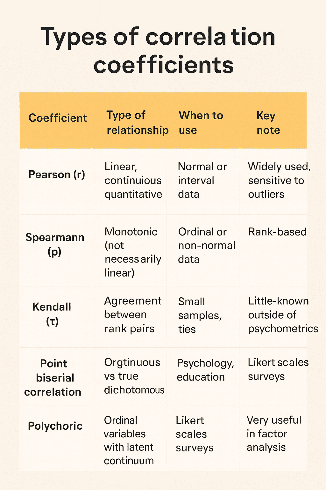

*By Maicel Monzon*

## Introduction

The human eye is trained to detect patterns.  
When two phenomena move together, we tend to assume that one causes the other.

Statistics, when misinterpreted, reinforces that dangerous intuition.  
**Correlation** describes coexistence; it **does not establish causality**.  
Yet headlines, public policies, and clinical decisions are often built on this confusion.

This article does not aim to mock obvious errors, but rather to **show how even technically correct analyses can support false conclusions** when the causal reasoning is weak.

---

## 1) Striking correlations (and why they mislead)

Some correlations are so obvious that they border on the absurd. Precisely for that reason, they are useful as a starting point.

- **Ice cream and drownings.** Both increase in summer. The common factor is heat, not ice cream.
- **Storks and birth rates.** In some rural European areas, both are more frequent. The explanation lies in the demographic context, not in the birds.
- **Nicolas Cage films and pool drownings.** A classic example of spurious correlations compiled by Tyler Vigen.

These cases are not interesting in themselves, but because they **reveal a general mechanism**:  
an unobserved third variable can generate misleading associations.

---

## 2) When confusion has real-world consequences

In health research, confusing correlation with causation is **far from anecdotal**.

**Example in public policy:**  
Countries with a higher density of physicians report more cancer diagnoses.  
Erroneous conclusion: “physicians cause cancer.”  
Reality: greater access to healthcare implies better detection.

### Reverse causation (not bidirectionality)

A common mistake is to invert the direction of the relationship:

> Children with poor school performance spend more hours watching television.

The relevant question is not rhetorical:
- Does television worsen academic performance?
- Or do children with academic difficulties turn more to television?

Here we are not talking about complex feedback loops, but about a **plausible inversion of the causal direction**.

{}
### What is a confounding variable?

A **confounder (confounding variable)** is a third variable that:
1. Is associated with the exposure  
2. Is associated with the outcome  
3. Is not part of the causal pathway between them  

Its effect is to generate a spurious association or to distort a real one.

**Example:** age can confound the relationship between medication use and mortality.
{}

---

## 3) What correlation actually measures

Pearson’s correlation coefficient (**r**) measures **the strength and direction of a linear relationship** between two continuous variables.

- r = +1 → perfect positive relationship  
- r = −1 → perfect negative relationship  
- r ≈ 0 → absence of a linear relationship  

{}
A high coefficient **does not imply causality**.  
It may be due to confounding, chance, or reverse causation.  
A coefficient close to zero **does not rule out non-linear relationships**.
{}

Correlation is descriptive. It **does not answer causal questions**.

---

## 4) Choosing the right coefficient will not rescue a bad question

There are multiple correlation coefficients because data structures and relationships vary.  
Choosing the appropriate coefficient **prevents technical errors**, but it **does not turn an association into a causal link**.

{}
Applying Pearson’s correlation to ordinal data or intrinsically curvilinear relationships yields misleading results, even if they are “statistically significant.”
{}

The central problem is usually not the coefficient itself, but **the subsequent interpretation**.

---

## 5) Causality: a problem of reasoning, not software

Establishing causality requires study design, context, and critical judgment.  
A classic guide is **Bradford Hill’s criteria**, proposed in 1965.

### Bradford Hill’s criteria

| Criterion | Key question |
|----------|--------------|
| Strength | How large is the association? |
| Consistency | Is it replicated in different settings and populations? |
| Specificity | Does the exposure lead to a specific effect? |
| Temporality | Does the cause precede the effect? *(mandatory)* |
| Biological gradient | Is there a dose–response relationship? |
| Plausibility | Is there a biologically plausible mechanism? |
| Coherence | Does it conflict with existing knowledge? |
| Experimental evidence | Is there supporting experimental evidence? |
| Analogy | Are there similar, well-established causal relationships? |

{}
These criteria **are not a mechanical checklist**.  
They help structure reasoning; they do not automate conclusions.
{}

---

### Causal diagrams (DAGs): think before you adjust

**Directed acyclic graphs (DAGs)** allow us to represent causal hypotheses prior to analysis.

**Conceptual example:**  
Smoking increases coffee consumption and cardiovascular risk.  
If we do not adjust for smoking, coffee will appear to be causally harmful.

The DAG does not “prove” anything.  
It **forces us to make our assumptions explicit**.

---

## 6) When a correlation did lead to causality

In the 1950s, the studies by Doll and Hill showed a strong association between tobacco use and lung cancer.  
The standard objection was: “correlation does not equal causation.”

The difference lay in the **cumulative reasoning**:
- large effects
- clear temporality
- dose–response relationship
- biological plausibility
- international consistency

Here, the appropriate response was not to dismiss the correlation, but to **investigate it rigorously**.

---

## 7) A useful metaphor

Seeing two leaves fall together does not imply that one pulls the other down.  
Ignoring the wind is ignoring a common cause.

---

## 8) Minimal causal rigor checklist

Before asserting causality, ask yourself:

1. Is there any unmeasured or unconsidered variable that could explain the association?
2. Could the outcome plausibly precede the supposed cause?
3. Does the study design allow for causal inference, or only for detecting associations?
4. Is the effect size clinically or practically meaningful?
5. Does the conclusion depend on unspoken or unjustified assumptions?

If you cannot answer these, correlation is not enough.

---

## 9) P-hacking: manufactured correlations

**P-hacking** consists of exploring multiple analyses until a “statistically significant” result appears.

With enough tests, chance alone guarantees false positives.

**Warning signs:**
- many variables and few pre-specified hypotheses
- surprising results without plausible mechanisms
- lack of preregistration
- small effects presented as major findings

{}
A low p-value does not validate a causal hypothesis.  
It only indicates statistical compatibility under specific assumptions.
{}

---

## Conclusion

Correlation is a starting point, not a conclusion.  
Without explicit causal reasoning, even flawless analyses can mislead.

The next time you read that “X causes Y,” pause and think critically.  
Statistics describe. **Reasoning decides.**

---

## To close (and to open the conversation)

If you work with real-world data—in health, research, or public policy—you have almost certainly faced a tempting correlation.

**The key question is not whether a correlation exists, but whether you dared to interrogate it.**

👉 **Question for the comments section:**

> Have you ever seen an important decision (clinical, regulatory, or scientific) rest on a correlation that would not withstand serious causal scrutiny?  
> Where did the reasoning fail: in the design, the analysis, or the interpretation?

If you wish, describe it in general terms (no sensitive data). I will respond by identifying **which type of causal trap is at play** and how the question should be reframed.

---

## References

Hill, A. B. (1965). *The environment and disease: association or causation?*  

Hernán, M. A., & Robins, J. M. (2020). *Causal Inference: What If*.  

Pearl, J. (2009). *Causality*.  

Silva Aycaguer, L. C. (1998). *Cultura estadística e investigación científica*. 

Vigen, T. (2015). *Spurious Correlations*.

