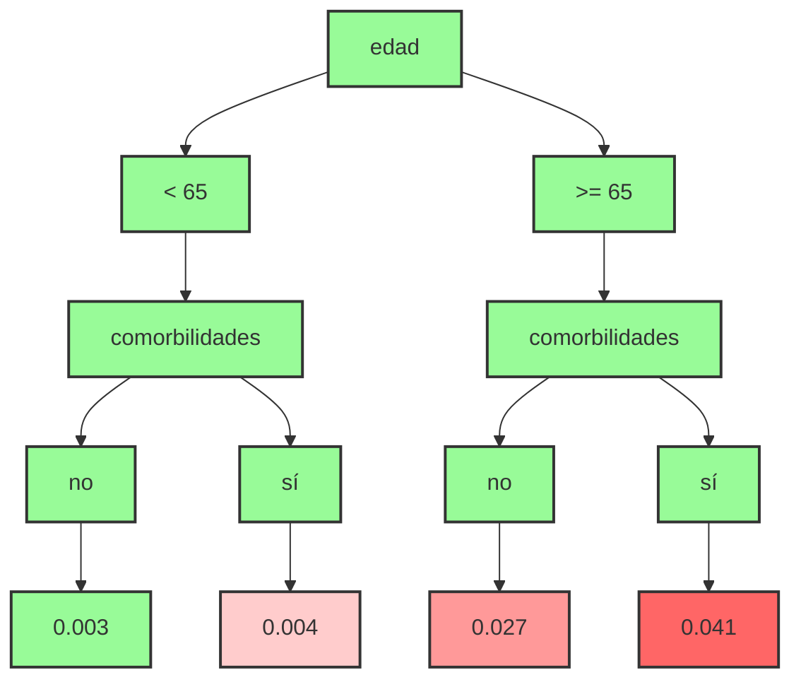

Este trabajo está impulsado por los resultados de mi [artículo anterior](https://revhabanera.sld.cu/index.php/rhab/article/view/4943) sobre desarrollo de modelos predictivos para el triaje.

{}
El modelo empleado conocido como **ABR** se actualizó posteriormente en mi tesis de doctorado.
{}

Los detalles del modelo **ABR** se pueden consultar en el [artículo ](https://revhabanera.sld.cu/index.php/rhab/article/view/4943) titulado *Identificación de pacientes de bajo riesgo de severidad en confirmados de la COVID-19. Cuba. Años 2020-2021*

**Figura 1. Árbol de bajo riesgo**

La actualización de este modelo se encuentra disponible en la  [tesis de dotorado ](https://www.researchgate.net/publication/388656780_MODELOS_PREDICTIVOS_PARA_LA_ESTIMACION_Y_CLASIFICACION_DEL_RIESGO_DE_MUERTE_EN_COVID-19) titulada  *MODELOS PREDICTIVOS PARA LA ESTIMACIÓN Y CLASIFICACIÓN DEL RIESGO DE MUERTE EN COVID-19*

