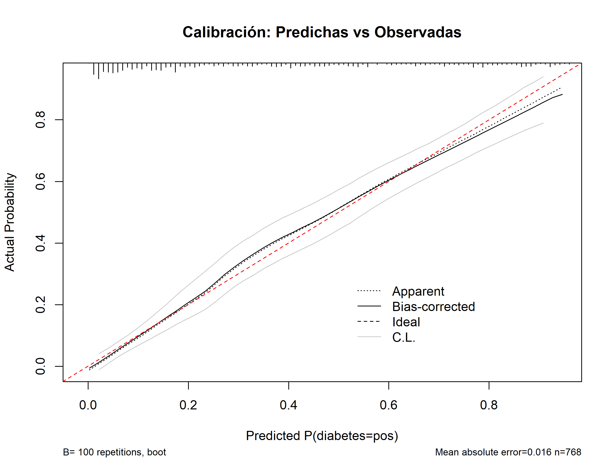
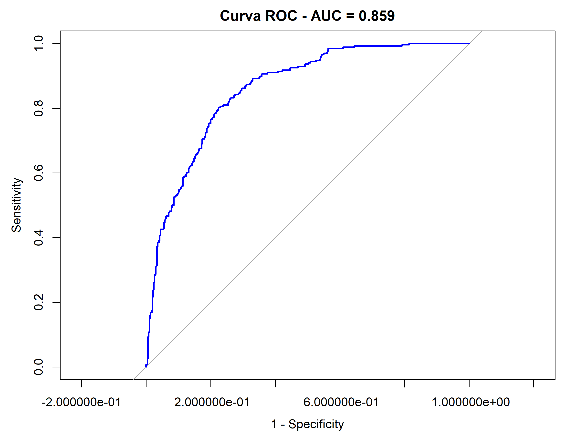
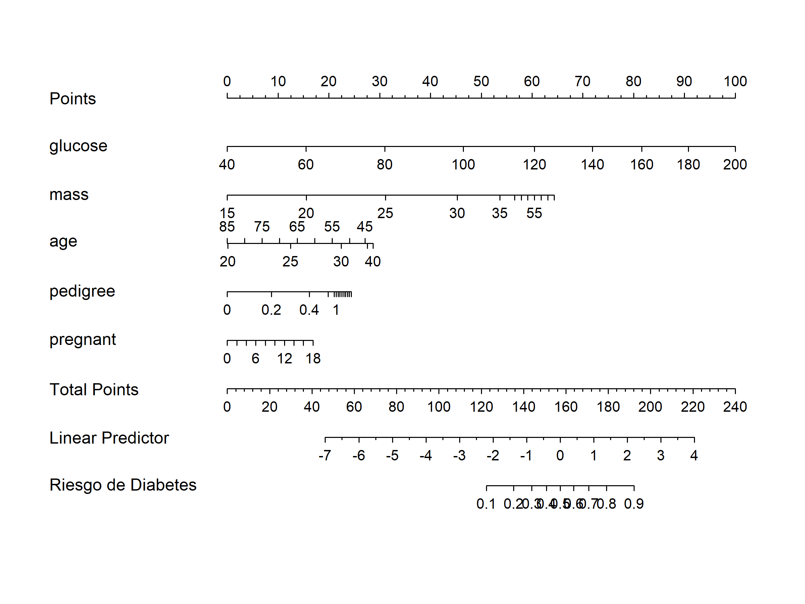
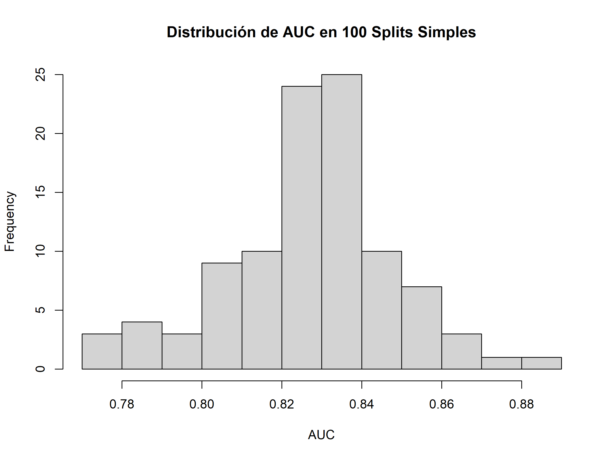

🎧 **Escucha el podcast de esta publicación**




Si está leyendo esta publicación, es probable que le interese desarrollar **modelos de predicción clínica** para **diagnosticar** o **pronosticar** enfermedades en pacientes. Seguramente sea investigador o estudiante de posgrado —en maestría o doctorado— en ciencias biomédicas, y busque cómo **desarrollar** y **validar** esos modelos en un **artículo científico** o **tesis**.

Casi seguro ha llegado a esa fase en la que la metodología se siente como un muro de ladrillos: no sabe **qué pasos seguir**, **qué software usar**, si lo que necesita se puede hacer en **SPSS** o si tendrá que meterse con esos **códigos** inquietantes de **R o Python** —y encima no tiene experiencia en programación. Y, lo peor de todo: le asalta la duda de si su modelo servirá para algo más allá de llenar un repositorio de tesis… o si siquiera **será útil** para los propios pacientes de su **muestra**, sin hablar de otros **contextos clínicos**.

Seamos francos: en el fondo, todos le huimos a ese comentario punzante que nos estalla la burbuja predictiva de un solo golpe:

> ¡Vaya!, un área bajo la curva de ensueño, sin rastros de calibración ni validación externa… probablemente fruto de una receta clásica: exceso de predictores, dicotomización entusiasta, escasez de eventos y una pizca de selección automática. TRIPOD lo llamaría ‘optimismo aparente’; nosotros, la receta del sobreajuste gourmet —con un cigarro y un guiño para rematar.

{} El **sobreajuste** ocurre cuando un modelo aprende tan bien los datos de entrenamiento (incluyendo ruido o detalles irrelevantes) que su rendimiento en datos nuevos es mucho peor. {}

En otras palabras, el modelo **funciona** espectacularmente bien… pero **solo con su muestra** de pacientes. *¡Las métricas de desempeño en otros conjuntos de datos son un desastre!* Más adelante retomaremos esa idea.

Mientras las tesis de alto nivel se centran en construir modelos de predicción clínica con **técnicas estadísticas** clásicas o sofisticados **algoritmos de aprendizaje automático** como los bosques aleatorios, los cursos de bioestadística *—¡incluso en programas de estudio de esta especialidad!—* apenas rozan el asunto. La **brecha es real**, y con ella viene la ansiedad de tener que aprenderlo todo ya.

Pero respire hondo. Este post puede endurecer su burbuja predictiva con una capa extra de titanio: su traductor metodológico no oficial, (casi) libre de lágrimas y cargado de herramientas prácticas. Yo mismo navegué ese infierno metodológico en mi **proceso doctoral**, así que no solo le ofrezco **consejos genéricos**: comparto las lecciones de alguien que ya se quemó las pestañas por usted, para que avance con **confianza** y **evite** los mismos **tropiezos**.

Olvídese del código complejo y enrevesado. Aquí nos enfocamos en la **lógica esencial** para construir un **modelo predictivo fiable**. Desglosaremos el **proceso paso a paso**, quitándole el miedo al procesamiento de datos con ejemplos de **código práctico en R**.

Si bien este post se centra en las cuestiones prácticas del **procesamiento de datos**, es importante destacar que la elección del diseño de la investigación está determinada por el **objetivo del estudio** de predicción, el cual según *TRIPOD (Transparent Reporting of a multivariable prediction model for Individual Prognosis Or Diagnosis)* se **clasifica** en tres **categorías fundamentales** (1):

- **Desarrollo** de un nuevo modelo

- **Validación** de un modelo existente

- **Actualización** de un modelo

Según el **objetivo de la investigación** se pueden optar por uno de los siguientes **diseños** de estudios:

```markmap {height="200px"}
- Diseños según Objetivo
  - Desarrollo de Modelos
    - Estudios de Cohorte
    - Ensayos Aleatorizados
    - Datos de Atención Rutinaria
  - Validación de Modelos
    - Estudios de Cohorte Independientes
    - Meta-análisis
    - Datos de Registro
  - Actualización de Modelos
    - Cualquier diseño anterior con nuevos datos
    - Datos con Estructura de Clúster
```
Se recomienda profundizar en estos temas a partir de la bibliografía propuesta para esta publicación. En este post no centraremos en la **secuencia de etapas clave** para desarrollar un **modelo predictivo**. Como base usaré el artículo *“Siete pasos para el desarrollo y un ABCD para la validación”* de  Ewout Steyerberg (1), así como su libro *Clinical Prediction Models* (2). A la receta añadiré las recomendaciones de Frank Harrell desde su obra *Regression Modeling Strategies* (3), y nos basaremos en su biblioteca **rms** para desarrollar este tutorial con **código práctico en R**. Finalmente daré mi propia visión del polémico asunto de particionar los datos en **conjunto de entrenamiento** y **conjunto de prueba** en una **proporción 70:30** y otras cuestiones que seguramente resultarán interesantes.

Empezaremos con la **estrategia de modelado**; el tutorial con todo el código vendrá después.  
**¡Empecemos!**

## Estrategia de modelado

Seguir una **estrategia de modelado** adecuada es esencial para **desarrollar y validar modelos de predicción**: no solo **mitiga el sesgo** y el **sobreajuste**, sino que nos **orienta** en un proceso que, de otro modo, puede volverse caótico.

A continuación, se muestran un conjunto de **bibliotecas en R** que nos ayudará implementar estas ideas, pero este proceso se puede realizar de igual manera en en SPSS o Python [^1]. 

[^1]: Puede contactarme para una consultoría personalizada donde puedo ayudarle a desarrollar un modelo predictivo o enseñarle a desarrollar la estrategia de modelado  con otras herramientas como **SPSS** o **Python** a mi correo personal maicel.monzon@gmail.com .

[Puedes  descargar e instalar el paquete **rms** desde su página oficial en el repositorio de CRAN.](https://cran.r-project.org/web/packages/rms/index.html) 
Tambien le harán falta otras bibliotecas para el manejo de datos,  confeccionar tablas y gráficos para su publicación, entre otras acciones. 


``` r
library(conflicted)   # Detecta y resuelve conflictos de funciones
library(rms)          # Modelado logístico restringido (lrm) y splines (rcs)
library(pROC)         # Curvas ROC y AUC
library(ggplot2)      # Gráficos pulidos (usado por rms internamente)
library(missRanger)   # Imputación iterativa con random forests
library(mlbench)      # Dataset de ejemplo: PimaIndiansDiabetes
library(dplyr)        # Manipulación de datos (pipe %>%)
library(caret)        # Particiones de datos (createDataPartition)
```


### 1. Definición del problema e inspección de datos

El primer paso en cualquier proyecto de modelado es **definir claramente el problema de investigación** y seleccionar la **variable de resultado** adecuada.


{} La **variable de resultado** debe definirse con precisión: especifique **qué evento se predice**, **cómo y cuándo se mide**, y el **horizonte temporal de predicción** (por ejemplo, mortalidad a los 30 días). También es clave indicar el método de evaluación del evento y si se aplicó **cegamiento** respecto a los predictores, para asegurar coherencia interna y validez del modelo. {}

Durante esta fase también realizamos un *análisis exploratorio de datos (EDA, por sus siglas en ingles)* para entender las características de las variables y detectar posibles problemas, como **datos atípicos** o **valores faltantes**. 

[Para conocer más detalles, ver mi post sobre EDA]().


``` r
set.seed(123)  # Reproducibilidad total (imputación, splits, bootstrap)
# Carga del dataset nativo
data("PimaIndiansDiabetes")
datos <- PimaIndiansDiabetes
# Variables clínicas con 0s imposibles (biológicamente)
vars_clinicas <- c("glucose", "pressure", "triceps", "insulin", "mass")
# Limpieza: 0 → NA, luego imputación
datos <- datos %>%
  mutate(across(all_of(vars_clinicas), ~ ifelse(.x == 0, NA, .x))) %>%
  missRanger()  # Imputa NA con random forests iterativos
# Configuración rms: datadist para predicciones automáticas
dd <- datadist(as.data.frame(datos))
options(datadist = "dd")
```


### 2. Codificación de las variables predictoras

La **codificación adecuada de las variables predictoras** es fundamental para construir **modelos robustos**.  

Es probable que necesites **agrupar categorías poco frecuentes** o crear **predictores resumen** para condensar información redundante o altamente correlacionada. Y si tu modelo se basa en **regresión logística**, no asumas linealidad de entrada: muchas veces es necesario aplicar **splines cúbicos restringidos** para relajar el **supuesto de linealidad** entre  los predictores y el resultado.

💡 **Tip para la publicación:**  Reporta cada predictor con su *método de medición*, *momento* de registro y *unidades* (si es continuo). Si categorizas, *justifica los puntos de corte*. Si es categórico, muestra todas las categorías y la de referencia. El modelo final debe reflejar *exactamente* la *codificación* usada.


{}
**Alerta:** Dicotomizar predictores cuantitativos —por ejemplo, convertir una variable continua como la edad o la presión arterial en una binaria (“≥65 años = 1”, “<65 = 0”)— es una mala práctica ampliamente desaconsejada. Esta estrategia desperdicia información, reduce el poder estadístico, introduce puntos de corte arbitrarios y aumenta el riesgo de sobreajuste. En lugar de categorizar, modela la relación continua (por ejemplo, con splines) para preservar la señal clínica real.
{}


### 3 .Especificación del tipo de modelo

En esta etapa se define la **estructura formal del modelo**, lo que incluye el tipo de relación entre variables (p. ej., lineal, no lineal) y, de manera crucial, la **selección de los predictores** finales que lo integrarán.


{}
**Alerta:** La elección de predictores no debe basarse en la aplicación mecánica de métodos algorítmicos como la Regresión Paso a Paso (RPP), ya que suelen producir modelos inestables y sobreajustados, especialmente en contextos biomédicos y sociales. 
{}


En  lugar de la preselección de variables basada únicamente en valores *p* de análisis bivariados, se recomienda:

-   Priorizar el **juicio clínico, la revisión sistemática de la literatura y la experiencia previa.**

-   Optar por un conjunto reducido de predictores clínicamente relevantes definidos a priori, o incluir todos los candidatos en el modelo multivariable inicial sin filtrado estadístico previo.

Existen algoritmos que tienen  enfoques alternativos a la selección automática de predictores  como la regresión Lasso o los árboles de clasificación. En la guía propuesta por Heinze se puede profundizar sobre este tema (5)


### 4. Estimación del Modelo

Una vez especificado el modelo (es decir, definidos los predictores y la estructura funcional), el siguiente paso de estimación tiene como objetivo calcular los coeficientes o parámetros que mejor se ajusten a los datos.


``` r
modelo <- lrm(
  diabetes ~ rcs(glucose, 3) + rcs(mass, 3) + rcs(age, 3) + rcs(pedigree, 3) + pregnant,
  data = datos,
  x = TRUE,  # Guarda diseño para bootstrap
  y = TRUE   # Guarda respuesta para bootstrap
)
```

En modelos de regresión, la **estimación del modelo**  se realiza a partir de métodos como la **máxima verosimilitud**. Sin embargo, cuando el número de eventos es limitado o el de predictores es alto, el riesgo de sobreajuste es elevado, lo que genera predicciones extremas y poco generalizables. Para mitigarlo, se emplean técnicas de **regularización, penalización o shrinkage**, que ajustan los coeficientes hacia cero para mejorar la estabilidad y la calibración en nuevas poblaciones.

El objetivo final no es maximizar el rendimiento aparente en la muestra de desarrollo, sino obtener un modelo con **predicciones estables, bien calibradas y clínicamente útiles**.

💡 **Tip para la publicación:** La ecuación final del modelo debe presentarse de forma completa —incluyendo todos los coeficientes, el intercepto y, si corresponde, la supervivencia basal—, reportando métricas de calibración y discriminación con sus intervalos de confianza. 

En machine learning es común dividir los datos en entrenamiento y prueba. Sin embargo, en contextos clínicos es diferente:

- Los **conjuntos de datos** suelen ser **pequeños o medianos** (usualmente menos de 1000 filas) → dividir reduce la información disponible para entrenar.

- Las **métricas** derivadas de la prueba pueden ser **altamente variables**, dependiendo de qué observaciones caen en la partición.

- Esto genera un **modelo menos estable** y menos confiable, especialmente en estimaciones de probabilidades individuales.

{} La ausencia de particiones en su estudio ser un **tema polémico**, pero no se preocupe!
[Más adelante, se comentan algunos argumentos para la discusión.](#hi) 
{}


### 5. Evaluación del Rendimiento del Modelo


Una vez desarrollado el modelo, es esencial cuantificar su capacidad predictiva antes de su validación. Esta evaluación se centra en tres aspectos clave:

-   **Calibración:** Mide la concordancia entre las probabilidades predichas y las observadas. Por ejemplo, ¿un 10% de riesgo predicho se corresponde con un 10% de eventos observados? Se evalúa visualmente con curvas de calibración y cuantitativamente con parámetros como el intercepto (A, calibración-in-the-large) y la pendiente de calibración (B).


``` r
cal_boot <- calibrate(modelo, method = "boot", B = 100)

plot(cal_boot, main = "Calibración: Predichas vs Observadas")
## 
## n=768   Mean absolute error=0.016   Mean squared error=0.00045
## 0.9 Quantile of absolute error=0.034
abline(0, 1, lty = 2, col = "red")  # Línea ideal
```



-   **Discriminación:** Evalúa la capacidad del modelo para distinguir entre pacientes que experimentan el evento y aquellos que no. La métrica más común es el estadístico C (o AUC-ROC), que representa la probabilidad de que un paciente con el evento tenga una puntuación de riesgo más alta que uno sin él.


``` r
val_boot <- validate(modelo, method = "boot", B = 100)

roc_obj <- roc(datos$diabetes, predict(modelo, type = "fitted"))
plot(roc_obj,
     main = paste("Curva ROC - AUC =", round(auc(roc_obj), 3)),
     col = "blue",
     legacy.axes = TRUE)
```




-   **Utilidad Clínica:** Determina si el modelo es útil para la toma de decisiones. El análisis de curvas de decisión y el Beneficio Neto (NB) permiten evaluar si el uso del modelo conduce a mejores resultados clínicos netos en comparación con estrategias alternativas (como tratar a todos o a ninguno).

### 6. Evaluación de la Validez del Modelo

La **evaluación del rendimiento** en los datos suele ser optimista. Por ello, es crucial evaluar la validez del modelo en datos no utilizados para su construcción, un proceso que se divide en:

- **Validación Interna:** Evalúa la reproducibilidad del modelo, es decir, su rendimiento en múltiples muestras de la misma población subyacente. Técnicas como el bootstrapping o la validación cruzada son superiores a la división simple de la muestra, ya que cuantifican y corrigen el optimismo en las métricas de rendimiento sin reducir el tamaño de la muestra de desarrollo.

- **Validación Externa:** Es la prueba definitiva de la generalizabilidad o transportabilidad del modelo. Consiste en aplicar el modelo a una población completamente independiente, lo que puede incluir:

  -   **Validación Temporal:** Usar pacientes reclutados en un período posterior.

  -   **Validación Geográfica:** Aplicar el modelo en pacientes de otros centros u hospitales.


### 7. Presentación del modelo

La presentación efectiva es crucial para la adopción clínica. Un modelo perfecto es inútil si los médicos no pueden usarlo fácilmente. Algunas opciones para llevar el modelo a la práctica asistencial son:

-   **Nomogramas**: Ideales para uso rápido en consulta.


``` r
nom <- nomogram(modelo, fun = plogis, funlabel = "Riesgo de Diabetes")
plot(nom, main = "Nomograma del Modelo")
```




-   **Aplicaciones web/móviles**: Para integración en flujos de trabajo clínicos

Una aplicación funcional para ejecutar el modelo en una pagina web, teléfono movil o tableta es una muy buena opción para generalizar el modelo.

En este enlace te muestro la calculadora web que programé en js, html y css, para el modelo de mi tesis.

[ver CovidCencecAPK]()


## Recomendaciones y análisis crítico {#hi}


En el contexto de modelos predictivos clínicos, una práctica común pero problemática es el uso exclusivo de una **partición simple (entranamento/preuba)** para el desarrollo, ajuste y evaluación final. A continuación, detallo los motivos clave con argumentos fundamentados.

El enfoque es aceptado por buena parte de la comunidad científica como se pono de manifiesto en el siguiente tweet:


<!--  -->


Pero abordemos en detalles algunas de las principales razones para abandonar esa práctica en contextos como los que habitualmente nos enfrentamos. 


### 1. Ineficiencia en el uso de los datos y pérdida de poder

Los datasets clínicos suelen ser pequeños (por ejemplo, menos de 500 pacientes) debido a limitaciones como costos o eventos raros. Una partición típica (70% train / 30% test) desperdicia hasta un 30% de los datos en la evaluación, reduciendo el tamaño efectivo para entrenar. Esto baja los eventos por variable predictora (EPV) —una métrica que indica cuántos eventos (como diagnósticos positivos) hay por cada predictor en el modelo— por debajo de 10-20, lo que genera modelos inestables y sesgados. Como resultado, el rendimiento aparente (por ejemplo, AUC alta en train) cae drásticamente en datos nuevos (de 0.85 a 0.65). En contextos clínicos, maximizar todos los datos es clave para capturar patrones reales sin perder poder estadístico.

### 2. Evaluaciones de rendimiento con alta variabilidad e inestabilidad

Con una sola partición, las métricas (como AUC para discriminación o Brier score para calibración, que mide el acuerdo entre predicciones y resultados reales) dependen del azar de cómo se dividen los datos. Simulaciones muestran variaciones de ±0.10-0.15 en AUC, similar a ruido aleatorio, y una varianza 2-3 veces mayor en muestras pequeñas (por ejemplo, 200 pacientes con 10% de eventos). Esto puede inflar o subestimar la calibración (evaluada con tests como Hosmer-Lemeshow), llevando a decisiones clínicas erróneas, como subtratar pacientes.

Para ilustrarlo en R con un dataset de ejemplo (PimaIndiansDiabetes), simula la variabilidad de AUC en splits repetidos:


``` r
auc_splits <- replicate(100, {
  trainIndex <- createDataPartition(datos$diabetes, p = 0.7, list = FALSE)
  train <- datos[trainIndex, ]; test <- datos[-trainIndex, ]
  
  model_simple <- glm(diabetes ~ glucose + mass + age, family = binomial, data = train)
  pred <- predict(model_simple, test, type = "response")
  
  roc(test$diabetes, pred)$auc
})

hist(auc_splits,
     main = "Distribución de AUC en 100 Splits Simples",
     xlab = "AUC",
     col = "lightgray",
     border = "black")
```



En comparación, métodos repetidos como validación cruzada son más estables y confiables.

### 3. Riesgo de sobreajuste y falta de generalización robusta

Una "instantánea" en el test set no corrige sobreajuste: el modelo se ajusta al train (incluyendo ruido), inflando rendimiento aparente (optimismo de 5-20% en R², per Harrell). Sin repetición, no se obtiene un error de generalización realista. Métodos repetidos (e.g., k-fold CV) promedian estimaciones para reducir sesgo, mejorando estabilidad. Esto afecta validez interna (sin corrección de optimismo) y generalización (fallos en cohortes externas por idiosincrasias de la muestra).


### Recomendaciones prácticas

En su lugar, usa métodos que aprovechen todos los datos, como validación cruzada repetida (divide en folds, repite múltiples veces para promediar) o bootstrapping (muestrea con reemplazo para estimar estabilidad). Estos corrigen optimismo y reducen variabilidad, alineándose con buenas prácticas para modelos clínicos. En R, prueba rms::validate() para bootstrapping. Para datasets pequeños, evita splits simples: prioriza robustez para resultados útiles en la práctica asistencial.

{}
**Recomendación clave:** En datasets clínicos pequeños, evite particiones simples; opte por bootstrapping en `rms` para validación interna. Esto asegura modelos estables y útiles, alineados con evidencia científica.
{}


## Llamada a la acción 

¿Has aplicado estas técnicas en tus proyectos de Machine Learning? ¿Qué estrategias usas para entrenar y validar tus modelos? Déjame tus comentarios 💬: comparte tus experiencias, dificultades o tips contigo. ¡Juntos podemos enriquecer este conocimiento!


## Bibliografía

1. Collins GS, Moons KGM, Dhiman P, Riley RD, Beam AL, Van Calster B, et al. TRIPOD+AI statement: updated guidance for reporting clinical prediction models that use regression or machine learning methods. BMJ [Internet]. 16 de abril de 2024 [citado 3 de octubre de 2025];e078378. Disponible en: https://www.bmj.com/lookup/doi/10.1136/bmj-2023-078378


2.  Steyerberg EW, Vergouwe Y. Towards better clinical prediction models: seven steps for development and an ABCD for validation. European Heart Journal [Internet]. 1 de agosto de 2014 [citado 9 de mayo de 2021];35(29):1925-31. Disponible en: <https://academic.oup.com/eurheartj/article-lookup/doi/10.1093/eurheartj/ehu207>

3. Steyerberg E. Clinical Prediction Models. 1th ed. USA: Springer; 2009. (Statistics for Biology and Health). 

4. Harrell Jr FE. Regression Modeling Strategies. 1era ed. New York: Springer; 2015.

5.  Heinze G, Wallisch C, Dunkler D. Variable selection - A review and recommendations for the practicing statistician. Biom J [Internet]. mayo de 2018 [citado 9 de mayo de 2021];60(3):431-49. Disponible en: http://doi.wiley.com/10.1002/bimj.201700067


