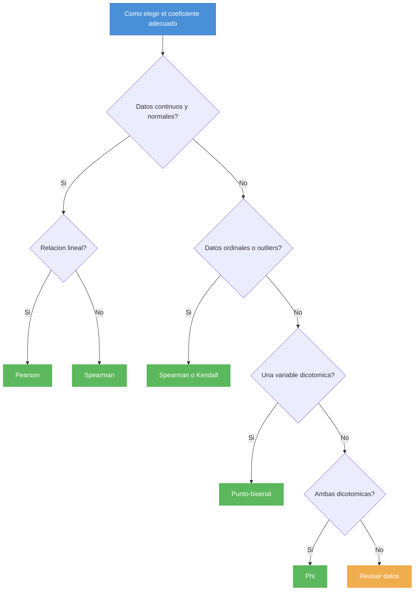
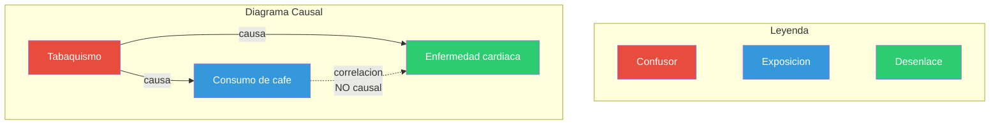

## Introducción

El ojo humano ama los patrones: ver dos líneas que se mueven juntas y concluir que una provoca la otra. La estadística, mal interpretada, a veces alimenta esa ilusión. La correlación es apenas la danza conjunta de dos variables, no una flecha de causa. Y, sin embargo, titulares, políticas y hasta decisiones médicas se sostienen sobre esta trampa.

---

## 1) Correlaciones curiosas (pero falsas)

- **Helados y ahogamientos.** En verano, ambos aumentan. No porque el helado mate, sino porque el calor atrae bañistas y heladeros.

- **Cigüeñas y natalidad.** En pueblos europeos, donde hay más cigüeñas, también hay más nacimientos… simplemente porque se trata de áreas rurales más fértiles, no porque las aves traigan bebés.

- **Películas de Nicolas Cage y ahogamientos en piscinas.** Ejemplo clásico de correlaciones espurias recopiladas por Tyler Vigen en su sitio [Spurious Correlations](https://tylervigen.com/spurious-correlations): cómico, pero ilustrativo.

---

## 2) La correlación y su impacto en la toma de decisiones

La confusión entre causalidad y correlación no es solo un chiste; tiene consecuencias graves.

**Política pública:** Un estudio muestra que los países con más médicos per cápita tienen más diagnósticos de cáncer. Conclusión errada: "los médicos causan cáncer". Realidad: mayor densidad médica implica mejor detección.

**Falacia de la causa inversa:** Niños con bajo rendimiento escolar pasan más horas frente a la televisión. ¿La TV los perjudica? ¿O los niños con dificultades recurren más a ella? La dirección de la causalidad puede invertirse fácilmente.

{}
**¿Qué es un confusor?**

Una **variable de confusión** (o confusor) es aquella que:
1. Está asociada con la exposición
2. Está asociada con el desenlace
3. **No** está en el camino causal entre exposición y desenlace

Su presencia puede hacer que dos variables parezcan relacionadas cuando no lo están, o puede ocultar una relación real.

*Ejemplo:* La edad puede confundir la relación entre consumo de medicamentos y mortalidad, ya que las personas mayores consumen más medicamentos Y tienen mayor mortalidad.
{}

---

## 3) ¿Qué mide realmente la correlación?

- El **coeficiente de correlación de Pearson (r)** mide la fuerza y dirección de la **relación lineal** entre dos variables continuas.  
- Sus valores van de **-1 a +1**:  
  - +1 → relación positiva perfecta  
  - -1 → relación negativa perfecta  
  - 0 → ausencia de relación lineal  

{}
**Advertencia:** Un r alto no significa causalidad. Puede deberse a **confusores**, **azar** o **causalidad inversa**. Además, un r cercano a cero no descarta relaciones no lineales.
{}

---

## 4) Tipos de coeficientes de correlación (más allá de Pearson)

No todas las relaciones son lineales ni todos los datos son continuos. Elegir el coeficiente adecuado es crucial para no malinterpretar los resultados.

{}
**Error común:** Aplicar Pearson a datos ordinales (como escalas de Likert) o a relaciones curvilíneas. El resultado será engañoso aunque sea "estadísticamente significativo".
{}

---

### ¿Cómo elegir el coeficiente adecuado?

---

## 5) Causalidad: un desafío que exige rigurosidad

Identificar causalidad no se improvisa. Requiere diseño experimental riguroso, pensamiento crítico y, frecuentemente, los **criterios de Bradford Hill** (1965), una guía clásica para evaluar si una asociación observada puede ser causal.

### Los 9 criterios de Bradford Hill

| Criterio | Pregunta clave | Ejemplo |
|----------|----------------|---------|
| **1. Fuerza** | ¿Qué tan grande es la asociación? | Fumadores tienen 20 veces más riesgo de cáncer de pulmón |
| **2. Consistencia** | ¿Se replica en diferentes poblaciones y contextos? | La asociación tabaco-cáncer se observa en múltiples países y décadas |
| **3. Especificidad** | ¿La exposición produce un efecto específico? | El asbesto causa específicamente mesotelioma |
| **4. Temporalidad** | ¿La causa precede al efecto? | **Único criterio obligatorio**: la exposición debe ocurrir antes del desenlace |
| **5. Gradiente biológico** | ¿Más exposición = más efecto? (dosis-respuesta) | A mayor número de cigarrillos/día, mayor riesgo de cáncer |
| **6. Plausibilidad** | ¿Tiene sentido biológico? | El humo del tabaco contiene carcinógenos conocidos |
| **7. Coherencia** | ¿Es compatible con el conocimiento existente? | No contradice lo que sabemos sobre carcinogénesis |
| **8. Evidencia experimental** | ¿Hay datos experimentales que lo respalden? | Estudios en animales muestran el efecto carcinógeno |
| **9. Analogía** | ¿Hay causas similares con efectos similares? | Otros carcinógenos inhalados también causan cáncer pulmonar |

{}
**Importante:** Estos criterios son una **guía de razonamiento**, no una lista de verificación mecánica. Ninguno (excepto temporalidad) es absolutamente necesario ni suficiente por sí solo.
{}

### El estándar de oro: ensayos clínicos aleatorizados

La forma más robusta de establecer causalidad es el **ensayo clínico aleatorizado (ECA)**:

- **Aleatorización:** distribuye confusores conocidos y desconocidos equitativamente
- **Grupo control:** permite comparar con y sin intervención
- **Cegamiento:** reduce sesgos de observación

Sin embargo, muchas preguntas causales en salud **no pueden responderse con ECAs** por razones éticas (no podemos asignar personas a fumar) o prácticas. En esos casos, dependemos de estudios observacionales bien diseñados y del razonamiento causal riguroso.

### Diagramas causales (DAGs)

Los **Directed Acyclic Graphs** o DAGs, popularizados por Judea Pearl, son herramientas visuales para representar relaciones causales y detectar confusores.

**Ejemplo:** ¿El café causa enfermedad cardíaca?

En este DAG, el tabaquismo es un **confusor**: los fumadores tienden a beber más café Y tienen mayor riesgo cardíaco. Si no controlamos por tabaquismo, concluiremos erróneamente que el café causa enfermedad cardíaca.

{}
**Recurso gratuito:** El libro *Causal Inference: What If* de Hernán y Robins está disponible gratuitamente en [hsph.harvard.edu/miguel-hernan](https://www.hsph.harvard.edu/miguel-hernan/causal-inference-book/) y es una excelente introducción a estos métodos.
{}

---

## 6) Un caso de éxito: cuando la correlación SÍ reveló causalidad

No toda correlación es espuria. A veces, una asociación observada **sí** conduce al descubrimiento de una causa real.

En la década de 1950, los estudios de **Richard Doll y Austin Bradford Hill** mostraron una correlación impresionante entre consumo de tabaco y cáncer de pulmón. La industria tabacalera argumentó exactamente lo que hemos discutido: "correlación no es causalidad".

Sin embargo, la evidencia cumplía múltiples criterios:

- ✅ **Fuerza:** riesgo 20-30 veces mayor en fumadores
- ✅ **Temporalidad:** el hábito precedía al cáncer por décadas
- ✅ **Dosis-respuesta:** más cigarrillos = más riesgo
- ✅ **Reversibilidad:** dejar de fumar reducía el riesgo
- ✅ **Plausibilidad:** mecanismos carcinógenos identificados
- ✅ **Consistencia:** replicado globalmente

Este caso ilustra que **la frase "correlación no es causalidad" no es un escudo para negar evidencia robusta**. Es una invitación a investigar más profundamente, no a descartar asociaciones importantes.

---

## 7) Metáfora para recordar

Piensa en la correlación como ver dos hojas que caen juntas en otoño. Creer que una arrastra a la otra es ignorar el viento invisible que las mueve a ambas.

---

## 8) Checklist para evitar caer en la trampa

Antes de concluir que existe una relación causal, hazte estas preguntas:

1. ✅ ¿Existe una variable oculta (confusor) que explique la relación?
2. ✅ ¿Podría la causalidad ir en sentido contrario?
3. ✅ ¿El diseño del estudio permite concluir causa o solo asociación?
4. ✅ ¿Hay criterios teóricos/experimentales que respalden esta relación?
5. ✅ ¿Se comunicó claramente que es correlación, no causalidad?
6. ✅ ¿La asociación cumple al menos algunos criterios de Bradford Hill?
7. ✅ ¿El tamaño del efecto es clínicamente relevante, no solo estadísticamente significativo?

---

## 9) Bonus: cuidado con el "p-hacking"

Una forma moderna de encontrar correlaciones falsas es el **p-hacking**: analizar datos de múltiples formas hasta encontrar un resultado "estadísticamente significativo" (p < 0.05).

Si pruebas 20 correlaciones diferentes, por puro azar una será "significativa" al 5%. Esto explica muchos hallazgos que luego no se replican.

**Señales de alerta:**

- Estudios con muchas variables pero pocas hipótesis previas
- Resultados "sorprendentes" sin plausibilidad teórica
- Ausencia de pre-registro del estudio
- Tamaños de efecto muy pequeños aunque "significativos"

{}
**Recuerda:** Un p-valor bajo no garantiza que el efecto sea real ni importante. Es solo una pieza del rompecabezas.
{}

---

## Conclusión

La correlación es una herramienta poderosa, pero es solo el primer paso. Confundirla con causalidad puede llevar a decisiones erróneas en medicina, política pública y vida cotidiana.

La próxima vez que leas un titular que sugiera que "X causa Y", pregúntate:

- ¿Hay confusores no considerados?
- ¿Se demostró temporalidad?
- ¿El diseño del estudio permite esa conclusión?

**La estadística sugiere, pero no prueba por sí sola.** El pensamiento crítico completa el trabajo.

---

## Bibliografía

Hill, A. B. (1965). The environment and disease: association or causation? *Proceedings of the Royal Society of Medicine*, 58(5), 295–300.

Hernán, M. A., & Robins, J. M. (2020). *Causal Inference: What If*. Chapman & Hall/CRC. [Disponible gratis en línea](https://www.hsph.harvard.edu/miguel-hernan/causal-inference-book/).

Pearl, J. (2009). *Causality: Models, Reasoning, and Inference* (2nd ed.). Cambridge University Press.

Silva Aycaguer, L. C. (1998). *Cultura estadística e investigación científica en el campo de la salud: una mirada crítica*. Madrid: Díaz de Santos.

Freedman, D. A. (2005). *Statistical Models: Theory and Practice*. Cambridge University Press.

Vigen, T. (2015). *Spurious Correlations*. Hachette Books. Sitio web: [tylervigen.com/spurious-correlations](https://tylervigen.com/spurious-correlations)