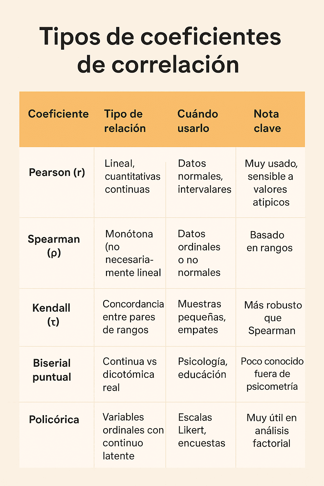

*Por Maicel Monzon*

## Introducción

El ojo humano está entrenado para detectar patrones.  
Cuando dos fenómenos se mueven juntos, tendemos a asumir que uno provoca al otro.

La estadística, mal interpretada, refuerza esa intuición peligrosa.  
La **correlación** describe coexistencia; **no establece causalidad**.  
Sin embargo, titulares, políticas públicas y decisiones clínicas se apoyan a menudo en esta confusión.

Este artículo no busca ridiculizar errores obvios, sino **mostrar cómo incluso análisis técnicamente correctos pueden sostener conclusiones falsas** si el razonamiento causal es débil.

---

## 1) Correlaciones llamativas (y por qué engañan)

Algunas correlaciones resultan tan evidentes que parecen absurdas. Precisamente por eso son útiles como punto de partida.

- **Helados y ahogamientos.** Ambos aumentan en verano. El factor común es el calor, no el helado.
- **Cigüeñas y natalidad.** En zonas rurales europeas, ambas son más frecuentes. La explicación está en el contexto demográfico, no en las aves.
- **Películas de Nicolas Cage y ahogamientos en piscinas.** Ejemplo clásico de correlaciones espurias recopiladas por Tyler Vigen.

Estos casos no son interesantes por sí mismos, sino porque **revelan un mecanismo general**:  
una tercera variable no observada puede generar asociaciones engañosas.

---

## 2) Cuando la confusión tiene consecuencias reales

En investigación en salud, confundir correlación con causalidad **no es anecdótico**.

**Ejemplo en política pública:**  
Países con mayor densidad de médicos reportan más diagnósticos de cáncer.  
Conclusión errónea: “los médicos causan cáncer”.  
Realidad: mayor acceso sanitario implica mejor detección.

### Causalidad inversa (no bidireccional)

Un error frecuente es invertir el sentido de la relación:

> Niños con bajo rendimiento escolar pasan más horas frente a la televisión.

La pregunta relevante no es retórica:
- ¿La televisión empeora el rendimiento?
- ¿O los niños con dificultades académicas recurren más a ella?

Aquí no hablamos de retroalimentación compleja, sino de **una inversión plausible del sentido causal**.

{}
### ¿Qué es una variable de confusión?

Una **variable de confusión** es una tercera variable que:
1. Está asociada con la exposición  
2. Está asociada con el desenlace  
3. No forma parte del mecanismo causal entre ambos  

Su efecto es generar una asociación aparente o distorsionar una real.

**Ejemplo:** la edad puede confundir la relación entre consumo de medicamentos y mortalidad.
{}

---

## 3) Qué mide realmente la correlación

El coeficiente de correlación de Pearson (**r**) mide **la intensidad y dirección de una relación lineal** entre dos variables continuas.

- r = +1 → relación positiva perfecta  
- r = −1 → relación negativa perfecta  
- r ≈ 0 → ausencia de relación lineal  

{}
Un coeficiente alto **no implica causalidad**.  
Puede deberse a confusión, azar o causalidad inversa.  
Un coeficiente cercano a cero **no descarta relaciones no lineales**.
{}

La correlación es descriptiva. **No responde preguntas causales.**

---

## 4) Elegir el coeficiente adecuado no salva una mala pregunta

Existen múltiples coeficientes de correlación porque los datos y las relaciones varían.  
Elegir el coeficiente correcto **evita errores técnicos**, pero **no convierte una asociación en causal**.

{}
Aplicar Pearson a datos ordinales o relaciones curvilíneas produce resultados engañosos, aunque sean “significativos”.
{}

El problema central no suele ser el coeficiente, sino **la interpretación posterior**.

---

## 5) Causalidad: un problema de razonamiento, no de software

Establecer causalidad exige diseño, contexto y juicio crítico.  
Una guía clásica son los **criterios de Bradford Hill**, propuestos en 1965.

### Los criterios de Bradford Hill

| Criterio | Pregunta clave |
|--------|----------------|
| Fuerza | ¿Qué tan grande es la asociación? |
| Consistencia | ¿Se replica en distintos contextos? |
| Especificidad | ¿La exposición produce un efecto concreto? |
| Temporalidad | ¿La causa precede al efecto? *(obligatorio)* |
| Gradiente | ¿Existe relación dosis–respuesta? |
| Plausibilidad | ¿Tiene sentido biológico? |
| Coherencia | ¿Contradice el conocimiento previo? |
| Evidencia experimental | ¿Hay respaldo experimental? |
| Analogía | ¿Existen fenómenos similares conocidos? |

{}
Estos criterios **no son un checklist mecánico**.  
Sirven para estructurar el razonamiento, no para automatizar conclusiones.
{}

---

### Diagramas causales (DAGs): pensar antes de ajustar

Los **diagramas causales dirigidos (DAGs)** permiten representar hipótesis causales antes del análisis.

**Ejemplo conceptual:**  
El tabaquismo aumenta el consumo de café y el riesgo cardiovascular.  
Si no se ajusta por tabaquismo, el café parecerá causalmente dañino.

El DAG no “demuestra” nada.  
**Obliga a explicitar supuestos.**

---

## 6) Cuando una correlación sí condujo a causalidad

En los años 50, los estudios de Doll y Hill mostraron una fuerte asociación entre tabaco y cáncer de pulmón.  
La objeción fue conocida: “correlación no es causalidad”.

La diferencia fue el **razonamiento acumulativo**:
- efectos grandes
- temporalidad clara
- dosis–respuesta
- plausibilidad biológica
- consistencia internacional

Aquí, la frase correcta no era descartar la correlación, sino **investigarla con rigor**.

---

## 7) Una metáfora útil

Ver dos hojas caer juntas no implica que una arrastre a la otra.  
Ignorar el viento es ignorar la causa común.

---

## 8) Checklist mínimo de rigor causal

Antes de afirmar causalidad, pregúntate:

1. ¿Existe una variable no considerada que explique la asociación?
2. ¿El efecto podría preceder a la supuesta causa?
3. ¿El diseño permite inferencia causal o solo asociación?
4. ¿El tamaño del efecto es clínicamente relevante?
5. ¿La conclusión depende de supuestos no explicitados?

Si no puedes responderlas, la correlación no basta.

---

## 9) P-hacking: correlaciones fabricadas

El **p-hacking** consiste en explorar múltiples análisis hasta encontrar un resultado “significativo”.

Con suficientes pruebas, el azar garantiza falsos positivos.

**Señales de alerta:**
- muchas variables, pocas hipótesis previas
- resultados sorprendentes sin plausibilidad
- ausencia de preregistro
- efectos pequeños presentados como hallazgos mayores

{}
Un p-valor bajo no valida una hipótesis causal.  
Solo indica compatibilidad estadística bajo supuestos específicos.
{}

---

## Conclusión

La correlación es un punto de partida, no una conclusión.  
Sin razonamiento causal explícito, incluso análisis impecables pueden inducir a error.

La próxima vez que leas que “X causa Y”, haz una pausa crítica.  
La estadística describe. **El pensamiento decide.**

---

## Para cerrar (y abrir la conversación)

Si trabajas con datos reales —en salud, investigación o políticas públicas—, es muy probable que ya te hayas enfrentado a una correlación tentadora.

**La pregunta no es si existe una correlación, sino si te atreviste a interrogarla.**

👉 **Pregunta para la caja de comentarios:**

> ¿Has visto alguna vez una decisión importante (clínica, regulatoria o científica) apoyarse en una correlación que no resistía un análisis causal serio?  
> ¿Dónde falló el razonamiento: en el diseño, en el análisis o en la interpretación?

Si quieres, descríbelo de forma general (sin datos sensibles). Responderé señalando **qué tipo de trampa causal está en juego** y cómo habría que replantearla.

"Si te gusta cuestionar los datos y la IA con rigor, suscríbete a mi boletín en LinkedIn para no perderte estos análisis semanalmente."

    
¿Te interesa pensar más allá de los números?

    <a href="https://www.linkedin.com/newsletters/7415401669913706496/" 
       target="_blank" 
       style="background-color: #0077b5; color: white; padding: 10px 20px; text-decoration: none; border-radius: 25px; font-weight: bold; display: inline-block;">
       Suscribirse al Boletín en LinkedIn
    </a>

---

## Bibliografía

Hill, A. B. (1965). *The environment and disease: association or causation?*  

Hernán, M. A., & Robins, J. M. (2020). *Causal Inference: What If*.  

Pearl, J. (2009). *Causality*.  

Silva Aycaguer, L. C. (1998). *Cultura estadística e investigación científica*. 

Vigen, T. (2015). *Spurious Correlations*.

