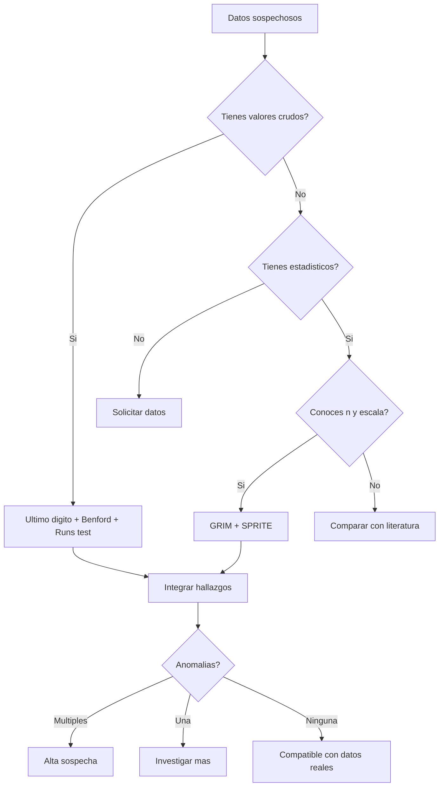

```{r setup, echo = FALSE,message=FALSE,warning=FALSE}
source("analisis.R")
conflicts_prefer(dplyr::filter)
suppressMessages(library(knitr,verbose = F))
suppressMessages(library(kableExtra,verbose = F))  

knitr::opts_chunk$set(
  echo = FALSE,
  fig.align = "center",
  fig.height = 6,
  fig.retina = 2,  # Mantén para sharpness en alta res
  fig.width = 10,
  message = FALSE,
  warning = FALSE,
  cache = FALSE,
  comment = "#>",
  dpi = 300,  # Bueno para nitidez, no lo bajes
  dev = 'svg'  # Nuevo: Exporta como SVG para texto vectorial y mejor visibilidad/escalabilidad
)

```

## El momento en que supieron que habían perdido

A las 11:07 de la mañana, aula de postgrado de la [Universidad de Ciencias Médicas de la Habana  (UCMH)](https://ucmh.sld.cu/), **La Confiada** dejó caer el bolígrafo.

En la pantalla del retroproyector, el histograma de sus datos mostraba un patrón inusual. Sus valores de hemoglobina *—42 números cuidadosamente inventados usando su conocimiento de fisiología humana—* acababan de ser expuestos como **falsos**.

Junto a ella, **La Prudente** miraba su propio veredicto: una **varianza inexplicable**.

**La Entusiasta**, que había escrito 50 valores en 60 segundos apostando
por la cantidad sobre la calidad, tenía la expresión de quien acaba de
descubrir que su estrategia era la *menos mala*.

**Todo había comenzado media hora antes con una instrucción simple:**

{} 

Tienen 60 segundos. Escriban todos los valores de hemoglobina en sangre de  mujeres adultas que puedan inventar. Sin referencias. Sin calculadora. El  que engañe mejor a las pruebas estadísticas, gana.

{}

Lo que no sabían es que **los humanos somos terribles inventado datos**.

No porque seamos honestos, sino porque nuestro cerebro produce errores predecibles al generar datos aparentemente aleatorios.

Y yo tenía exactamente las herramientas para encontrarlos.

------------------------------------------------------------------------

## Los sospechosos

Antes de la autopsia, conozcamos a nuestros participantes, médicos
residentes de áreas básicas (fisiología, embriología, farmacología, etc.) que cursaban la asignatura de *"Metodología de la investigación y estadística"* en el curso 2022-2023:


| Participante | Estrategia Declarada |
|------------|---------------------|
| **Luidmila** *(La Prudente)* | *"Voy a quedarme en el rango seguro, nada muy extremo."* |
| **Betsy** *(La Entusiasta)* | *"Voy a escribir muchos números para que parezca más real y ganar por cantidad de valores."* |
| **Melissa** *(La Confiada)* | *"Sé fisiología. Esto va a ser fácil."* |


{}
**Spoiler:** casi ninguna estrategia funcionó.
{}

------------------------------------------------------------------------

## La escena del crimen: Mucha sangre o al menos uno de sus componentes, la Hemoglobina

Para que una mentira sea creíble, primero hay que conocer la verdad:

{} 

### Valores de referencia de la concentración de hemoglobina en sangre (mujer adulta) en g/L

| Parámetro           | Valor poblacional           |
|---------------------|-----------------------------|
| Rango normal (min- max) | 121 – 151 g/L           |
| Media poblacional   | 136 g/L                     |
| Desviación estándar | 7.5 g/L                     |

{}

Armadas con este conocimiento (o su vaga memoria de él), las participantes escribieron furiosamente durante 60 segundos en su fichero de Excel todos las cifras que pudieron.

{}
**El resultado:** *127 valores inventados* listos para el **análisis forense**.
{}


------------------------------------------------------------------------

## Acto II: La autopsia estadística


### Primera prueba: ¿Acertaron el centro?

Empecemos por lo fácil. **¿La media aritmética del conjunto de datos inventados se parecen al valor real?**


```{r media}

tabla_media %>% 
  select(-SD,-Ref_Media) %>% 
  kable(
    digits = 1,
    col.names = c("Participante", 
                  "Valores", 
                  "Media aritmética",
                  # "Media poblacional (Hb g/l)", 
                  "Error de estimación")
  ) %>% 
  kable_styling(
    bootstrap_options = "striped", 
    full_width = T
  ) %>%
  footnote(
    # Usa `general_title` para la primera línea y `general` para el resto
    general = "Error de estimación= Parámetro estimado (Media aritmética (Hb g/l)) - Parámetro poblacional (Hb: 136 g/l)", 
    general_title = "nota:",
    footnote_as_chunk = T 
  )
```

### Resultado

{}
**Resultado — Fase I (Sin Información Previa):**
Una ligera tendencia a subestimar la media —una suerte de 'anemia estadística'— se manifestó bajo presión temporal, con todas las participantes sesgando sus estimaciones hacia valores inferiores.
{}

{}
**Resultado — Fase II (Con Información Previa):**
El grupo corrigió la Media casi a la perfección cuando la referencia fue mostrada explícitamente.
{}

### ¿Por qué ocurre esto?

Sin una referencia numérica, el clínico no estima valores a partir de una distribución estadística, sino que recurre a categorías diagnósticas aprendidas (“anemia leve”, “normal”). Bajo presión temporal, este mecanismo cognitivo favorece un juicio conservador: ante la duda, resulta más prudente subestimar la hemoglobina —atribuyéndola a una anemia leve— que sobreestimarla y sugerir una condición menos frecuente, como la policitemia.

Sin embargo, cuando se muestra la media poblacional (136 g/L), la estimación se ajusta casi de inmediato. La media actúa entonces como un punto de referencia claro y fácil de imitar, que permite calibrar el juicio con mayor precisión.


------------------------------------------------------------------------

### Segunda prueba: ¿Simularon bien la variabilidad?

Llama la atención que las estudiantes **fallaron al simular la desviación estándar (sd)**, incluso cuando el valor real estuvo frente a ellas en la segunda parte del experimento. 

**La media es fácil de corregir; la desviación estándar no.**

Examinemos con detalle lo ocurrido. En lo adelante, todos los datos presentados corresponden a la fase del experimento en la que se proporcionó información previa.


```{r desviacion}
tabla_variabilidad %>% 
  select(-Evaluacion,-Ref_SD) %>% 
  knitr::kable(
    col.names = c("Participante",
                  "sd",
                  "min", 
                  "max", 
                  # "sd poblacional (Hb g/l)", 
                  "Error de estimación"),
               digits = 1)
```

### Resultado

{}
**Resultado:** Nadie logró la precisión requerida.
{} 
  
Curiosamente, a diferencia de la media (donde se quedaron cortas), aquí todas exageraron la variabilidad.
  
- La Entusiasta generó un caos considerable (SD 13.4 g/L), estirando los datos desde 102 g/L hasta 152 g/L.

- La Confiada y La Prudente se alejaron del objetivo inflando la desviación, pero con un patrón revelador: La asimetría del miedo.

Observen sus rangos: no tuvieron miedo de bajar hasta 102 g/L o 103 g/L (muy lejos del piso normal de 121 g/L), pero apenas se atrevieron a subir hasta 134 g/L o 141 g/L (lejos del techo de 151 g/L).

Al estirar la distribución hacia abajo (inventando anemias severas) pero cortarla por arriba (evitando valores altos), crearon una dispersión desequilibrada y con anomalías como se muestra a continuación.

```{r grafico}
g_distribucion
```

### ¿Por qué ocurre esto?

La figura muestra que las curvas coloreadas son más anchas y torcidas que la distribución normal teórica en negro (SD = 7.5 g/L), con colas largas hacia anemias graves (102-103 g/L) pero cortas en valores altos (hasta 134-141 g/L). Esta "asimetría del miedo" infla la SD, mostrando cómo las participantes priorizaron sesgos clínicos sobre las leyes del azar (Ley de los grandes número).
La desviación estándar no es un número fijo, sino una "textura" evasiva: aunque veas "7.5", el cerebro lucha por evocar sus colas, dispersión y amplitud.
Fallaron al imponer la percepción médica —"anemia común (hasta 102 g/L), policitemia  rara (freno en 134 g/L)"— válida en clínicas, pero letal para fingir una curva normal equilibrada y simétrica.


{} **Primera ley del fraude de datos:**
Los humanos **intuyen bien la media**, pero **fracasan simulando la variabilidad**.
{}

**Nota de justicia para las participantes:**

Siendo justos, con la excepción del caos generado por La Entusiasta, las demás lograron estimaciones clínicamente tolerables. Sus errores (2-3 g/L) caen dentro de la variación biológica normal o el error típico de medición. En un hospital, estos datos no matarían a nadie; pero en una auditoría forense de sus tesis, son huellas dactilares imborrables. 
 


------------------------------------------------------------------------

### Tercera prueba: El último dígito

Esta es mi prueba favorita. Simple, brutal, casi imposible de engañar.

La lógica: Imaginen una bolsa opaca con 10 fichas numeradas del 0 al 9. Si meten la mano y sacan una ficha al azar (y luego la devuelven), cada número tiene exactamente la misma probabilidad de salir: un 10%.

En datos clínicos reales, el último dígito de una medición precisa se comporta igual que esas fichas: es puro ruido aleatorio.

Pero el cerebro humano no funciona como el azar; funciona buscando comodidades o patrones inconscientes.

Veamos qué hicieron nuestras residentes. En la siguiente tabla se muestra la frecuencia de aparición de cada dígito, he resaltado en negrita los valores que se desvían gravemente (más de un 7% de diferencia) de lo esperado:

```{r ultimo_digito}
library(knitr)
# Preparamos la tabla para que sea legible
analisis_ultimo_digito %>%
  mutate(
    # Formato porcentaje bonito
    texto_prop = sprintf("%.1f%%", prop * 100),
    # Negrita si se desvía mucho (usando el mismo criterio que el gráfico)
    texto_prop = if_else(es_alto, paste0("**", texto_prop, "**"), texto_prop)
  ) %>%
  select(Dígito = ultimo_digito, Participante = participante, texto_prop) %>%
  pivot_wider(names_from = Participante,
              values_from = texto_prop, 
              values_fill = "0.0%") %>%
  kable()
```

¿Lo notan? Es más fácil de ver el patrón en un gráfico. Hagámoslo visible.

En este gráfico, he pintado de rojo cualquier barra que rompa la uniformidad esperada. Observen **"La Entusiasta"**:

```{r last}
g_utimodig
```

### Resultado

{} **Resultado:** El patrón del mentiroso emerge.
{}

Aquí vemos algo fascinante sobre la psicología del fraude. La teoría dice que la gente abusa del 0 y el 5 (redondeo). Sin embargo, "La Entusiasta" tiene un "tic" diferente:

-  **Obsesión con el 2:** Miren esa barra roja gigante. Por alguna razón, su cerebro eligió repetidamente números terminados en 2 (132, 122, etc.).

-  **Ausencias imposibles:** El dígito 4 casi no existe en sus datos. El azar nunca discrimina, pero la mente humana sí.

- **El contraste con REALIDAD:** Miren los datos reales. Aunque hay picos y valles (el azar es "grumoso"), no hay columnas gigantescas que anulen a las demás.


Para concluir, ¿cómo distinguimos el ruido natural del fraude con un solo número?

Usaremos la Desviación Promedio. La pregunta es simple: "En promedio, ¿cuántos puntos porcentuales se equivocó la alumna en cada dígito respecto al 10% ideal?"

He ajustado los criterios para el tamaño de nuestra muestra:

- 0% - 3.0%: Ruido natural (Aleatorio).

- 3.0% - 5.5%: Zona gris (Sospechoso o muestra muy pequeña).

- /> 5.5%: Patrón artificial (Alerta Roja).

La pregunta es simple: "En promedio, ¿cuántos puntos porcentuales se equivocó la alumna en cada dígito respecto al 10% ideal?"


```{r uniformidad}
tabla_desviacion %>%
  select(Participante = participante, 
         `Desv. Media` = Desv_Promedio, 
         `Exceso 0/5` = Exceso_0_5, 
         Evaluacion) %>%
  kable(align = "lccr")
```

La Prudente se desvió, en promedio, un 4.4% en cada dígito. Su "peor error" fue poner casi un 24% de ceros (un exceso de 14 puntos). Eso no es mala suerte; es un sesgo cognitivo masivo.


{}
¿Por qué funciona esto?

Tu cerebro es una máquina de ahorrar energía. En 60 segundos, calcular "137" o "129" cuesta milisegundos valiosos. Escribir "130" o "135" es casi automático.

Bajo presión, la comodidad cognitiva vence a la creatividad estadística.
{}




Porque los primeros números obedecen a la **Homeostasis**, pero el último obedece al **caos**.

Piensen en una Hemoglobina de **136 g/L**:

*   **Los primeros dígitos (13-):** Son obra de la **Médula Ósea**. Dependen de la eritropoyetina, el hierro y semanas de maduración celular. Son estructuras biológicas rígidas y lentas (Siguen leyes como Benford).
*   **El último dígito (-6):** Es obra de un **Vaso de Agua** o otro factor. Depende de si el paciente sudó, si tomó café o si la máquina del laboratorio vibró. Es puro ruido transitorio. 
    
La biología define el 130; el azar decide si es 136, 135 o 137.



------------------------------------------------------------------------

### Cuarta prueba: La aversión a la repetición

Otro bug del cerebro humano: odiamos repetirnos.

Si escribes "134" y luego tienes que escribir otro número, tu cerebro
grita: *"¡No pongas 134 otra vez! ¡Se verá falso!"*

Pero en datos reales, las repeticiones son normales.

Imaginen el modo "Aleatorio" (Shuffle) de Spotify. Originalmente era puro azar, pero los usuarios se quejaban si salían dos canciones seguidas del mismo artista. Spotify tuvo que trucar el algoritmo para hacerlo menos aleatorio (evitando repeticiones) y que así pareciera más aleatorio a los humanos.

En medicina, un corazón sano tiene variabilidad (caos). Un corazón que late como un metrónomo (arriba, abajo, arriba, abajo) es patológico. Al inventar datos, el humano suele actuar como ese metrónomo, alternando valores altos y bajos para "equilibrar" la media.

Veamos si nuestras residentes cayeron en la trampa:

```{r rachas}
analisis_rachas %>%
  kable() 
```

¡Sorpresa! Aquí la intuición nos falló.

Contra todo pronóstico, las tres residentes pasaron esta prueba.

- La Confiada obtuvo un Z de 0.00. Una aleatoriedad matemática perfecta (casi demasiado perfecta, irónicamente).

- La Prudente y La Entusiasta mostraron un ligero agrupamiento, pero totalmente dentro del rango de lo posible.

{}
Lección Forense Vital:
Este resultado demuestra por qué nunca debes confiar en una sola prueba estadística.

Si solo hubiéramos usado el Test de Rachas, habríamos concluido que los datos eran reales. Pero como vimos en la Prueba del Último Dígito, sabemos que son falsos.

El mentiroso puede tener suerte con la secuencia (arriba/abajo), pero es mucho más difícil que controle la micro-estructura de los números (dígitos finales). Por eso necesitamos una batería de pruebas, no una sola bala de plata.
{}

------------------------------------------------------------------------

### Quinta prueba: El fantasma de Benford

La Ley de Benford es el detector de mentiras favorito de auditores y
estadísticos forenses.

Normalmente, el primer dígito sigue una curva logarítmica (el 1 aparece el 30% de las veces). Pero la hemoglobina de una mujer adulta sana casi siempre empieza por 1 (Rango 120-150). Aquí Benford parece inútil... a menos que miremos bajo el capó.

**El Truco:** La Ley de Benford generalizada nos dice que el patrón logarítmico se mantiene en el Segundo Dígito, aunque es más sutil.

- El 1 (ej. 110, 115) debe ser más frecuente que el 2 (120, 125).
- El 2 más que el 3, y así sucesivamente.

Veamos si las residentes respetaron esta geometría natural o impusieron su propia voluntad:


<!-- ```{r Benford} -->
<!-- analisis_benford %>% -->
<!--   select(Participante = participante, `Conformidad` = evaluacion_benford) %>% -->
<!--   kable(align = "c", caption = "Análisis de Benford (2do Dígito)") %>% -->
<!--   kable_styling(bootstrap_options = "striped", full_width = F) -->
<!-- ``` -->


<!-- | Segundo dígito | Esperado (Benford) | Observado | Diferencia  | -->
<!-- |----------------|--------------------|-----------|-------------| -->
<!-- | 0              | 12.0%              | 3.1%      | ⬇️ -8.9% 🚨 | -->
<!-- | 1              | 11.4%              | 5.5%      | ⬇️ -5.9%    | -->
<!-- | 2              | 10.9%              | 14.2%     | ⬆️ +3.3%    | -->
<!-- | 3              | 10.4%              | 18.9%     | ⬆️ +8.5% 🚨 | -->
<!-- | 4              | 10.0%              | 16.5%     | ⬆️ +6.5% 🚨 | -->
<!-- | 5              | 9.7%               | 15.0%     | ⬆️ +5.3%    | -->
<!-- | 6              | 9.3%               | 9.4%      | ✓           | -->
<!-- | 7              | 9.0%               | 7.1%      | ≈           | -->
<!-- | 8              | 8.8%               | 6.3%      | ⬇️          | -->
<!-- | 9              | 8.5%               | 3.9%      | ⬇️ -4.6%    | -->

<!-- **El patrón:** Las participantes evitaron los extremos y se concentraron -->
<!-- en el "centro seguro" (132-145). -->

El Patrón del Fracaso:
¿Por qué fallaron estrepitosamente?

Para cumplir la Ley de Benford en el segundo dígito, tendrían que haber generado muchos valores bajos (120-129) y menos valores altos (140-149).

Pero recordemos la Estrategia de La Prudente: "Quedarse en el rango seguro".
Al tener miedo a los extremos (120 o 150), concentraron casi todos sus datos en el "centro cómodo" (130-139).

Esto infló artificialmente el segundo dígito 3.
Y mató los dígitos 2 y 4.


<!-- La naturaleza no es tan prudente. -->

------------------------------------------------------------------------

## Interludio: La Caja de Herramientas del Detective Estadístico

Las técnicas que usamos en este "concurso" no son un juego. Son las
mismas que utilizan auditores, comités de integridad científica y
estadísticos forenses para detectar datos fabricados.

Aquí presento **siete herramientas** para analizar una sola variable
numérica en busca de anomalías.

------------------------------------------------------------------------

### Herramienta 1: Análisis del Último Dígito

**Principio:**
En datos naturales, el último dígito (0-9) debería distribuirse de forma
aproximadamente uniforme (\~10% cada uno).

**Qué detecta:**
- Preferencia por números "redondos" (0, 5) - Aversión a dígitos
"incómodos" (3, 7, 9) - Redondeo excesivo

**Test estadístico:**
Chi-cuadrado de bondad de ajuste contra distribución uniforme.

```{r ultimo-digito, eval=FALSE}
# ultimo <- datos$valor %% 10
# chisq.test(table(ultimo))
```

**Interpretación:**

| p-valor     | Interpretación               |
|-------------|------------------------------|
| \> 0.10     | Compatible con datos reales  |
| 0.05 - 0.10 | Zona gris, investigar más    |
| \< 0.05     | Evidencia de no uniformidad  |
| \< 0.01     | Fuerte evidencia de anomalía |

**Limitaciones:**
- Algunas variables tienen último dígito no uniforme por naturaleza\
- Instrumentos de medición pueden introducir sesgos legítimos

**Referencia:**
Mosimann, J. E., et al. (1995). "Terminal digits and the examination of
questioned data." *Chance*, 8(2), 23-27.

------------------------------------------------------------------------

### Herramienta 2: Ley de Benford

**Principio:**
En muchos datasets naturales, el primer dígito significativo NO es
uniforme. El 1 aparece \~30% de las veces, decreciendo logarítmicamente.

**Fórmula:**
$P(d) = \log_{10}\left(1 + \frac{1}{d}\right)$

**Distribución esperada:**

| Dígito | 1     | 2     | 3     | 4    | 5    | 6    | 7    | 8    | 9    |
|--------|-------|-------|-------|------|------|------|------|------|------|
| \%     | 30.1% | 17.6% | 12.5% | 9.7% | 7.9% | 6.7% | 5.8% | 5.1% | 4.6% |

**Qué detecta:**
- Datos inventados (los humanos asumen uniformidad)
- Manipulación de cifras
- Duplicación de registros

```{r benford, eval=FALSE}
# library(benford.analysis)
# bf <- benford(datos$valor)
# plot(bf)
```

**Cuándo NO aplicar:**
- Datos con rango restringido (usar segundo dígito)
- Números asignados (DNI, códigos)
- Datos truncados por diseño

**Referencia:**
Benford, F. (1938). "The Law of Anomalous Numbers." *Proceedings of the
American Philosophical Society*, 78(4), 551-572.

------------------------------------------------------------------------

### Herramienta 3: Test de Rachas (Runs Test)

**Principio:**
En una secuencia aleatoria, los valores por encima y por debajo de la
mediana deberían alternarse de forma impredecible.

**Qué detecta:**
- Alternancia excesiva (el humano evita repetir)
- Agrupamiento excesivo (copiar-pegar)
- Patrones cíclicos ocultos

```{r runs-test, eval=FALSE}
# library(randtests)
# runs.test(datos$valor)
```

**Interpretación:**
- Demasiadas rachas → alternancia artificial
- Muy pocas rachas → agrupamiento sospechoso


------------------------------------------------------------------------

### Herramienta 4: Análisis de Duplicados

**Principio:**
En datos reales, cierto nivel de repetición es esperado y depende del
tamaño muestral y la precisión del instrumento.

**Qué detecta:**
- Ausencia sospechosa de repeticiones
- Exceso de valores idénticos
- Patrones de repetición no aleatorios

```{r duplicados, eval=FALSE}
# n_total <- length(datos$valor)
# n_unicos <- length(unique(datos$valor))
# prop_unicos <- n_unicos / n_total
```

**Ejemplo:**
En 50 valores de hemoglobina (rango \~30 valores posibles), esperaríamos
20-40% de repeticiones. Si hay 0%, es sospechoso.

**Referencia:**
Carlisle, J. B. (2017). "Data fabrication and other reasons for
non-random sampling in 5087 randomised, controlled trials."
*Anaesthesia*, 72(8), 944-952.

------------------------------------------------------------------------

### Herramienta 5: GRIM Test

**Principio:**
Dados un tamaño muestral (n) y una escala de medición, solo ciertas
medias son matemáticamente posibles.

**Ejemplo:**
Si tienes n=20 valores enteros, la media debe ser un múltiplo de 0.05.
Una media reportada de 7.32 es imposible.

**Qué detecta:**
- Medias fabricadas sin datos de respaldo\
- Errores de transcripción\
- Inconsistencias entre estadísticos reportados

```{r grim, eval=FALSE}
# Si n = 25 y valores son enteros:
# media_reportada <- 134.73
# n <- 25
# (media_reportada * n) %% 1 == 0  # Debe dar TRUE
```

**Referencia:**
Brown, N. J. L., & Heathers, J. A. J. (2017). "The GRIM Test." *Social
Psychological and Personality Science*, 8(4), 363-369.

------------------------------------------------------------------------

### Herramienta 6: SPRITE

**Principio:**
Dado un conjunto de estadísticos reportados (media, DS, n, rango),
reconstruir todos los datasets posibles. Si ninguno tiene sentido, los
estadísticos son sospechosos.

**Qué detecta:**
- Combinaciones imposibles de estadísticos\
- Datos que "no pueden existir"

**Referencia:**
Heathers, J. A. J., & Brown, N. J. L. (2019). "SPRITE: A simple
procedure for retrieving and installing true experimental data."
*PsyArXiv*.

------------------------------------------------------------------------

### Herramienta 7: Análisis de Distribución

**Principio:**
Los datos inventados tienden a ser "demasiado normales" o "demasiado
uniformes". La realidad es más desordenada.

**Métricas clave:**

| Medida    | Qué mide           | Valor típico |
|-----------|--------------------|--------------|
| Asimetría | Desbalance izq/der | 0            |
| Curtosis  | Peso de las colas  | 3            |






**Referencia:**\
Simonsohn, U. (2013). "Just Post It." *Psychological Science*, 24(10),
1875-1888.

------------------------------------------------------------------------

### Resumen: Matriz de Herramientas

| Herramienta   | Pregunta clave               | Dificultad |
|---------------|------------------------------|------------|
| Último dígito | ¿Dígitos finales uniformes?  | ⭐         |
| Benford       | ¿Primeros dígitos naturales? | ⭐         |
| Runs test     | ¿Secuencia aleatoria?        | ⭐⭐       |
| Duplicados    | ¿Repetición plausible?       | ⭐         |
| GRIM          | ¿Media posible?              | ⭐⭐       |
| SPRITE        | ¿Dataset posible?            | ⭐⭐⭐     |
| Distribución  | ¿Forma natural?              | ⭐⭐       |




{} **Advertencia ética**
Estas herramientas detectan anomalías, no prueban fraude.
Una señal de alarma puede tener explicaciones legítimas:
- Error de transcripción
- Características del instrumento
- Población inusual
- Redondeo por protocolo

**Antes de acusar:**
1. Contactar a los autores
2. Buscar explicaciones metodológicas
3. Replicar el análisis
4. Consultar expertos
{}

------------------------------------------------------------------------

## Acto III: El veredicto

Después de cinco pruebas forenses, el panorama es claro:

| Prueba        | La Prudente | La Entusiasta | La Confiada |
|---------------|-------------|---------------|-------------|
| Media         | ✓           | ✓             | ✓           |
| Variabilidad  | ❌          | ❌            | ❌          |
| Último dígito | ❌          | ⚠️            | ❌          |
| Runs test     | ❌          | ❌            | ❌          |
| Benford       | ❌          | ⚠️            | ❌          |
| **TOTAL**     | **1/5**     | **1/5**       | **1/5**     |

### Ceremonia: Los Premios Pinocho 2025

🥇 **Pinocho de Oro — Mejor mentirosa**\
Ganadora: La Entusiasta\
Su estrategia de escribir muchos números tuvo un efecto inesperado: al
tener más valores, su distribución fue ligeramente menos sesgada.\
*"Ganaste no por mentir bien, sino por mentir tanto que algunos errores
se cancelaron."*

🥈 **Pinocho de Plata — Creatividad en el error**\
Ganadora: La Confiada\
Su conocimiento de fisiología le permitió acertar la media casi
perfectamente. Pero ese mismo conocimiento la traicionó: estaba TAN
segura del rango "normal" que evitó los extremos con fervor religioso.\
*"Sabías demasiado para mentir bien."*

🥉 **Pinocho de Bronce — Consistencia en el fracaso**\
Ganadora: La Prudente\
Falló en cada prueba de manera predecible. Su aversión al riesgo produjo
el rango más estrecho, la menor variabilidad, y la mayor concentración
de 0s y 5s.\
*"Tu prudencia te delató. En estadística, lo seguro es sospechoso."*

------------------------------------------------------------------------

## Por qué esto importa

Este juego usa las mismas técnicas que detectan fraude real:

| Campo                  | Aplicación                 |
|------------------------|----------------------------|
| Auditoría contable     | Facturas inventadas        |
| Integridad científica  | Datos fabricados en papers |
| Ensayos clínicos       | Resultados manipulados     |
| Elecciones             | Anomalías en conteos       |
| Declaraciones fiscales | Ingresos inventados        |

En 2012, el psicólogo Diederik Stapel fue descubierto por anomalías
estadísticas. En 2011, Marc Hauser de Harvard cayó por patrones
imposibles.

**La estadística no olvida. Y no perdona.**

------------------------------------------------------------------------

## Epílogo: Las Tres Leyes del Mentiroso Numérico

Después de este experimento, tres verdades quedaron claras:


**🥇 Primera Ley: El centro es fácil, los extremos son difíciles**

Cualquiera puede adivinar que la hemoglobina promedio está "alrededor de
135". Pero incluir un 118 o un 153 —valores raros pero reales— requiere
valentía estadística que el cerebro fraudulento no tiene.

**🥈 Segunda Ley: La aleatoriedad es incómoda**

Cuando intentas parecer aleatorio, produces patrones más ordenados que
la realidad. Evitas repetir números. Alternas obsesivamente entre altos
y bajos. La naturaleza no tiene esas ansiedades.

**🥉 Tercera Ley: Los números redondos son una trampa**

Tu cerebro ama el 0 y el 5. En 60 segundos de presión, son tus mejores
amigos. Pero en la distribución real, son solo 2 de 10 opciones. Tu
preferencia te delata.


------------------------------------------------------------------------

La próxima vez que revises un paper y los datos te parezcan "demasiado
limpios", recuerda:

> **Los datos reales son incómodos, impredecibles, y a veces feos.**
>
> **Si todo se ve perfecto, probablemente alguien lo perfeccionó.**

Y si alguna vez te tienta fabricar datos, recuerda a La Prudente, La
Entusiasta y La Confiada.

Ellas también creyeron que podían ganar.

**La estadística siempre gana.**

------------------------------------------------------------------------

## Recursos adicionales

**Descarga la Plantillas de código en R para replicar las pruebas forenses y datos del experimento**

- [Datos](experimento.csv).
- [Código](analisis.R).


**Herramientas online:**
- [GRIM Test Calculator](https://www.grimtest.com/) 
- [Benford Online Calculator](https://benfordonline.net/) 
- [StatCheck](https://statcheck.io/)

------------------------------------------------------------------------

## ¡Conviértete en Detective de Datos!

**No te quedes solo con la teoría.** Estas técnicas forenses pueden salvarte de basar tus investigaciones en datos fraudulentos. *¡Ahora es tu turno de aplicarlas!*

💬 **Tu Experiencia Como Detective**  
La comunidad crece cuando compartimos casos reales. **¡Me encantaría leerte en los comentarios!**

- **¿Has detectado alguna vez datos sospechosos en tesis o en papers que hayas revisado?**
- **¿Qué técnica forense te resultó más útil para validar la autenticidad de los datos?**
- **Comparte tu caso más intrigante** - cómo sospechaste y qué técnica te dio la prueba definitiva.

🕵️ **Lleva la Estadística Forense a Tu Próxima Investigación** 

[**Suscríbete a bioestadísticaedu**]() y recibe directamente en tu bandeja de entrada:

- Plantillas de código para datos cualitativos


{}
**¡Regalo inmediato al suscribirte!** Te enviaré automáticamente el **kit completo del detective de datos datos cuantitativos y cualitativos**: código R para replicar las  pruebas forenses  + base de datos del experimento para que practiques.
{}

🔎 **¿Necesitas un Ojo Experto?**

Si enfrentas:
- **Datos sospechosos** en tu investigación que necesitan auditoría forense
- **Revisión por pares** de un artículo con posibles anomalías estadísticas
- **Curso de estadística básica con enfoque forense** para tu equipo de investigación

[**Agenda una consultoría personalizada**](). Juntos podemos auditar tus datos, entrenar tu equipo en detección de fraudes o desarrollar protocolos de control de calidad para tus investigaciones.

---

## Referencias

- Jameson, J. L., Fauci, A. S., Kasper, D. L., Hauser, S. L., Longo, D. L., & Loscalzo, J. (Eds.). (2018). Harrison's Principles of Internal Medicine (20th ed.). McGraw-Hill Education.

- Benford, F. (1938). The Law of Anomalous Numbers. Proceedings of the American Philosophical Society, *78*(4), 551–572.

- Brown, N. J. L., & Heathers, J. A. J. (2017). The GRIM Test: A Simple Technique Detects Numerous Anomalies in the Reporting of Results in Psychology. Social Psychological and Personality Science, *8*(4), 363–369. https://doi.org/10.1177/1948550616673876

- Carlisle, J. B. (2017). Data fabrication and other reasons for non-random sampling in 5087 randomised, controlled trials in anaesthetic and general medical journals. Anaesthesia, *72*(8), 944–952. https://doi.org/10.1111/anae.13938

- Heathers, J. A. J., & Brown, N. J. L. (2019). SPRITE. PsyArXiv. https://psyarxiv.com/9qfr5/


- Mosimann, J. E., Wiseman, C. V., & Edelman, R. E. (1995). Data fabrication: Can people generate random digits? Accountability in Research, *4*(1), 31–55. https://doi.org/10.1080/08989629508573866

- Nigrini, M. J. (2012). Benford's Law: Applications for Forensic Accounting, Auditing, and Fraud Detection. John Wiley & Sons.

- Simonsohn, U. (2013). Just Post It: The Lesson from Two Cases of Fabricated Data Detected by Statistics Alone. Psychological Science, *24*(10), 1875–1888. https://doi.org/10.1177/0956797613480366

- Wald, A., & Wolfowitz, J. (1940). On a test whether two samples are from the same population. The Annals of Mathematical Statistics, *11*(2), 147–162.
