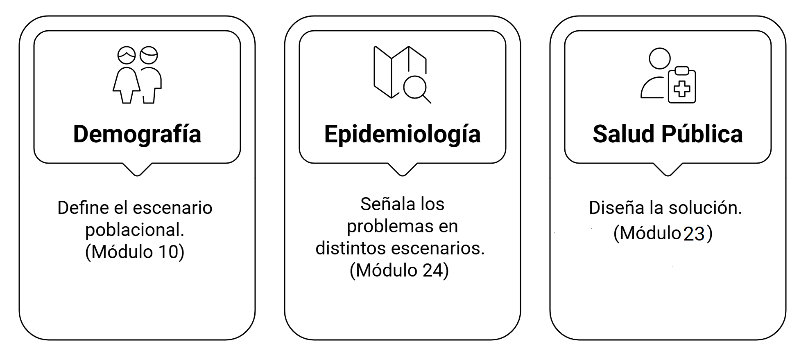

## Introducción


### El Experimento: Física-Ficción en el Caribe

Recuerdo mi primer día en la residencia de Bioestadística en la [Escuela Nacional de Salud Pública (ENSAP)](https://ensap.sld.cu/). Llevaba una pregunta clavada en la cabeza, una de esas que uno no se atreve a formular en voz alta:

> ¿Realmente esta formación me servirá fuera de Cuba? ¿Podré competir con profesionales formados en otros sistemas?.

Como tú, yo también esperaba *—quizás con algo de ingenuidad—* que algún profesor, en un pasillo, me dijera en tono de complicidad:

**«Sí, esto te servirá si un día decides hacer el viaje de Colón a Cuba… pero de regreso a Europa ».**

Me inquietaba saber si un egresado de esta especialidad podría aspirar a un puesto en Norteamérica o Europa sin que se notaran las costuras.

Hoy, más de veinte años después, la pregunta sigue viva. Solo cambió de dueño: ahora como profesor en la ENSAP, la escucho en las voces de residentes que enfrentan un mundo bioestadístico mucho más exigente y computacional que el que yo conocí. También encuentro residentes deseosos de acompañar a Colón en su viaje de regreso a casa pero ese seria otro tema.

Este artículo es, en cierto modo, un experimento de física-ficción personal.

**¿Qué le diría a mi yo joven si pudiera viajar al pasado? ¿Vale la pena estudiar Bioestadística después de haberte graduado de medicina?**

Sería mi versión doméstica de la **paradoja del abuelo**: en lugar de eliminar al antepasado, buscaría asesinar su duda existencial. Me siento frente a ese residente inseguro, abro mi laptop… y pongo los datos sobre la mesa. 

### De que hablaremos

Vamos a poner al currículo cubano de bioestadística en el ring para un **Análisis Crítico del Currículo de Bioestadística Cubano Frente a las Tendencias Globales.** 

En la esquina opuesta, no uno, sino tres oponentes académicos de prestigio internacional *—maestrías con reputación, músculo curricular y pegada brutal—* listos para medirse en un sparring sin artimañas.





| Criterio de selección                                 | Johns Hopkins                                                                 | Harvard                                                                        | Universidad de Washington                                                      |
|-------------------------------------------------------|-------------------------------------------------------------------------------|--------------------------------------------------------------------------------|--------------------------------------------------------------------------------|
| Antigüedad del departamento de bioestadística         | Fundado en **1918**. Más de **100 años** de historia.                         | Fundado en **1922**. Más de **100 años** de historia.                          | Creado en **1970**. Más de **50 años** de experiencia.                         |
| Posición en evaluaciones de expertos en bioestadística| Clasificada como **número 1** por académicos en Estados Unidos.               | Clasificada como **número 1** (empate) por académicos.                         | Clasificada como **número 1** (empate) por académicos.                         |
| Posición en rankings internacionales por disciplina   | Dentro de las **5 mejores** universidades del mundo en áreas estadísticas vinculadas con salud. | Ubicada como **número 1 mundial** en disciplinas relacionadas con salud pública y bioestadística. | Dentro de las **5 mejores** en bioestadística y salud poblacional en varios listados internacionales. |
| Reputación global de la universidad                   | Universidad de élite, con múltiples programas entre los **10 mejores** nacionales. | Universidad de alcance mundial, consistentemente en el **top 3** global.        | Universidad pública de investigación de alto prestigio, generalmente en el **top 20** nacional. |
| Reconocimiento en investigación biomédica             | Gran influencia histórica en estudios clínicos y métodos biomédicos avanzados. | Líder internacional en genética estadística, causalidad y análisis de grandes datos. | Reconocida por su fortaleza en modelos longitudinales y estudios de salud de poblaciones. |




## La Pelea

Para ser justos en esta pelea, primero necesitamos saber qué peso traemos al ring. No se puede hablar de competitividad internacional sin comprender antes nuestro propio ADN académico.

Cuando estás dentro del programa, es fácil ver cada asignatura como un obstáculo aislado que hay que aprobar. Pero basta alejarse unos pasos para notar algo que no siempre se aprecia a simple vista: **hay una estructura lógica e intencional detrás del currículo**, un andamiaje diseñado para sostener la formación de un bioestadístico integral.

Así que le muestro a mi versión joven el mapa de lo que está a punto de estudiar. No es un simple listado de materias: es la arquitectura de su **futuro cerebro profesional**.


### Los atributos de la especialidad en bioestadística

La siguiente figura presenta el mapa  de los **contenidos de la residecia de Bioestadística**. Si observas con atención, notarás que el programa no gira solo en torno a recetas estadísticas y de metodología de la investigación. Te obliga a transitar entre cuatro funciones clave: **Servicios, Investigación, Docencia y Dirección**, un equilibrio que no es común en la formación internacional.

```markmap {height="300px"}
- Plan de Estudios
  - Primer Año
    - Función en Servicios de Salud
      - Módulo 1. Herramientas informáticas para la organización, respaldo y procesamiento de la información.
      - Módulo 2. Gestión de Información.
      - Módulo 3. Álgebra Lineal.
      - Módulo 4. Análisis Matemático.
    - Función Investigativa
      - Módulo 8. Estadística Descriptiva.
      - Módulo 24. Epidemiología.
      - Curso 3. Bioseguridad.
      - Curso 4. Gestión de riesgo de desastres y su influencia en la salud.
      - Módulo 25. Filosofía y sociedad.
      - Curso 5. Bioética.
      - Curso 6. Problemas sociales de las ciencias.
    - Función de Dirección
      - Módulo 23. Salud Pública.
      - Curso 1. Historia de la Salud Pública en Cuba.
      - Curso 2. Gestión en Salud.
  - Segundo Año
    - Función en Servicios de Salud
      - Módulo 5. Probabilidades.
      - Módulo 6. Introducción a la Inferencia Estadística.
      - Módulo 7. Muestreo.
      - Módulo 9. Estadísticas de Salud.
      - Módulo 10. Demografía.
      - Módulo 11. Análisis de varianza y Regresión.
      - Módulo 12. Métodos no Paramétricos.
    - Función de Investigación
      - Módulo 17. Metodología de la Investigación en Ciencias de la Salud.
      - Taller de tesis I.
    - Función Docente y Educativa
      - Módulo 26. Proceso Enseñanza Aprendizaje.
  - Tercer Año
    - Función en Servicios de Salud
      - Módulo 13. Análisis de Series Cronológicas.
      - Módulo 14. Análisis Multivariado.
      - Módulo 15. Análisis de Datos Cualitativos.
      - Módulo 16. Análisis de Supervivencia.
      - Módulo 18. Investigaciones Epidemiológicas.
      - Módulo 19. Evaluación de test y estrategias para el diagnóstico.
      - Módulo 20. Ensayos Clínicos.
      - Módulo 21. Evaluación de factores que afectan el pronóstico.
      - Módulo 22. Investigaciones en Sistemas y Servicios de Salud.
    - Función de Investigación
      - Talleres de tesis II y III.
```


¿Lo ves? Es un **esqueleto robusto**. **Álgebra y Análisis Matemático** sostienen toda la estructura, y sobre esa base pesada se levantan asignaturas como **Análisis Multivariado o Ensayos Clínicos**. Lo que parece una simple lista de módulos es, en realidad, un **sistema** bien articulado.

Con el mapa sobre la mesa, ahora sí podemos compararlo con el territorio global.

### Round 1: Los Cimientos de Granito (Lo que sí tenemos)

Abro el **Programa de Bioestadística (2023).**

Mi “yo” del pasado se pone nervioso, esperando descubrir que nuestra formación es de papel maché frente al hormigón armado de los programas del norte.

*—“Tranquilo”, le digo. —“Mira esto”.*

Los módulos iniciales de matemáticas revelan una **base rigurosa** en el programa, sólida desde una perspectiva internacional.


Mientras muchos *Masters of Public Health (MPH)* suavizan la matemática para hacerla “amigable”, el currículo cubano te obliga a pasar por el túnel completo: cálculo, álgebra lineal y fundamentos rigurosos de inferencia. **Una matriz inversa se calcula igual en La Habana que en Seattle, y la función de verosimilitud no entiende de fronteras.**

Y no es lo único.

Y contamos con un elemento distintivo que a veces pasa desapercibido: la sólida articulación entre la Demografía y la Epidemiología. Esta **integración**, sin ser la única fortaleza del plan de estudios, representa una de nuestras mayores ventajas formativas..




Esto significa que nuestro programa no forma “operadores de software” ni “calculadoras humanas”. Forma salubristas con pensamiento poblacional, **capaces de entender dinámicas sociales, sesgos estructurales y problemas operativos del sistema de salud.**

En este primer round *—el de los fundamentos—* **no tenemos nada que envidiarle a nadie.**


### Round 2: El Choque de Realidades (David vs. Goliats)

Hasta aquí, nuestro currículo cubano se sostiene con dignidad: **teoría sólida, estadística clásica robusta y una integración con el sistema de salud** que muchos programas del norte envidiarían. Pero basta abrir los sílabos de los gigantes internacionales para que la atmósfera en la habitación del tiempo se vuelva densa.

Es ese momento incómodo en que David levanta la vista y dice:

> —Compadre, ¿y este Goliat dónde entrena?

Para responder, le hablé de los tres pesos pesados del ecosistema global de la bioestadística seleccionados para la comparación:



1.  [**Máster en Ciencias de Johns Hopkins**](https://publichealth.jhu.edu/academics/scm-dept-of-biostatistics): Los reyes de la Inferencia Causal. Aquí no preguntan “qué pasó”, sino “qué causó qué”, con una precisión casi quirúrgica.

2.  [**Máster en Ciencias de Harvard**](https://hsph.harvard.edu/program/sm-biostatistics/)**:** Estadística + Biología + Computación. Bioinformática, genómica, machine learning… todo está integrado desde el primer semestre.

3.  [**Máster en Ciencias de University of Washington**](https://www.biostat.washington.edu/academics/ms)**:** El dominio del Big Data biomédico. Datos inmensos, computación en la nube, pipelines automáticos… pura artillería pesada.





| Categoría | Currículo Cubano (UCMH)  | Harvard  | Johns Hopkins  | University of Washington |
|---|---|---|---|---|
| **Estadística Fundamental** | Probabilidades; Inferencia; Regresión; Análisis de varianza; Métodos no paramétricos; Series temporales; Análisis multivariado; Análisis de supervivencia; Estadística descriptiva. | Inferencia; Modelos lineales; Modelos generalizados; Métodos cuantitativos para biología; Métodos estadísticos de gran dimensión. | Inferencia; Modelos longitudinales; Ensayos clínicos; Métodos de causalidad; Modelos mixtos; Series temporales en salud. | Modelos lineales; Métodos para datos de gran volumen; Métodos computacionales aplicados; Modelos espaciales; Series temporales. |
| **Computación y Herramientas Analíticas** | Herramientas informáticas; Organización y procesamiento de información; Gestión de información. | Programación aplicada; Computación científica; Ciencia de datos; Bioinformática; Manejo de información biomédica. | Programación estadística; Minería de datos; Manejo de bases de datos biomédicas complejas. | Programación avanzada; Computación en la nube; Sistemas distribuidos; Infraestructura digital para datos de salud. |
| **Modelos Predictivos** | Regresión lineal; Regresión logística; Métodos multivariados. | Métodos predictivos; Aprendizaje supervisado; Aprendizaje profundo aplicado a biología y salud. | Métodos predictivos con enfoque causal; Aprendizaje estadístico aplicado a datos de salud. | Métodos predictivos para datos de gran escala; Analítica poblacional; Aprendizaje automático aplicado a datos masivos. |
| **Métodos de Causalidad** | Epidemiología clásica; Ensayos clínicos; Diseños de investigación en salud. | Métodos de inferencia causal aplicados a biomedicina. | Métodos causales; Enfoque contrafactual; Modelos longitudinales; Métodos basados en supuestos de identificación. | Métodos causales aplicados a registros poblacionales y datos de gran volumen. |
| **Ciencia de Datos Biomédicos** | No incluye contenidos de genómica, bioinformática ni datos biomédicos especializados. | Genómica; Bioinformática; Datos moleculares; Integración de información biológica. | Datos ómicos; Registros médicos electrónicos; Información biomédica estructurada y no estructurada. | Datos de sensores; Datos continuos; Datos moleculares; Imágenes médicas; Flujos continuos de información de salud. |
| **Fuentes de Datos en Salud** | Estadísticas de salud; Demografía; Muestreo; Análisis de situación de salud; Sistemas y servicios de salud. | Datos ómicos; Texto biomédico; Imágenes médicas; Cohortes clínicas integradas. | Registros electrónicos de salud; Bases administrativas; Registros longitudinales. | Datos de dispositivos portátiles; Sensores; Plataformas digitales; Registros poblacionales masivos. |
| **Investigación y Diseño de Estudios** | Metodología de la investigación; Talleres de tesis; Evaluación de pruebas diagnósticas. | Diseño experimental moderno; Integración entre estadística, biología y computación. | Diseño de estudios con enfoque causal; Evaluaciones metodológicas; Análisis crítico. | Diseño de estudios en entornos computacionales; Investigación basada en datos de gran escala. |
| **Salud Pública y Epidemiología** | Epidemiología; Salud pública; Gestión en salud; Bioética; Filosofía y sociedad; Historia de la salud pública; Riesgos y desastres. | Epidemiología moderna; Modelos de transmisión; Integración biomédica. | Epidemiología con enfoque causal; Análisis longitudinal. | Epidemiología computacional; Vigilancia basada en datos masivos. |



Y aquí viene el KO técnico.


### Limitaciones del Currículo de Bioestadística Cubano

El currículo cubano de Bioestadística sigue siendo sólido en matemáticas y estadística clásica, pero no acompaña la evolución global del campo. Esto **limita la capacidad del egresado para enfrentar datasets reales, sistemas complejos y métodos modernos**. A continuación, un análisis organizado de sus principales brechas.

**1. Datos perfectos… pero el mundo no siempre lo es**

En condiciones ideales, una investigación bien diseñada produce una base rectangular, limpia y estructurada, como la que se construye con un cuestionario ajustado a los objetivos del estudio. Eso está bien, y el currículo lo cubre.

El problema es que esa no es la única realidad que enfrenta un bioestadístico.

{}
El currículo asume datos limpios y rectangulares, pero no prepara al egresado para manejar datos reales, incompletos o no estructurados.
{}



Fuera del entorno controlado, aparecen datos que:
- provienen de registros hospitalarios,
- derivan de dispositivos de la vida diaria (wearables, sensores),
- contienen texto clínico,
- incluyen imágenes médicas,
- vienen de secuencias biológicas,
- o están incompletos, desordenados y mezclados.

Para trabajar con estas fuentes se necesitan **técnicas de preprocesamiento** que no se enseñan en profundidad en la especialidad:

- manejo avanzado de datos faltantes,
- tratamiento de valores atípicos,
- integración de múltiples fuentes,
- trabajo con datos no estructurados,

e incluso operaciones básicas como procesar correctamente un fichero de texto con secuencias de ADN.



[Te invito a conocer mas sobre analisis exploratorio de datos en el siguiente post ]().

**2. Estadística bayesiana: un ausente importante**

El programa enseña  la inferencia clásica: **pruebas de significación, intervalos de confianza, regresión y análisis frecuentista tradicional**.
Incluso se reconocen, en algunos módulos, las limitaciones del p-value y sus interpretaciones incorrectas. **Pero ahí se detiene el avance.**

{}
El programa reconoce los problemas del enfoque clásico… pero no enseña el camino alternativo que hoy domina decisiones clínicas, Estadística bayesiana aplicada, Modelos jerárquicos bayesianos, Modelos longitudinales con enfoque bayesiano, Diseño adaptativo de estudios y Modelación biomédica moderna.
{}



Lo que no aparece en ningún módulo:
- Factor de Bayes,
- priors y posteriors,
- modelos jerárquicos,
- MCMC,
- intervalos de probabilidad,
- ensayos adaptativos bayesianos,
- Stan, JAGS o PyMC.

Es una puerta que se señala, pero que nunca se abre.


[Este post profundiza en el tema de las limitaciones de las pruebas de significación ]().


**3. Causalidad y sesgos modernos: se menciona el problema, no la solución**

Los módulos de epidemiología y metodología explican sesgos tradicionales, pero no desarrollan el marco moderno de causalidad ni las herramientas actuales para cuantificar o corregir sesgos.

{}
En otras palabras:
sabemos que hay sesgos… pero no aprendemos a estimarlos, modelarlos o reducirlos con técnicas estándar del siglo XXI.
{}




- marco contrafactual de Rubin,
- DAGs y teoría de Pearl,
- IPTW, G-formula, TMLE,
- aprendizaje causal,
- análisis de sensibilidad (E-values, confusión no medida),
- estimación orientada a objetivos.




[Te invito a conocer mas sobre el enfoque de respuestas potenciales en el siguiente post ]().

**4. Modelos de predicción clínica: un territorio casi intacto**

La residencia no aborda el desarrollo de modelos diagnósticos o pronósticos para pacientes individuales. Además de la regresión lineal y logística no se abordan otros modelos predictivos.

{}
El egresado puede analizar un ensayo clínico… pero no puede construir un modelo predictivo moderno de mortalidad, readmisión o diagnóstico asistido.
{}




El currículo se queda en modelos lineales y regresión logística, que siguen siendo útiles, sí…
pero la predicción clínica moderna usa:

- Random Forests y boosting,
- redes neuronales,
- validación cruzada avanzada,
- curvas de calibración,
- análisis de riesgo,
- TRIPOD, PROBAST,
- MLOps clínico y actualización de modelos.



[Si deseas desarrollar y validar un modelo de predicción clínica, puedes consultar mi post sobre el tema]().


**5. Tenemos la matemática, pero no el puente hacia la IA**

La formación incluye: álgebra lineal, matrices, vectores, probabilidad,es decir, la base conceptual para entender IA moderna pero solo somos usuarios acríticos de estas. No podemos entender la mayoría de los algoritmos de aprendizaje automático.

{}
Los egresados pueden usar ChatGPT o Gemini…
pero no pueden explicar cómo funcionan ni auditar modelos aplicados a salud.
{}




No se muestra cómo esas piezas se ensamblan las herramientas matemática para formar:

- modelos generativos,
- modelos de lenguaje,
- arquitecturas neuronales modernas,
- herramientas de auditoría y evaluación de sesgos en IA.



[Si te interesa el tema, puedes consultar mi post sobre cómo funcionan los grandes modelos de lenguaje ]().


### Resultado del Round 2

Sí, tenemos fundamentos fuertes. Pero Harvard, Hopkins y UW no solo tienen fundamentos: tienen fundamentos + **ML + big data + bioinformática + computación moderna + IA biomédica.**

Es como un boxeador que domina el jab, pero descubre que el oponente también domina el jab… y **además practica puede dar patadas con giros en el aire.**

En este asalto, colega, **no perdemos por falta de talento**, sino por falta de *armamento moderno.*

Y esa diferencia es suficiente para que el round se vaya 10–8 en contra.


### Round 3: La Revancha — El Bioestadístico Híbrido (La Propuesta Frankenstein)

Mi “yo joven” me mira con los ojos muy abiertos:

*—“¿Entonces… una IA me va a reemplazar?”*

*—“No, campeón.*

Lo que te va a reemplazar es *quedarte inmóvil* mientras el mundo corre.”

La conclusión no es destruir la especialidad. Esa base —matemática, metodológica, epidemiológica— es seria y valiosa.

El problema no es lo que tenemos. El problema es lo que falta.

El mundo bioestadístico dejó de ser exclusivamente estadístico:


<!-- -   ahora se mueve en bases de datos en streaming, -->
<!-- -   entrenando modelos de predicción clínica, -->
<!-- -   auditando IA biomédica, -->
<!-- -   procesando textos, imágenes y genomas. -->

Lo que necesitamos no es borrar lo existente: necesitamos evolucionar.

Necesitamos un **Bioestadístico Híbrido.**

Un profesional capaz de:


<!-- -   **entender al paciente** (tu formación médica), -->
<!-- -   **entender la incertidumbre** (tu formación estadística), -->
<!-- -   **y entender el código que usa la IA para anticipar complicaciones quirúrgicas.** -->

La buena noticia es casi humorística:

todo lo que nos falta **ya existe**… solo que desperdigado en distintos planes, diplomados y maestrías.


<!-- -   La especialidad aporta la teoría, los modelos, la epidemiología. -->

<!-- -   La informática en salud aporta IA, sistemas y computación moderna. -->

<!-- -   La práctica real aporta datos complejos (caóticos, sucios, heterogéneos). -->

La solución no es romper nada. **La solución es fusionarlo.**

Y, de hecho, tú mismo lo viviste: la **Maestría de Informática en Salud** ya contiene piezas esenciales de la armadura moderna: programación, IA, bases de datos, modelación, señales biomédicas, métodos bayesianos…

Ese es el germen del “Bioestadístico Híbrido”. Solo falta integrarlo, sistematizarlo y declararlo como un camino claro.

Aquí está un ejemplo:



```markmap {height="500px"}
- Maestría en Informática en Salud
  - Módulo 1: Introducción a la Informática en Salud
    - Bases para el desarrollo del pensamiento abstracto y el razonamiento lógico
    - Fundamentos generales de la computación y sistemas operativos
    - Redes computarizadas en la salud
    - Información Científico-Técnica
    - Salud y población
    - Fundamentos de las ciencias básicas biomédicas y métodos de las ciencias médicas
  - Módulo 2: Informática
    - Fundamentos teóricos de la estructura de datos
    - Estado actual y tendencias en los lenguajes de programación
    - Diseño de bases de datos
    - Inteligencia artificial y sistemas expertos
    - Programación avanzada
  - Módulo 3: Investigaciones en Informática en Salud
    - Estadística para la informática en salud
    - Bioética
    - Metodología de la investigación científica
  - Perfil terminal A: Informatización de la Salud Pública
    - Gerencia Informática
    - Ingeniería de software
    - Manipulación de datos
  - Perfil terminal B: Modelación de procesos biomédicos
    - Modelos matemáticos en biomedicina
    - Temas de Estadística
      - Análisis multivariado
      - Muestreo
      - Métodos bayesianos
      - Diseño experimental
    - Análisis de señales biomédicas
    - Modelos computacionales no tradicionales
      - Vida artificial
      - Morfogénesis
      - Computadoras biológicas
  - Perfil terminal C: Informática educativa
    - Fundamentos de la educación
    - Fundamentos de la enseñanza asistida por computadoras
    - Diseño informático educativo
```



### El Bioestadístico Híbrido (versión 2025)

La idea no es destruir la especialidad. La idea es **evolucionarla.**

Tomar lo mejor de tres ecosistemas que hoy viven separados —la estadística clásica, la informática aplicada a la salud y las demandas tecnológicas del siglo XXI— y convertirlos en un solo organismo funcional.

Ese organismo no existe hoy… pero podría existir mañana.

**1. Lo que aporta la especialidad (nuestra columna vertebral)**

Aquí está nuestra identidad histórica, lo que nos ha sostenido durante décadas:


<!-- -   Inferencia clásica y modelos lineales -->

<!-- -   Ensayos clínicos y epidemiología cuantitativa -->

<!-- -   Diseño de estudios y lógica causal básica -->

<!-- -   Integración real con el sistema de salud -->

Es una base sólida, rigurosa, valiosa. Pero en 2025, **ya no basta.**

**2. Lo que aporta la Informática en Salud (nuestro “lado ingeniero”)**

Aquí aparecen los músculos que nuestra formación original nunca tuvo:


<!-- -   Redes neuronales y sistemas inteligentes -->

<!-- -   Ingeniería de software y metodologías reproducibles -->

<!-- -   Bases de datos modernas (SQL/NoSQL) -->

<!-- -   Modelación computacional y automatización -->

Este es el ecosistema que permite que la estadística deje de ser un PDF y se convierta en **sistemas reales que funcionan en hospitales reales.**

**3. Lo que exige el mundo moderno (el terreno donde hoy perdemos por forfeit)**

Esto es lo que enseñan Harvard, Hopkins, UW, Michigan o UNC sin despeinarse:


<!-- -   Machine Learning aplicado a problemas clínicos -->

<!-- -   Bioinformática y análisis de datos ómicos -->

<!-- -   IA biomédica, NLP clínico y modelos de lenguaje -->

<!-- -   Big data proveniente de sensores y wearables -->

<!-- -   Computación en la nube y arquitecturas distribuidas -->

<!-- -   Modelos bayesianos para decisión clínica -->

No es ciencia ficción. Es simplemente el estándar profesional actual.

⭐ ¿Qué obtenemos si fusionamos estos tres ecosistemas?

Nace una figura nueva, que probablemente no existe todavía en el mapa latinoamericano:

Un profesional capaz de…


<!-- -   auditar un algoritmo, no solo usarlo, -->

<!-- -   detectar y corregir sesgos clínicos, -->

<!-- -   programar sus propios análisis, -->

<!-- -   diseñar estudios con rigor y entender causalidad, -->

<!-- -   trabajar con datos reales: incompletos, sucios, masivos y vivos. -->

No es *“un estadístico más”.* No es *“un programador con bata”.* No es *“un epidemiólogo con un RStudio abierto”.*

Es un profesional con **tres identidades simultáneas:**


<!-- -   un médico que entiende al paciente, -->
<!-- -   un estadístico que entiende la incertidumbre, -->
<!-- -   un científico de datos que implementa la solución técnica. -->

Eso, colega… **es imparable.** Y eso es exactamente lo que ya están formando las mejores universidades del mundo.




```markmap {height="500px"}
- Plan de Estudios
  - Función en Servicios de Salud: Análisis de Datos, Modelado y Herramientas Tecnológicas
    - Fundamentos e Infraestructura (Año 1)
      - Módulo 1. Programación en R y Python para Bioestadística (incluye Git/GitHub).
      - Módulo 2. Gestión de Bases de Datos Clínicas y de Investigación (SQL y NoSQL).
      - Módulo 3. Álgebra Lineal y Análisis Matemático Aplicado (énfasis computacional).
      - Módulo 4. Computación en la Nube y Contenedores (Docker/Singularity).
      - Módulo 5. Pipelines Reproducibles para Ciencias de Datos en Salud (Snakemake / Nextflow).
    - Inferencia y Modelos Predictivos (Año 2)
      - Módulo 6. Probabilidad e Inferencia Estadística Avanzada.
      - Módulo 7. Muestreo Complejo, Diseño de Encuestas y Análisis de Datos Muestrales.
      - Módulo 8. Modelos Lineales Generalizados y Regresión Avanzada (Logística, Poisson, Multinomial).
      - Módulo 9. Machine Learning Aplicado a Datos de Salud (Clasificación, Regresión, Agrupamiento).
      - Módulo 10. Demografía Computacional y Estadísticas de Salud con Grandes Volúmenes de Datos.
      - Módulo 11. Análisis de Datos en Tiempo Real (sensores, wearables, streaming).
    - Análisis Avanzado y Aplicaciones Especializadas (Año 3)
      - Módulo 12. Análisis de Supervivencia Avanzado y Modelos de Riesgos Competitivos.
      - Módulo 13. Análisis Multivariado y Reducción de Dimensionalidad (PCA, t-SNE, UMAP).
      - Módulo 14. Bioinformática y Datos Ómicos (Genómica, Transcriptómica, Microbioma).
      - Módulo 15. Inferencia Causal en Epidemiología y Ensayos Clínicos (Propensity Scores, G-Computation).
      - Módulo 16. Ensayos Clínicos Avanzados (Adaptativos, Bayesianos, por Conglomerados).
      - Módulo 17. Deep Learning en Imágenes Médicas y NLP Clínico.
      - Módulo 18. Regulación y Auditoría de IA Biomédica (GMLP, FDA, ISO).
      - Módulo 19. Visualización Interactiva y Data Storytelling.
      - Módulo 20. Investigación en Sistemas y Servicios de Salud (Optimización y Evaluación).
  - Función Investigativa: Diseño Metodológico, Ética y Desarrollo de Tesis
    - Fundamentos y Contexto (Año 1)
      - Módulo 21. Estadística Descriptiva y Exploratoria con Visualización Programática.
      - Módulo 22. Epidemiología Cuantitativa y Diseño de Estudios Observacionales Avanzados.
      - Módulo 23. Bioética, Gobernanza y Privacidad de Datos (GDPR, HIPAA, sesgos algorítmicos).
      - Módulo 24. Bioseguridad y Gestión de Riesgos en Entornos de Datos Sanitarios.
    - Metodología y Planificación (Año 2)
      - Módulo 25. Metodología de la Investigación con Enfoque en Big Data y Ciencia Reproducible.
      - Taller de Tesis I. Diseño de Protocolo y Plan de Análisis Estadístico Computacional.
    - Ejecución y Diseminación (Año 3)
      - Taller de Tesis II y III. Implementación, Análisis Avanzados y Publicación Científica.
  - Función de Dirección: Liderazgo en Salud Pública Basada en Datos
    - Contexto y Tendencias (Año 1)
      - Módulo 26. Fundamentos de Salud Pública y Gestión Sanitaria Basada en Datos.
      - Módulo 27. Historia de la Salud Pública y Tendencias Digitales Globales.
  - Función Docente y Educativa: Comunicación y Formación Continua
    - Pedagogía Digital y Comunicación (Año 2)
      - Módulo 28. Proceso Enseñanza-Aprendizaje y Comunicación Científica de Datos.
      - Módulo 29. Consultoría Bioestadística y Comunicación con Clínicos (obligatorio).
  - Módulos Electivos (Año 3 - Elegir 2-3)
    - Módulo E1. Estadística Bayesiana Aplicada en Salud.
    - Módulo E2. Estadística Espacial y Modelado Geoespacial de Enfermedades.
    - Módulo E3. Métodos Avanzados para Datos Longitudinales.
    - Módulo E4. Gestión de Proyectos Analíticos y Equipos de Ciencia de Datos.
    - Módulo E5. Ética y Desafíos Sociales de la Inteligencia Artificial en Medicina.
    
```



### El pequeño detalle técnico

**¿Quién demonios enseña esto? y ¿Qué humano graduado de ciencia médicas lo soporta?**

Un inciso antes de que se emocionen demasiado:

Sobre el papel, este nuevo currículo "híbrido y moderno" luce espectacular. Brillante. Digno de Harvard. Pero tiene un bug crítico de implementación que ningún código de Python puede arreglar: el Factor Humano.

Para impartir este programa necesitamos un claustro de profesores que entiendan la Inferencia Bayesiana con la misma profundidad con la que manejan Kubernetes (desplegar, gestionar y escalar aplicaciones modernas). Y, siendo brutalmente sinceros, encontrar a un académico que disfrute por igual de las demostraciones matemáticas rigurosas y de resolver conflictos de merge en Git es más difícil que encontrar un unicornio azul en el Malecón. Por otra parte, está el reto de asimilar todo ese contenido en los tres años de la residencia. Pero quien dijo que uno se hace biostadístico el día que te gradúas. La mejor parte viene después en la que tendrás que aprender trabajando duro y estudiando por tu cuenta.  

La mayoría de nosotros, la **"vieja guardia"**, somos inmigrantes digitales en este nuevo mundo. Así que mi propuesta no es solo un reto para el pobre residente que viene a aprender; es una amenaza directa a nuestra zona de confort como docentes y profesionales. O nos actualizamos, o tendremos que pedirle a los alumnos que nos expliquen qué rayos hace ese script que acabamos de mandarles a estudiar.

## Conclusión: La Respuesta al Residente (versión racional y sin anestesia)

Cuando el residente me pregunta: **“Profe… ¿esto me sirve para el mundo real?”,** claro que podría responderle con una frase motivacional de póster universitario. Pero no vine a eso.

La respuesta es sí, rotundo. Pero con asteriscos, subrayados y un par de señales rojas parpadeando.

Tienes algo que no aparece en cursos exprés ni en plataformas de moda: el **hábito del método, la disciplina del razonamiento y la resiliencia** de quien aprendió ciencia en condiciones duras. Eso, colega, es **capital cognitivo.** Y es raro.

Pero —y aquí viene el golpe—

si te quedas solo con lo que viste en el aula y la residencia, los algoritmos te pasarán por encima como un camión de 16 ruedas. La historia científica está llena de gente brillante… que se oxidó creyendo que ya había llegado.

Ahí entra la última lección.

La vida profesional es una ecuación simple: **Azar + Duro Trabajo Racional.**

Nacer en el cocodrilo es tu azar inicial. Aprender a invertir matrices y luego aprender Python por tu cuenta… ese es tu **control**, tu forma de intervenir en la variabilidad.

No decides dónde naces ni cómo funciona el mundo, pero sí decides **qué tipo de bioestadístico quieres ser.** Y cuando la suerte pase —porque siempre pasa, aunque tarde—, más vale que te encuentre **pensando, no repitiendo recetas.**

## Mis recomendaciones

**1. Defiende tu base teórica a muerte (pero no te aferres a los rituales viejos)**

Tu arma principal no es el PC del laboratorio. Es tu capacidad de pensar correctamente.

El álgebra, la lógica y la inferencia rigurosa son tu frontera contra el dogma, la superficialidad y el *“lo hice porque así lo dice el paquete”.*

No confundas la comodidad del protocolo con **rigor metodológico.** Los algoritmos no piensan; **tú sí.** El juicio crítico no se terceriza. Cuando la computadora termina, **tu trabajo recién empieza.**

**2. La tecnología no es moda: es un requisito de la inferencia moderna**

El nuevo paradigma exige **programar, simular y reproducir procesos**, no por estética, sino porque es científicamente indispensable.

Aprende R y Python como si fueran idiomas maternos. Usa software, pero **no te sometas a él.**

La computadora ejecuta instrucciones incluso cuando son absurdas. Tu deber no es apretar botones, **sino entender por qué** los aprietas y **qué significan realmente** los resultados que devuelve.

**3. Habita la intersección: ahí está tu verdadero valor**

*No eres un técnico.* *No eres un matemático en bata.* *No eres un “corredor de modelos”.*

Eres el **artífice intelectual** que:


<!-- -   formula bien el problema, -->
<!-- -   define la pregunta sustantiva, -->
<!-- -   entiende al clínico, -->
<!-- -   entiende al ingeniero, -->
<!-- -   y decide lo que ningún software puede decidir por ti. -->

La estadística nunca fue neutral ni automática.

Tu rol es **hacer explícita la subjetividad racional**, no permitir que la máquina la maquille como “objetividad numérica”.

Tu meta no es producir resultados, sino producir **conocimiento** —el que cambia decisiones, políticas y vidas.

## ¡Tu turno!

Pasa de la teoría a la práctica ¿Alguna vez te has sentido como un impostor tecnológico pese a dominar la teoría estadística? No te preocupes: nos ha pasado a todos. La transición del “sé derivar la verosimilitud” al “sé automatizar un pipeline” es menos obvia de lo que nos venden.

Para ayudarte en ese salto, preparé la Hoja de Ruta del Bioestadístico Híbrido 2025: una selección de recursos gratuitos, estructurados y comparables a lo que enseñan Harvard, JHU y UW en sus másteres. Todo pensado para que puedas actualizarte sin depender de instituciones, presupuestos o fronteras.

👇 [Suscríbete a nuestra comunidad de bioestadísticaedu]()

Recibirás artículos directamente en tu bandeja y acceso inmediato al Checklist del Bioest adístico Híbrido, con plantillas editables, ejemplos guiados y recomendaciones prácticas para avanzar por tu cuenta.

Y ahora te pregunto, colega:

**¿Qué pieza sientes que falta en tu formación hoy?** ¿Te animas a dar el salto hacia la programación y los datos reales, o prefieres quedarte en la comodidad del “point-and-click”?

**Te leo en los comentarios.**

## Bibliografía

1.  Ministerio de Salud Pública. (2023). Programa de la Especialidad de Primer Grado en Bioestadística. La Habana: Universidad de Ciencias Médicas de La Habana.

2.  Instituto Superior de Ciencias Médicas de La Habana. (2003). Programa de la Maestría de Informática en Salud. La Habana: Centro de Cibernética Aplicada a la Medicina (CECAM).

3.  Veritasium (en español). (2020). El éxito: ¿es suerte o trabajo duro? [Video]. YouTube.

<!-- cometario para linkleling -->

<!-- "Comparé el plan de estudios de mi residencia con el de Harvard y Johns Hopkins. -->

<!-- En matemáticas puras, aguantamos el primer round. 🥊 Pero cuando entra la IA y el Big Data, nos están dando una paliza. -->

<!-- ¿La solución? No es tirar el título. Es evolucionar hacia el 'Bioestadístico Híbrido'. -->

<!-- Aquí mi análisis completo y la hoja de ruta para actualizarse gratis. 👇" -->

