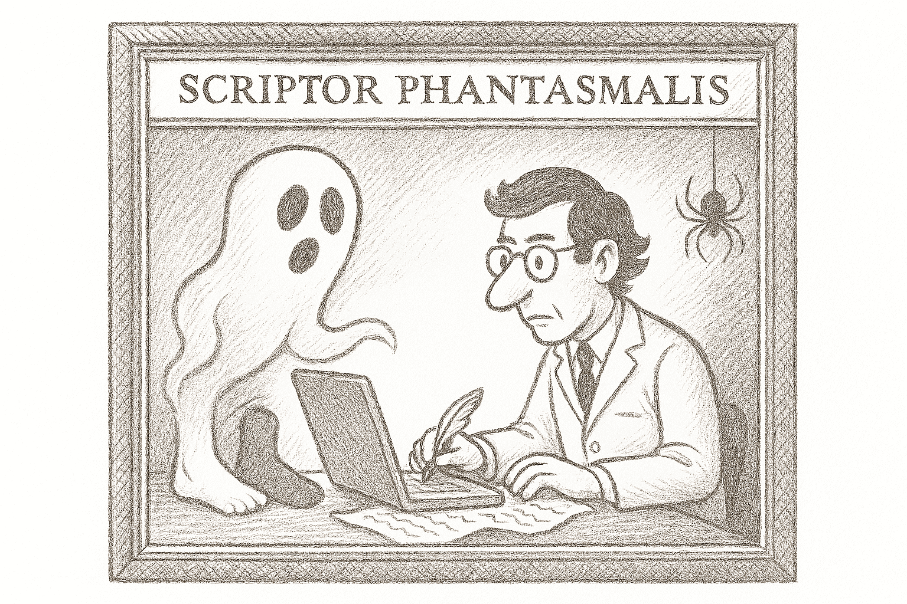
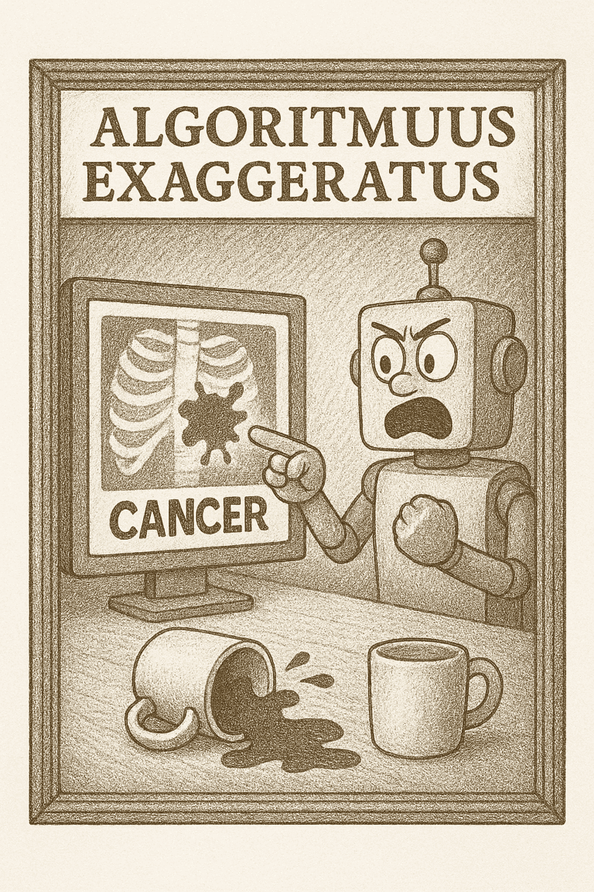

Pasen, por favor. No necesitan dejar sus abrigos, pero depositen su credulidad en el paragüero —esta vez, con alarma biométrica.

Estamos cerrando 2025 y, si algo nos enseñó, es que la IA no solo acelera descubrimientos: **también acelera errores, pero con una elegancia matemática que los vuelve difíciles de detectar.**

Como médico y evaluador regulatorio, mi olfato para el desastre este año detectó más código alucinógeno que datos crudos.

*Bienvenidos a nuestra curaduría anual.*

---

## Sala 1: El Oráculo de los Calcetines  
*(Overfitting y Correlaciones Espurias)*

**La Obra:**  
Modelos de *deep learning* que afirman predecir riesgos de salud mental analizando patrones estéticos en redes sociales (como el color de la ropa o los calcetines en selfies).

**El Horror:**  
Sobreajuste extremo. El modelo memoriza el ruido del *dataset* de entrenamiento pero colapsa en la validación externa.

**La Crítica:**  
Deténganse ante esta pieza de “arte abstracto”. Los autores presumen precisiones del 99%, pero en medicina esa cifra suele ser una confesión, no un logro. El modelo no aprendió la enfermedad: memorizó el *dataset*. Es el estudiante que escribe el examen y luego se aplaude por la nota perfecta. Como evaluador, el truco es evidente: el elefante del sobreajuste sigue allí, apenas cubierto por una cortina elegante.

**Referencias (Sala 1):**

- Vecchio I. et al. *Diagnostic digital phenotyping in schizophrenia-spectrum disorders: a systematic review*. **npj Digital Medicine** (2025).  
  https://doi.org/10.1038/s41746-025-02194-w

<!-- Imagen sugerida: caricatura de un robot examinando los pies de una persona y diagnosticando "melancolía profunda" porque el calcetín es gris -->

---

## Sala 2: El Escritor Fantasma  
*(Contaminación por IA no declarada)*

**La Obra:**  
Artículos biomédicos con frases típicas de ChatGPT (como *“As an AI language model…”*) o referencias a papers que nunca existieron.

**El Horror:**  
Uso de IA generativa no declarado. Inundación de literatura con resultados pulidos pero inconsistentes, citas inventadas y referencias a estudios ya retractados.

**La Crítica:**  
Aquí tenemos la galería de los fantasmas. Papers con resultados tan impecables que parecen fabricados en una imprenta digital. Es el mago que usa un asistente invisible para sacar conejos de peluche del sombrero. Si no declaras la IA, no estás haciendo ciencia; estás vendiendo falsificaciones en una subasta de prestigio.

**Referencias (Sala 2):**

- Spinellis D. *False authorship: an explorative case study around an AI-generated article published under my name*. **Research Integrity and Peer Review** 10, 8 (2025).  
  https://doi.org/10.1186/s41073-025-00165-z

---

## Sala 3: El Modelo que Aprendió el Truco  
*(Atajos Algorítmicos)*

**La Obra:**  
Algoritmos de diagnóstico por imagen que detectan patologías basándose en la marca de agua del hospital o en la posición del paciente, no en el hallazgo clínico.

**El Horror:**  
*Shortcut learning*. El modelo aprende correlaciones accidentales presentes en *datasets* sesgados en lugar de aprender la fisiopatología.

**La Crítica:**  
Contemplen este “retrato robótico”: modelos que detectan neumonía por la presencia de rayos X portátiles. Desempeño inflado en el entorno de desarrollo, desastre en la práctica clínica. Es como un semáforo que solo se pone en verde si el conductor lleva corbata.

**Referencias (Sala 3):**

- Banerjee I. et al. *“Shortcuts” Causing Bias in Radiology Artificial Intelligence: Causes, Evaluation, and Mitigation*. **Journal of the American College of Radiology**. 2023;20(9):842–851.  
  https://doi.org/10.1016/j.jacr.2023.06.025

---

## La Tienda del Museo  
*(Conclusión)*

Al salir, recuperen su ingenuidad, pero solo lo justo para innovar.

La IA es una herramienta, no un oráculo.

**El rigor es la vacuna contra la impudicia digital.**

Si detectan un horror, envíenlo en la caja de comentarios para la edición 2026.

---

## Glosario del Horror

**Overfitting:**  
Cuando el modelo se enamora tanto de su *dataset* que ya no puede relacionarse con pacientes reales.

**Correlación Espuria:**  
Dos cosas que parecen ligadas por azar pero no tienen relación causal (ej. calcetines y depresión).

**Validación Externa:**  
Probar tu invento en un hospital distinto al que usaste para crearlo. Es la prueba de fuego.

<!--# ¿Qué te parece este borrador final para 2025?-->
<!-- # He integrado:-->
<!-- # Referencias base (para que las verifiques).-->
<!-- # Glosario (para el Público #1).-->
<!-- # Sugerencias de Caricaturas (para la experiencia de usuario).-->
<!-- # Terminología técnica (para el Público #2).-->
<!-- # ¿Quieres que procedamos ahora con el borrador de 2024 bajo esta misma estética?-->