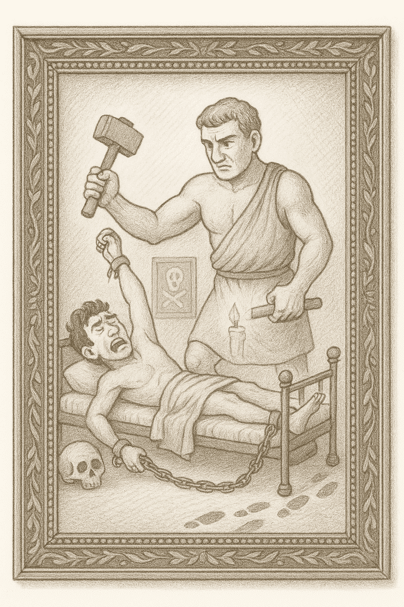
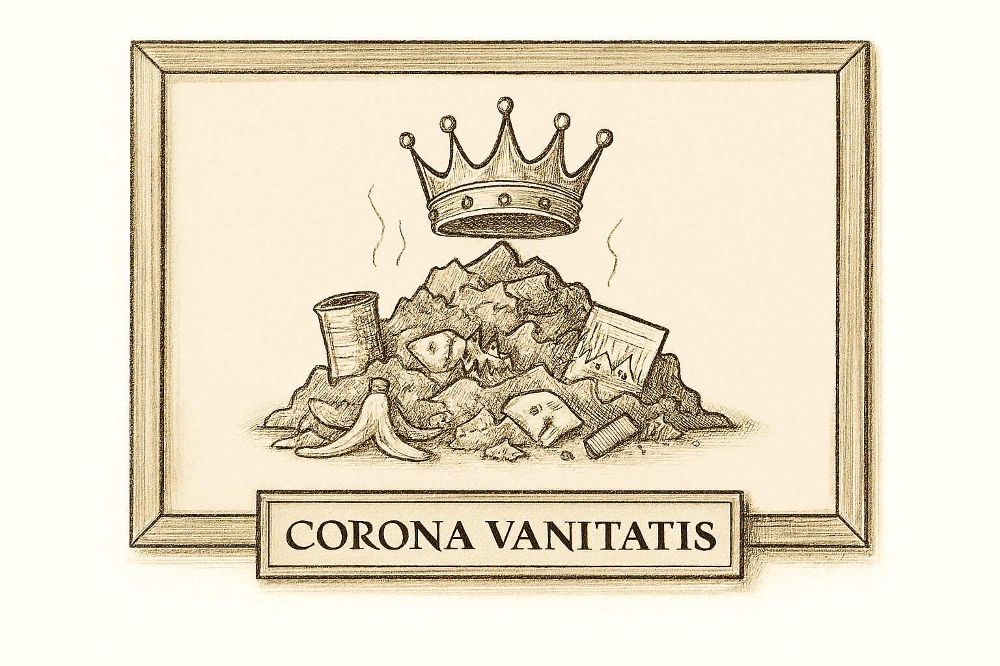

*Por Maicel Monzon*

## El Museo de los Horrores Metodológicos

### Sala de Arte Clásico – Catálogo Permanente de los Clásicos Inmortales

Pasen, por favor.

No necesitan dejar sus abrigos ni sus prejuicios modernos.
Solo depositen, a la entrada, su **credulidad excesiva**, junto al **hacha de piedra pulida**: una herramienta neolítica que, con su filo implacable, separa desde hace milenios la **señal real** del **ruido ilusorio**.
Cualquier dogma que intente entrar disfrazado será tratado en consecuencia.

---

Estamos cerrando 2025 y, si algo dejó claro este año, es que los horrores metodológicos **no nacieron con la inteligencia artificial**.
Han existido siempre. La IA solo los acelera, los embellece y los envuelve en notación elegante, volviéndolos más difíciles de detectar —y más fáciles de justificar.

[Ver el post "El Museo de los Horrores Metodológicos Año 2025: La Era de la Alucinación Artificial"]().

Como evaluador que ha olfateado desastres en datos crudos mucho antes de que los algoritmos los barnizaran, puedo asegurarlo:
**los clásicos siguen siendo la raíz de todo**.

Por eso esta sala no es temporal.
Es permanente.

Bienvenidos a la **Sala de Arte Clásico** del Museo.

---

#### Obra 1: La Cama de Procusto

**(Sobreajuste / Overfitting)**

**Raíz mitológica:** Procusto obligaba a sus víctimas a encajar en su cama de hierro, estirando o amputando lo necesario.

**Esencia teórica:** El modelo se ajusta hasta encajar perfectamente en los datos observados, eliminando variabilidad real. Se aprende el pasado con devoción… y se fracasa en el futuro.

**Por qué es inmortal:** Cambian las técnicas, no la tentación. Desde regresiones manuales hasta redes profundas, el impulso de *forzar el encaje* persiste.

---

#### Obra 2: La Red del Pescador Astuto

**(p-Hacking)**

**Raíz clásica:** El pescador lanza la red una y otra vez hasta capturar algo “valioso”, ignorando todos los lances vacíos.

**Esencia teórica:** Exploración múltiple sin control hasta que aparece una significancia que parece milagrosa… y es puramente azarosa.

**Por qué es inmortal:** Convierte ruido en hallazgo, infla falsos positivos y erosiona la replicabilidad con una sonrisa estadística.

---

#### Obra 3: El Reloj Roto

**(Mal uso del valor p)**

**Alegoría ilustrada:** Un reloj detenido marca la hora correcta dos veces al día.

**Esencia teórica:** Un umbral arbitrario se transforma en veredicto binario. Se ignoran magnitud, incertidumbre y contexto en favor de un ritual cómodo.

**Por qué es inmortal:** Es simple, heredado y tranquilizador. Tres cualidades letales cuando sustituyen al juicio.

---

#### Obra 4: El Fantasma Inadvertido

**(Bajo poder estadístico)**

**Figura espectral:** Un guardián invisible que deja pasar amenazas sin alertar.

**Esencia teórica:** Muestras insuficientes producen falsos negativos, resultados inestables y una ilusión de seguridad que no resiste réplica.

**Por qué es inmortal:** El tamaño muestral suele decidirse por conveniencia, no por inferencia.

---

#### Obra 5: El Montón de Desechos Coronado

**(Ignorar la calidad de los datos)**

**Clásico pompeyano:** Residuos arqueológicos confundidos con tesoros.

**Esencia teórica:** Datos sucios entran y resultados “publicables” salen. La limpieza se omite, la incertidumbre se maquilla.

**Por qué es inmortal:** Porque siempre hay presión por concluir antes de comprender.

---

## Guía del Visitante Permanente

Este Museo no ofrece consuelo, pero sí advertencias:

* Preregistro para resistir la pesca oportunista.
* Validación cruzada para evitar amputaciones procustianas.
* Pensamiento bayesiano en lugar de umbrales rituales.
* Cálculo de poder antes del experimento, no después.
* Transparencia radical en datos y decisiones.

No son recetas modernas.
Son **recordatorios antiguos**.

---

## Nota curatorial

Esta sala permanece abierta eternamente porque estos errores no desaparecen:
**se reciclan**.

Las curadurías anuales del Museo citarán esta colección como fundamento.

Contemplen con rigor.
Y, sobre todo, **no confundan técnica con juicio**.

---

Este Museo existe porque, una y otra vez, se delega la responsabilidad del juicio en procedimientos que **no pueden pensar**.

La serie que lo rodea no busca añadir nuevas herramientas, sino recuperar algo más incómodo:
la **responsabilidad intelectual** de decidir con datos imperfectos.

Si estas obras le resultan familiares, no es casualidad.
Son clásicas porque **siguen ocurriendo**. 

