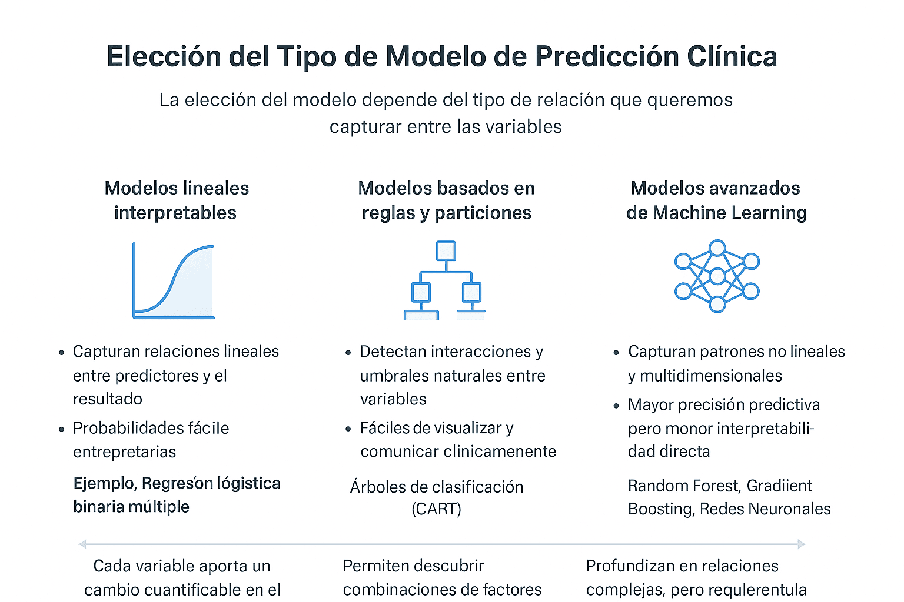

🎧 **Escucha el podcast de esta publicación**



Si usted es un investigador en salud, estudiante de posgrado, maestría o doctorado en el campo de las ciencias biomédicas, y quiere enfocar su trabajo en el desarrollo de **modelos de predicción clínica** para el **diagnóstico** o el **pronóstico**, es probable que haya llegado a la fase donde la metodología se vuelve un muro. No conoce qué pasos seguir, qué software utilizar o, después de meses de trabajo, existen dudas sobre su utilidad en contextos diferentes a los que fue creado.

Hoy en día, muchas tesis de alto nivel giran en torno a la creación de modelos de predicción clínica (usando técnicas de regresiones avanzadas  o Machine Learning).

Este post es su traductor metodológico y un tutorial. Muestro algunos consejos sobre cómo hacer un modelo predictivo y algunas experiencias que yo mismo pasé en mi tesis de doctorado.

Olvídese del código críptico y céntrese en la lógica: vamos a desglosar los siete pasos cruciales del método Steyerberg para que su modelo predictivo sea robusto, confiable y publicable. Deje de sentir dolor con la estadística; convierta su modelo en una herramienta clínica útil.

# Estrategia de modelado

Contar con una estrategia de modelado correcta es esencial para desarrollar y validar modelos de predicción. En este artículo, exploraremos las siete etapas clave del proceso de modelado propuesto por Ewout Steyerberg en su artículo (1).

## 1. Definición del problema e inspección de datos {#sec-1}

El primer paso en cualquier proyecto de modelado es **definir claramente el problema de investigación** y seleccionar la **variable de resultado** adecuada.

{}
### Variable de resultado
La **variable de resultado** debe definirse con precisión: especifica **qué evento se predice**, **cómo y cuándo se mide**, y el **horizonte temporal de predicción** (por ejemplo, mortalidad a 30 días). Indica además el método de evaluación y si hubo **cegamiento** respecto a los predictores, para garantizar coherencia y validez del modelo.
{}

Durante esta fase, también realizamos un análisis exploratorio de datos (EDA) para comprender las características de las variables y detectar posibles problemas, como **datos atípicos** o **valores faltantes**.


``` r
# Realiza una descripción general del conjunto de datos
# Instala y Carga de Librerías útiles 
library(caret)
library(MLDataR) # para utilizar la biblioteca diabetes_data
library(dplyr)
library(dlookr) # para EDA
library(predtools)
# Cargar el conjunto de datos
data("gusto")
gusto <- gusto
# EDA
descripcion <- overview(gusto)
summary(descripcion) # descripción general del conjunto de datos
```

<!-- Para conocer más detalles sobre el proceso de ¨Exploratory Data Analysis (EDA)¨ [ver la publicación dedicada a este tema](es/post/2025-02-11-eda/_index.Rmd) -->

## 2. Codificación de las variables predictoras {#sec-2}

La **codificación** adecuada de las **variables predictoras** es fundamental para construir modelos robustos.

Es probable que debas utilizar técnicas como la agrupación de categorías poco frecuentes y la creación de predictores resúmenes para simplificar información correlacionada. Además, cuando las relaciones entre variables no son lineales, aplicamos herramientas como **splines cúbicos restringidos** , que permiten capturar patrones complejos sin comprometer la precisión del modelo.

Dicotomizar predictores cuantitativos (por ejemplo, transformar una variable continua como la edad o la presión arterial en una variable binaria, como “≥65 años = 1” y “\<65 = 0”) es considerada una mala práctica metodológica.

## 3 .Especificación del tipo de modelo {#sec-3}

La elección del modelo depende del tipo de relación que queremos capturar entre las variables.




Un aspecto clave es la selección de predictores finales para lo que se emplean varios métodos. Sin embargo, la aplicación mecánica de métodos algorítmicos tradicionales, como la Regresión Paso a Paso (RPP), ha demostrado ser inconsistente y poco robusta, especialmente en el contexto de las aplicaciones biomédicas y sociales.


## 4. Estimación del Modelo {#sec-4}

El paso de estimación del modelo es un componente central del desarrollo de modelos predictivos, orientado a obtener los parámetros o estructuras que mejor expliquen los datos de entrenamiento. Su propósito es equilibrar el ajuste al conjunto de datos con la capacidad del modelo para generalizar a nuevas observaciones.

La regularización es una estrategia clave dentro de este proceso, diseñada para reducir el sobreajuste (overfitting) mediante la introducción controlada de sesgo que estabiliza las predicciones.

Modelos paramétricos (p. ej., regresión): emplean técnicas de contracción o shrinkage (como LASSO o Ridge regression) que aplican una penalización sobre los coeficientes estimados —basados en máxima verosimilitud penalizada—, reduciendo la varianza y evitando predicciones extremas.

Modelos de machine learning (p. ej., XGBoost, SVM, Random Forest): utilizan la optimización de hiperparámetros (como la tasa de aprendizaje, el parámetro C o la profundidad de los árboles) para controlar la complejidad del modelo. Estos ajustes inducen un sesgo controlado que mejora la validez externa y la estabilidad predictiva frente a nuevos datos.

En conjunto, la estimación y la regularización contribuyen a lograr un modelo más robusto y generalizable, especialmente cuando se combinan con una validación interna adecuada (como cross-validation o bootstrap).


## 5. Evaluación del Rendimiento del Modelo {#sec-5}

El rendimiento del modelo se evalúa mediante métricas como calibración y discriminación . La calibración mide la concordancia entre las predicciones y los resultados observados, mientras que la discriminación evalúa la capacidad del modelo para distinguir entre pacientes con diferentes resultados. Herramientas como las rectas de calibración y la validación cruzada de 10 pliegues fueron fundamentales para asegurar la calidad del modelo.

## 6. Evaluación de la Validez del Modelo {#sec-6}

La validación del modelo es un paso crítico para garantizar su aplicabilidad en diferentes contextos. En este estudio, utilizamos tanto validación interna como externa , empleando particiones temporales y geográficas para reflejar escenarios reales. Este enfoque nos permitió evaluar la robustez del modelo frente a cambios en el tiempo y variaciones regionales.

## 7. Presentación del modelo {#sec-7}

La presentación efectiva es crucial para la adopción clínica. Un modelo perfecto es inútil si los médicos no pueden interpretarlo fácilmente. Considera:

- **Nomogramas**: Ideales para uso rápido en consulta
- **Aplicaciones web/móviles**: Para integración en flujos de trabajo clínicos
- **Puntuaciones de riesgo**: Simplificadas para triaje rápido
- **Documentación clara**: Incluyendo limitaciones y casos de uso

Recuerda: la transparencia en la presentación favorece la confianza clínica.


¿Has aplicado estas técnicas en tus proyectos de Machine Learning? ¿Qué estrategias usas para entrenar y validar tus modelos? Déjame tus comentarios 💬: comparte tus experiencias, dificultades o tips contigo. ¡Juntos podemos enriquecer este conocimiento!

# Bibliografía

1.  Steyerberg EW, Vergouwe Y. Towards better clinical prediction models: seven steps for development and an ABCD for validation. European Heart Journal [Internet]. 1 de agosto de 2014 [citado 9 de mayo de 2021];35(29):1925-31. Disponible en: <https://academic.oup.com/eurheartj/article-lookup/doi/10.1093/eurheartj/ehu207>


