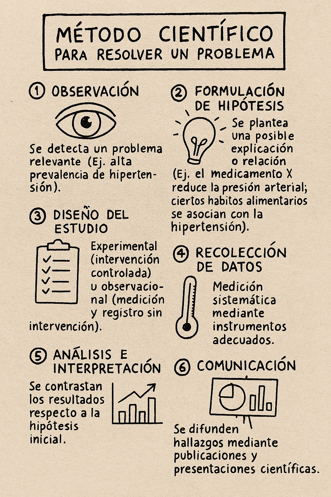
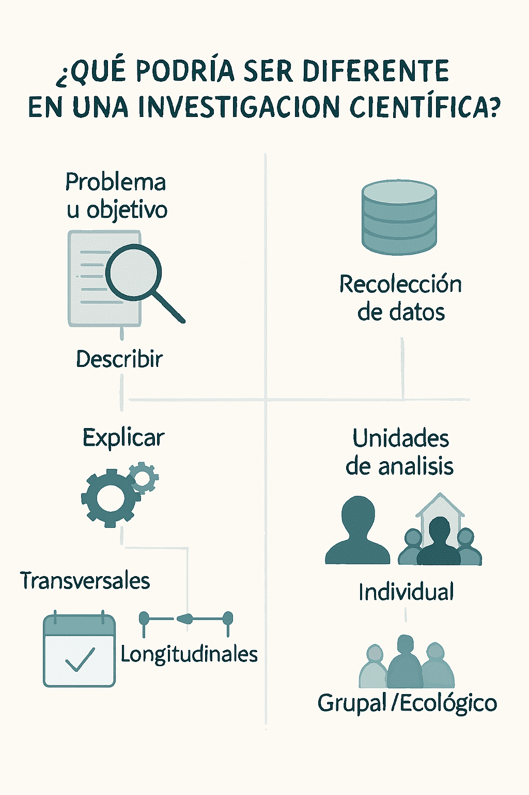
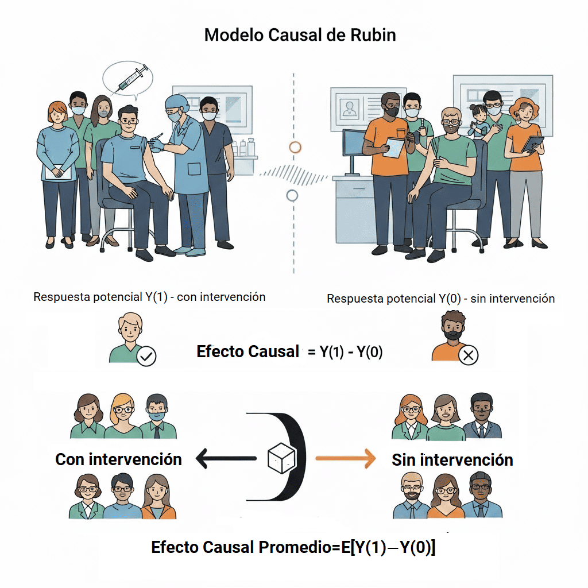
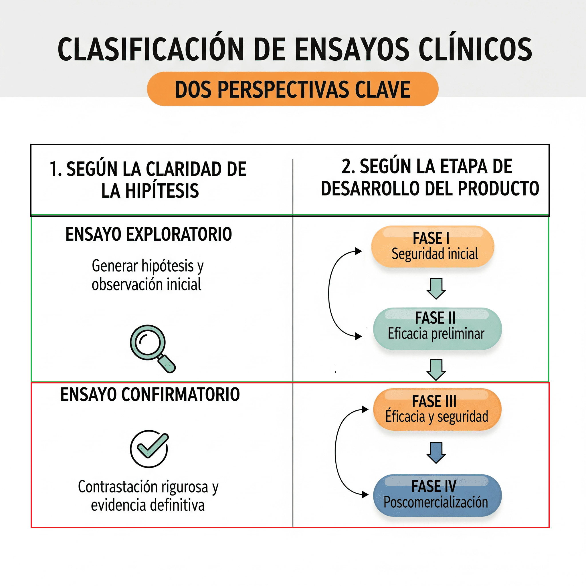
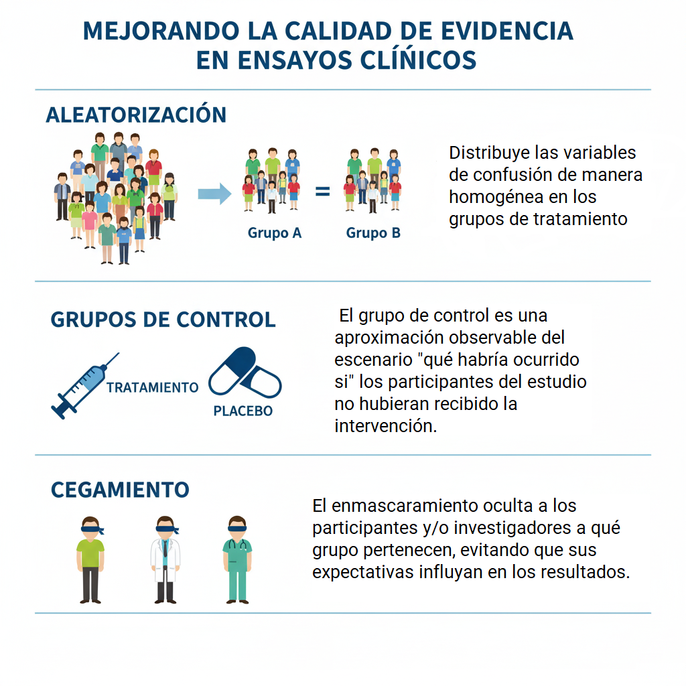
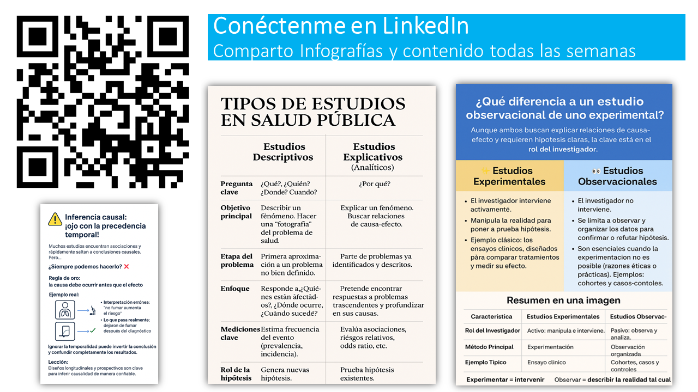
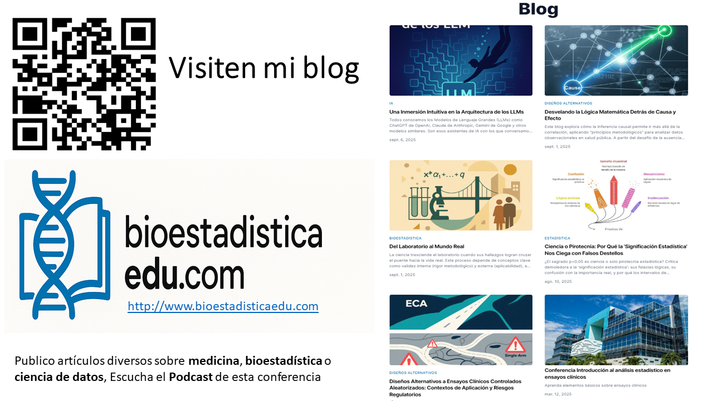

Sumario

- **Características generales** de las investigaciones experimentales

- El estudio causal, el dilema de los **sesgos**.

- **Diseños más comunes** a nivel individual y por conglomerados

  - Ensayos clínicos

  - Ensayos comunitarios

---

Diálogo infantil (motivación)

En un pequeño banco, Sofía, con las manos en el móvil, habla a Mateo, que está sentado a su lado (mirando el suyo).

---

---

---

---

Pregunta 1:

Existe una lógica similar en las investigaciones empíricas?

---

 Sí, existe una lógica operativa similar y fundamental que guía todas las investigaciones empíricas, más allá de sus diferencias específicas.

---

Todos las invetigaciones comparten el método científico, un sistema de pasos universales para investigar problemas de forma rigurosa, 

---

Exiten similitudes entre un estudio experimental y observacional. (Ejemplo)

| Etapa/Aspecto        | Estudio 1                              | Estudio 2                                  |
|----------------------|----------------------------------------|--------------------------------------------|
| Problema             | ¿Funciona el medicamento X?            | ¿Qué hábitos se asocian a hipertensión?    |
| Hipótesis            | El medicamento reduce la presión       | Cierta dieta se relaciona con hipertensión |
| Diseño               | Intervención, grupo control            | Observación en entorno natural             |
| Recolección de datos | Ensayo, medidas pre y post tratamiento | Encuestas y registros sin manipulación     |
| Análisis             | Comparación causal                     | Relación descriptiva/correlacional         |

---

Por tanto, todas las investigaciones tienen algo en común (Punto)

*"Un conjunto de acciones planificadas que se emprenden con la finalidad de resolver, total o parcialmente, un problema científico determinado"*

Definición de investigación científica (Rosa Jimenes, Metodología de la Investigación)

---

Pregunta 2:

Qué podría ser diferente en una investigación ?

---

Las decisiones metodológicas que un investigador debe tomar para adaptar el método científico a su problema de investigación pueden ser distintas.

---

Clasificación de las investigaciones científicas

| **Eje**                         | **Clasificación propuesta**                                                                                                                                                      |
|---------------------------------|----------------------------------------------------------------------------------------------------------------------------------------------------------------------------------|
| **Objetivo**                    | **Descriptivos**: muestran cómo es la realidad (qué, cómo, cuánto). **Explicativos**: buscan entender **por qué ocurre** y sus **mecanismos causales**.                        |
| **Temporalidad**                | **Transversales**: observación en un solo momento. **Longitudinales**: seguimiento en el tiempo (prospectivos, retrospectivos, históricos).                                    |
| **Unidad de análisis**          | **Individuales**: persona como unidad. **Ecológicos**: grupos/poblaciones. *(opcional: Multinivel, combinación de ambos)*.                                                      |
| **Manipulación (explicativos)** | **Observacionales**: el investigador no interviene. **Experimentales**: el investigador interviene. **Cuasi-experimentales**: intervención sin asignación aleatoria.            |

---

Clasificación (investigación científica): Estado del conocimiento y alcance de los resultados

-   **Estudios descriptivos:** Describen una realidad

-   **Estudios explicativos o analítico:** Explican una realidad **relaciones causa - efecto**

---

Clasificación (investigación explicativa o analíticas): Manipulación del objeto de estudio

-   **Estudios Observacionales:** -\> El investigador no interviene, observa y analiza lo que ocurre (casos y controles, Cohorte).

-   **Estudios Experimentales:** El investigador **manipula el objeto de estudio** (hay una la intervención) para evaluar su efecto.

---

Pregunta 3

"¿Cómo logran los estudios experimentales establecer causalidad y cuál es el fundamento teórico para medirla?"

-   El investigador manipula el objeto de estudio (intervención) para determinar un efecto causal.

-   Se puede usar el enfoque de Respuestas Potenciales para definir y cuantificar un "Efecto causal'

---

Pregunta 4

Qué es el efecto causal?

Cada unidad (individuo o comunidad) tiene dos resultados posibles:

-   Con intervención Y(1)

-   Sin intervención Y(0)

Efecto causal = diferencia entre ambos resultados potenciales.

---

Ejemplo 2

---

Pregunta 3

¿Bajo el marco de resultados potenciales, cómo se determina si una intervención (X) es causa de un resultado (Y)?

Existe causa si esa diferencia es distinta de cero (individual o en promedio)

$$0 \neq Y_i(0) - Y_i(1)$$

---

Cuándo nuestra medición de esa diferencia no coincide con la diferencia real?

El sesgo (en estimación causal) es la diferencia entre el valor esperado de nuestro estimador y el verdadero valor del parámetro causal (el ATE).

Definición matemática:

$$\text{Sesgo} = \mathbb{E}[\widehat{\text{ATE}}] - \text{ATE}$$

---

Porqué la medición de esa diferencia no coincide con la diferencia real?

1.  **Grupos No Comparables (El problema más común)** : *Ej. Si el grupo que recibe el tratamiento es más joven/sano que el grupo de control*

2.  **Variables Ocultas (Factores de confusión)** : *Ej. Estudiar si el café causa cáncer, pero no controlas por fumadores*

3.  **Mecanismos de Selección** : *Ej. Si solo mides a quienes completan el estudio (y los que abandonan son diferentes)*

---

La Ecuación Clave

**Lo que observas = Efecto causal real + Sesgo**

---

Sesgo

-   El sesgo es **siempre desconocido**, porque se desconoce uno de los términos, y por el llamado **argumento del contrafactual** (es imposible comparar en idénticas circunstancias contra lo que no se hizo).

-   Lo que se busca en la investigación es identificar y **minimizar el sesgo**

---

Tipos de sesgo

| **Tipos de sesgo** | **Descripción**                                                                           | **Ejemplos**                                                   |
|--------------------|-------------------------------------------------------------------------------------------|----------------------------------------------------------------|
| **Selección**      | Desviación del **efecto causal** en la población debido a la selección.                   | Diferencias entre instituciones, formas clínicas, etc.         |
| **Confusión**      | Influencia de variables claves que distorsionan la relación entre exposición y resultado. | Modificadores de efecto (tratamientos diferenciales).          |
| **Información**    | Errores en la medición que afectan la validez de los resultados.                          | Datos inconsistentes, valores aberrantes, falta de datos, etc. |

---

Resumen parcial

-   Los estudios pueden ser **descriptivos** o **investigaciones explicativas**.

-   Las **investigaciones explicativas** se clasifican en **observacionales** o **experimentales**

---

Pregunta 3:

Cómo se clasifican las **investigaciones explicativas experimentales** ?

---

-   Existen, varias clasificaciones, sin embargo, una taxonomía rígida es difícil porque muchas clasificaciones usan como ejes de clasificación métodos para mitigar el sesgo.

---

-   Los métodos se pueden aplicar simultáneamente, lo que dificulta las clasificación por solapamiento en los distintos diseños.

-   Por ejemplo, en el contexto de los ensayos clínicos las clasificaciones tienen fines más operativos (establecer la etapa de desarrollo, fines regulatorios, etc)

---

Ejemplo 3

La Aleatorización puede estar en cualquier etapa de un ensayo clínico

---

Existen múltiples ejes de clasificación de las **investigaciones explicativas experimentales**, Sin embargo, resulta más útil identificar dónde encaja cada método o diseño y saber por qué se usan

---

Ejes de clasificación

-   Asignación aleatoria a grupos de intervención: Aleatoriado / No aleatorizado

-   Controlado: Controlado / No controlados

-   Enmascaramiento: sin enmascaramiento / simple ciego / doble ciego / triple ciego

-   Diseño: Clásico / Adaptativos

---

 Los ensayos clínicos confirmatorios compartes atributos que le confieren contrastación rigurosa

---

Simplificando:

Agrupación según el numero de unidades de análisis a medir y el contexto:

-   Estudios a nivel individual (nivel individual contextos médicos/hospitalarios):

-   Estudios a nivel de grupos (contexto comunidad):

---

Definción 5: Ensayos Comunitarios

Estudios donde la intervención se aplica a una comunidad completa o conglomerado, con el objetivo de medir el efecto en la salud colectiva.

---

Tipos de Ensayos Comunitarios

1.  Ensayo de Intervención por Conglomerados (Cluster Randomized Trial):

2.  Ensayo con Diseño de series temporales interrumpidas

3.  Ensayo de intervención escalonada (Stepped Wedge Trial):

---

Estudios experimentales (nivel individual)

---

Defincion 5: Ensayos clinicos

Ensayo Clínico es cualquier forma de experimento planificado que involucra pacientes y se diseña con el fin de determinar el tratamiento más apropiado para futuros pacientes con una condición patológica dada.

*Pocock*

---

Características esenciales de un Ensayo Clínico

-   el investigador introduce una Intervención deliberada intervención (carácter experimental).

-   La Intervención incluye personas (pacientes)

-   Busca estudiar una relación causa-efecto (eficacia y seguridad)

---

Comparación

---

Los ensayos clínicos aleatorizados (ECA) son la mejor herramienta para establecer causalidad, y las guías **ICH** los reconocen como el estándar global. Logran esto a través de:

1)  Asignación aleatoria

2)  Comparación concurrente

3)  Evaluación objetiva y cegamiento

---

Principios Éticos y Regulatorios de la Investigación

Los principios éticos y regulatorios que tenemos hoy son una consecuencia directa de investigaciones experimentales que fueron éticamente catastróficas.

---

Ejemplo: Estudio de Sífilis de Tuskegee, 1932 - 1972, 600 personas afectadas

"La explotación sin consentimiento forjó nuestra demanda de Justicia y Autonomía."

---

Ejemplo: Talidomida. 10,000 a 20,000 bebés con malformaciones, abortos espontáneos y muertes neonatales.

"La prisa sin pruebas nos enseñó el costo brutal de ignorar la Seguridad."

---

Ejemplo: Ivermectina en la Covid-19 : reportes de miles de casos de eventos adversos (ej. toxicidad hepática, interacciones medicamentosas)

"La desinformación en crisis reafirmó la Primacía del Paciente y el Rigor Científico."

---

Principios Éticos y Regulatorios de la Investigación

Los principios éticos surgen de la necesidad de proteger a los participantes, como evidencian casos históricos.

Se basan en el **Informe Belmont** (Respeto, Beneficencia, Justicia) y se formalizan en:

-   **Declaración de Helsinki**

-   **Guía ICH E6(R2) de Buenas Prácticas Clínicas (GCP)**.

---

Los estudios experimentales hoy

Ensayos clínicos → alta sofisticación (plataformas, adaptativos, biomarcadores).

Ensayos comunitarios → esenciales para evaluar políticas y programas, pero con desafíos logísticos y metodológicos.

---

Tendencias que transforman los diseños experimentales

Digitalización → estudios que se pueden hacer desde casa (apps, relojes inteligentes, teleconsultas).

Inteligencia Artificial → ayuda a elegir mejor a los participantes y analizar datos más rápido.

---

Tendencias que transforman los diseños experimentales

Evidencia del “mundo real” → usamos también la información de hospitales y registros, no solo de ensayos muy controlados.

Diseños más prácticos → combinamos investigación con la aplicación en la vida diaria (ej. probar un tratamiento mientras se mide cómo se implementa en clínicas o comunidades).

---

No solo innovación, también responsabilidad

Transparencia en IA y algoritmos.

Inclusión de poblaciones diversas (no dejar atrás a quienes no acceden a lo digital).

Participación comunitaria en ensayos poblacionales. Visual sugerido: una balanza ⚖️ (innovación ↔ equidad).

---

El futuro de los ensayos experimentales: una agenda compartida

Individual → medicina personalizada y digital.

Poblacional → políticas basadas en evidencia, escalables y justas.

Tarea común → mantener el rigor científico, la ética y la relevancia social.

---

Pensamiento final

“Los diseños experimentales seguirán siendo el estándar para establecer causalidad. Nuestro desafío es que, en cada nivel —del paciente individual a la comunidad entera—, la ciencia sea más inclusiva, más innovadora y más útil para transformar la salud.”

---

Bibliografía

Campbell MK, Piaggio G, Elbourne DR, Altman DG; for the CONSORT Group. CONSORT 2010 statement: extension to cluster randomised trials. BMJ. 2012. (Guía de reporte; lectura obligada para entender transparencia en cRCTs). BMJ

Metodología de la investigación. Elementos básicos para la investigación clínica, Rosa Jimenes Peneque, 1ed, ECIMED

Hemming K., et al. Key considerations for designing, conducting and reporting cluster randomized trials (revisión y guía práctica, 2023). Útil para ICC, poder y análisis. PMC

---

Muchas Gracias

---

Más contenido

---

Más contenido

