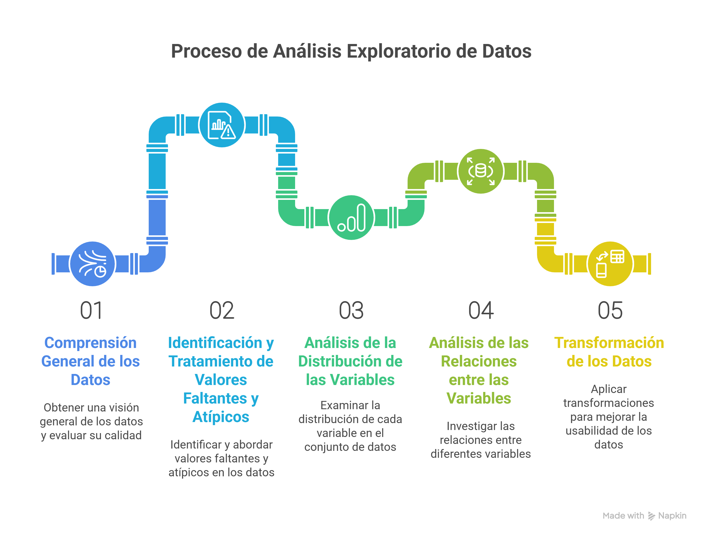

El **Análisis Exploratorio de Datos (EDA)** es una disciplina fundamental en el campo de la ciencia de datos, popularizada por el matemático John Tukey. Más que una simple serie de pasos, el EDA es una filosofía que nos invita a interactuar con nuestros datos, visualizarlos, resumirlos y "hablar" con ellos antes de saltar a modelados complejos. Implica el análisis de datos centrado en comprender a fondo su estructura, identificar patrones ocultos, detectar anomalías (valores atípicos), gestionar datos ausentes y, en última instancia, proporcionar una base sólida para la formulación de modelos predictivos o inferenciales. Además, es crucial para descubrir cómo se relacionan las variables entre sí.

## La Regla de Oro: GIGO (Garbage In, Garbage Out)

Un concepto popular y vital en el campo de la ciencia de datos es **GIGO** (Garbage In, Garbage Out, o "Basura entra, basura sale"). Este concepto subraya que la calidad de los resultados de cualquier análisis o modelo es directamente proporcional a la calidad de los datos de entrada. No importa cuán sofisticado sea tu algoritmo o cuán potente sea tu infraestructura computacional, los datos de mala calidad siempre producirán resultados deficientes, engañosos o inútiles. El EDA es nuestra primera línea de defensa contra el GIGO, asegurando que trabajamos con datos limpios y comprensibles.

## Un Flujo de Trabajo Práctico de EDA

Aunque el EDA es un proceso iterativo y no una "camisa de fuerza" rígida, es útil seguir un flujo de trabajo estructurado para garantizar que cubrimos los aspectos más importantes. El orden de las etapas y el énfasis en cada una dependerán en gran medida del problema específico, el tipo de datos y los objetivos del análisis.

Este proceso general incluye:




A continuación, profundicemos en cada una de estas etapas, utilizando ejemplos prácticos con el paquete `dlookr` en R.


### 1. Comprensión General de los Datos y Evaluación de su Calidad

Antes de sumergirnos en análisis profundos, es fundamental tener una visión panorámica de nuestro conjunto de datos. Esta etapa implica:

-   **Dimensiones del dataset:** ¿Cuántas filas (observaciones) y columnas (variables) tenemos?

-   **Tipos de datos:** ¿Las variables son numéricas (enteros, flotantes), categóricas (factores, caracteres), lógicas o de fecha/hora? Es crucial que los tipos de datos sean correctos para las operaciones que deseamos realizar.

-   **Inspección inicial:** Revisar las primeras y últimas filas del dataset para obtener una idea general del formato y contenido.

-   **Estadísticas descriptivas básicas:** Para variables numéricas: media, mediana, desviación estándar, mínimo, máximo, cuartiles. Para variables categóricas: conteo de ocurrencias, proporciones. Esto nos da una primera impresión de la dispersión y centralidad de los datos.

Con `dlookr`, la función `diagnose()` es ideal para una revisión rápida de la calidad de los datos, mostrando el tipo de variable, el número de valores únicos, valores faltantes, valores cero y valores negativos.


``` r
# Para obtener un resumen rápido de las características de los datos
diagnose(mtcars_na)
```


Esta fase nos ayuda a formar una primera hipótesis sobre la calidad y estructura de los datos, identificando posibles problemas desde el principio.

#### 2. Identificación y Tratamiento de Valores Faltantes y Atípicos

Los valores faltantes (NA, NaN, null) y los valores atípicos (outliers) son dos de los desafíos más comunes en cualquier conjunto de datos y pueden distorsionar significativamente los resultados de nuestros análisis y modelos.

**Valores Faltantes:**

-   **Identificación:** Cuantificar la cantidad y proporción de valores faltantes por variable. Visualizar patrones de ausencia (¿los valores faltantes ocurren aleatoriamente o hay un patrón?).

-   **Tratamiento:**

  - **Eliminación:** Si la cantidad de valores faltantes es pequeña o si una variable tiene un porcentaje muy alto de NAs, se pueden eliminar filas o columnas.

  - **Imputación:** Rellenar los valores faltantes. Métodos comunes incluyen la media, mediana o moda (para datos numéricos y categóricos, respectivamente), o métodos más avanzados basados en modelos (regresión, k-NN, etc.). La elección depende de la naturaleza de los datos y el problema.

**Valores Atípicos:**

-   **Identificación:** Observaciones que se desvían significativamente del resto de los datos. Se pueden detectar mediante gráficos de caja (boxplots), diagramas de dispersión, puntuaciones Z, el método IQR (rango intercuartílico) o algoritmos más sofisticados.

-   **Tratamiento:**

  -  **Eliminación:** Si se confirma que son errores de entrada de datos.

  -   **Transformación:** Aplicar transformaciones logarítmicas o de raíz cuadrada para reducir su impacto.

  -   **Capping/Flooring:** Limitar los valores atípicos a un percentil superior o inferior (por ejemplo, el 99% o el 1%).

  -   **Mantener:** A veces, los valores atípicos son observaciones genuinas e importantes que no deben eliminarse.
  
`dlookr` ofrece funciones visuales y programáticas para abordar estos problemas:


``` r
# Visualizar la distribución de valores faltantes
plot_na(mtcars_na)

# Identificar valores atípicos para una variable específica (ej. "hp")
# plot_outlier() es excelente para visualizar.
plot_outlier(mtcars_df, "hp")
```
  

### 3. Análisis de la Distribución de las Variables

Comprender la distribución de cada variable individualmente es clave para seleccionar los métodos estadísticos y de modelado adecuados.

**Variables Numéricas:**

-   **Histogramas y gráficos de densidad:** Permiten visualizar la forma de la distribución, identificar asimetrías (skewness), curtosis, y la presencia de múltiples modos.
-   **Medidas de asimetría y curtosis:** Cuantifican la forma de la distribución.
-   **Pruebas de normalidad:** Aunque muchas veces no son estrictamente necesarias, pueden complementar el análisis visual.

**Variables Categóricas:** - **Gráficos de barras:** Muestran la frecuencia o proporción de cada categoría. - **Tablas de frecuencia:** Resumen el conteo y porcentaje de cada nivel.

`dlookr` simplifica la visualización de distribuciones:


``` r
# Visualizar la distribución de una variable numérica (ej. "mpg")
plot_hist(mtcars_df, "mpg")

# O ver la distribución y normalidad
plot_normality(mtcars_df, "mpg")

# Para variables categóricas (como 'cyl' en mtcars que es numérica discreta)
# Podemos convertirla a factor para un análisis categórico.
mtcars_factor_cyl <- mtcars_df %>% mutate(cyl = as.factor(cyl))
plot_bar(mtcars_factor_cyl, "cyl")
```


Este análisis nos ayuda a entender el comportamiento de cada característica y a identificar la necesidad de transformaciones futuras.

### 4. Análisis de las Relaciones entre las Variables

Esta etapa se centra en descubrir cómo las variables interactúan entre sí. Es fundamental para la selección de características, la identificación de multicolinealidad y la comprensión de la causalidad (o correlación).

-   **Dos variables numéricas:**

  -   **Diagramas de dispersión (scatter plots):** Visualizan la dirección y fuerza de la relación (positiva, negativa, nula, no lineal).
  -   **Coeficientes de correlación (Pearson, Spearman):** Cuantifican la fuerza y dirección de la relación lineal (Pearson) o monótona (Spearman).

-   **Una variable numérica y una categórica:**

  -   **Gráficos de caja (boxplots) o gráficos de violín:** Comparan la distribución de la variable numérica entre las diferentes categorías.
  -   **Pruebas t de Student o ANOVA:** Para determinar si hay diferencias estadísticamente significativas en las medias.

-   **Dos variables categóricas:**

  -   **Tablas de contingencia y gráficos de barras apiladas/agrupadas:** Muestran la distribución conjunta.
  -   **Pruebas de significación:** Para evaluar la independencia entre las variables.
  -   **Matrices de correlación:** Visualizan las correlaciones entre múltiples variables numéricas simultáneamente, a menudo con mapas de calor (heatmaps).
  
`dlookr` facilita la exploración de relaciones:


``` r
# Visualizar la matriz de correlación entre todas las variables numéricas
plot_cor(mtcars_df)

# Analizar la relación entre una variable objetivo ('mpg') y otra característica ('wt')
# plot_eda() permite explorar diversas relaciones bivariadas.
plot_eda(mtcars_df, target = "mpg", feature = "wt") # Numérica vs Numérica (scatterplot)

# Relación entre 'mpg' (numérica) y 'cyl' (considerada categórica aquí)
plot_eda(mtcars_df, target = "mpg", feature = "cyl") # Numérica vs Categórica (boxplot)
```

### 5. Transformación de los Datos

Una vez que hemos comprendido nuestros datos, es posible que necesitemos transformarlos para que sean más adecuados para los algoritmos de machine learning o para mejorar el rendimiento del modelo.

-   **Manejo de asimetría:**

  -   **Transformaciones logarítmicas, de raíz cuadrada o de Box-Cox:** Pueden normalizar distribuciones sesgadas, reduciendo la influencia de valores extremos.

-   **Escalado de características:**

  -   **Normalización (Min-Max Scaling):** Escala los datos a un rango fijo (por ejemplo, [0, 1]). Útil para algoritmos sensibles a la escala como SVM o redes neuronales.

-   **Estandarización (Z-score Scaling):** Transforma los datos para que tengan una media de 0 y una desviación estándar de 1. Es común en algoritmos basados en distancia (k-NN, K-Means, PCA).

-   **Codificación de variables categóricas:**

-   **One-Hot Encoding:** Convierte variables categóricas en múltiples columnas binarias, una por cada categoría. Esencial para algoritmos que solo trabajan con entradas numéricas.

-   **Label Encoding:** Asigna un número entero a cada categoría. Útil si hay un orden inherente en las categorías.

-   **Ingeniería de Características (Feature Engineering):** Crear nuevas variables a partir de las existentes. Esto puede ser tan simple como combinar dos columnas o tan complejo como extraer información de texto o imágenes. Esta etapa es a menudo la que más impacto tiene en el rendimiento del modelo.


`dlookr` ofrece funciones útiles para la transformación de datos:


``` r
# Transformación logarítmica para reducir la asimetría de una variable
mtcars_transformed_log <- transform_df(mtcars_df, mpg = log(mpg))
# Compara la distribución de mpg original vs. transformada
plot_normality(mtcars_df, "mpg")
plot_normality(mtcars_transformed_log, "mpg")

# Binarización o discretización de una variable continua (ej. 'hp' en 3 bins)
mtcars_binned <- binning(mtcars_df, "hp", n = 3)
head(mtcars_binned %>% select(hp, hp_Binned))

# Estandarización de variables numéricas (Z-score)
mtcars_scaled <- normalize(mtcars_df, method = "scale")
head(mtcars_scaled) # Observa cómo los valores de todas las columnas han cambiado
```


## Herramientas Populares para EDA

Para realizar un EDA efectivo, contamos con potentes herramientas en lenguajes como R y Python:

-   **En R:**
    -   El ecosistema `tidyverse` (`dplyr` para manipulación, `ggplot2` para visualización) es indispensable.
    -   Paquetes específicos para EDA como **`dlookr`**, es excelente por su enfoque estructurado en el diagnóstico de calidad, exploración y transformación de datos, ofreciendo funciones y reportes automatizados que agilizan el proceso. Otros paquetes útiles incluyen `DataExplorer`, `skimr`, y `visdat`.
-   **En Python:**
    -   `pandas` para manipulación de datos.
    -   `matplotlib` y `seaborn` para visualización estática.
    -   `plotly` para visualizaciones interactivas.
    -   Bibliotecas como `missingno` para visualizar valores faltantes, `pandas_profiling` para informes automáticos de EDA, y `sweetviz` para comparaciones.

## Conclusión

El Análisis Exploratorio de Datos no es solo una fase inicial, sino un proceso continuo de aprendizaje sobre tus datos. Es una inversión de tiempo que rinde grandes dividendos, ya que una comprensión profunda de los datos nos permite tomar decisiones más informadas, construir modelos más robustos y, en última instancia, extraer conocimientos más valiosos. Al dominar el EDA, te equipas con la habilidad de transformar datos brutos en una historia coherente y accionable, evitando la trampa del GIGO y asegurando que tus esfuerzos de ciencia de datos generen un impacto real.
