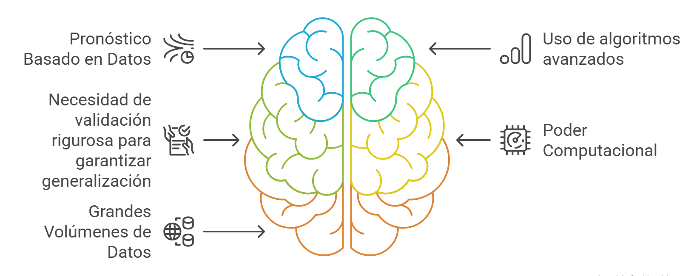

```{r setup, include=FALSE}
# Opciones globales para los chunks de código
knitr::opts_chunk$set(
  echo = TRUE,       # Muestra el código
  message = FALSE,   # Oculta mensajes de paquetes
  warning = FALSE,   # Oculta advertencias
  fig.align = 'center', # Centra las figuras
  fig.retina = 2     # Mejora la resolución de las figuras
)

# Carga de bibliotecas necesarias para todo el post

library(rsample)
library(rms)
```

## El Debate Central: ¿Explicar o Predecir?

En el campo de la bioestadística, un debate metodológico fundamental gira en torno a la distinción entre dos propósitos principales del modelado: los modelos diseñados para **explicar** fenómenos en una población,y aquellos orientados a **predecir** características o eventos futuros en un individuo. Estos últimos se conocen comúnmente como Modelos de Predicción Clínica [@steyerbergLibro2009].

Mientras que los modelos explicativos priorizan la inferencia causal y la interpretabilidad de los resultados, lo que se alinea con el propósito general de la investigación científica de comprender mecanismos subyacentes[@silvaaycaguer1998], los modelos predictivos están más vinculados al desarrollo de tecnologías [@steyerbergLibro2009] . Por ejemplo, su objetivo es construir herramientas fiables para estimar la probabilidad de que ciertas enfermedades estén presentes (modelos diagnósticos) o predecir resultados futuros (modelos pronósticos), lo cual es crucial para la toma de decisiones clínicas.

Los modelos de predicción clínica se puden enmarcar dentro del enfoque de **aprendizaje automático** (machine learning), ya que comparten objetivos y metodologías clave[@ryu2022] .



Este artículo no busca ser una comparativa técnica exhaustiva entre la **"bioestadística clásica"** y el **"machine learning"** aplicado a la salud. En cambio, es una exploración breve de los dos paradigmas fundamentales que subyacen al modelado en salud pública: uno centrado en la **generación de conocimiento** y otro en el **desarrollo y validación de tecnologías** para la toma de decisiones informadas. Además, se incluirán algunos ejemplos en código R que podrían ser útiles para los lectores interesados en implementar problemas similares.

------------------------------------------------------------------------

## La implementación del modelo

Antes de escribir una sola línea de código, debemos definir el objetivo fundamental del modelo y el problema.

Esta decisión dicta toda la metodología subsecuente.

1.  **El enfoque explicativo:** Buscamos **entender relaciones** y cuantificar la asociación entre predictores y un resultado en una población específica. El modelo es una herramienta para generar hipótesis y explicar mecanismos. La pregunta clave es: *¿Cuál es la magnitud y la incertidumbre de la asociación entre X e Y?*

2.  **El enfoque predictivo:** Buscamos crear una herramienta que **generalice bien a datos nuevos y no vistos**. El modelo es un medio para tomar decisiones informadas sobre individuos en otros contextos. La pregunta clave es: Para un nuevo paciente con estas características, *¿cuál es la probabilidad de que ocurra Y, y qué tan fiable es esa predicción?*

Existe una percepción errónea de que el **machine learning** se limita a los algoritmos de "caja negra" más avanzados, como los Bosques Aleatorios, las Redes Neuronales Profundas (DNNs) y los Gradient Boosting Machines (GBM).

Sin embargo, el panorama del machine learning es mucho más amplio e incluye tambien modelos altamente interpretables. Para ilustrarlo con un ejemplo práctico, consideremos la regresión logística binaria múltiple. Este es un algoritmo ampliamente reconocido y utilizado en campos como el análisis causal y el diseño de modelos de predicción clínica, precisamente por su transparencia. Permite entender claramente cómo cada variable influye en el resultado.

Pero, es importante destacar que otros algoritmos, como las redes bayesianas y las redes neuronales de una sola capa (lineales, sin capas ocultas no lineales), también ofrecen un alto grado de interpretabilidad y explicabilidad. Estos modelos pueden ser utilizados eficazmente en lugar de la regresión logística para abordar problemas tradicionales, especialmente cuando comprender el "porqué" de las predicciones es tan importante como la predicción misma.

Vamos a explorar ambos mundos con un caso práctico: predecir el riesgo de diabetes utilizando el conjunto de datos *PimaIndiansDiabetes2* , incluido en el paquete **mlbench** [@leisch]. La "Base de Datos de Diabetes de Indígenas PIMA" es un conjunto de datos ampliamente utilizado para la evaluación del riesgo de diabetes y la elaboración de modelos predictivos.

```{r datos}
#  bibliotecas
library(tidyverse)
library(gtsummary)
library(missRanger)
library(mlbench)
data(PimaIndiansDiabetes2) 


# lectura y transformación de datos 
datos <- 
  PimaIndiansDiabetes2  %>% 
  missRanger(num.trees = 100,verbose = 0) %>% # imputación múltiple
  mutate(diabetes=if_else(diabetes=="pos",1,0)) %>% # transformación del resultado
  select(diabetes,age,pedigree,pregnant,mass,glucose,pressure) 
```

## Enfoque 1: El Enfoque explicativo

Cuando el objetivo es la **explicación**, nuestro foco está en la estimación de efectos y su incertidumbre.

**El "Porqué":** Queremos cuantificar las asociaciones en nuestra muestra para generar conocimiento. Por ejemplo, ¿cuál es la fuerza de la asociación entre la predisposición genética (pedigree) y la diabetes?

```{r Inferencia}

# Ajuste del modelo de regresión logística
modelo_explicativo <- glm(diabetes ~ ., data = datos, family = "binomial")

tbl_regression(modelo_explicativo, exponentiate = TRUE) %>%
  as_gt() %>%
  gt::tab_header(title = "Factores de riesgo para la diabetes en mujeres de la etnia PIMA")

```

Una vez aplicada la regresión logística, se observa que por cada unidad de cambio en la variable **pedigree**, es 2.37 veces más probable que la mujer sea diabética si se mantienen el resto de las variables constantes. Dado que este intervalo de confianza no incluye el valor uno del Odds Ratio (OR), tenemos evidencia para sugerir una asociación estadística entre los antecedentes familiares de diabetes y la presencia de la enfermedad.

Si bien, este resultado del modelo no es garantía de significación clínica, puede sugerir una explicación causal y, además, nos proporciona un rango plausible para la magnitud del efecto.

En este caso, el foco de la modelación no es una herramienta para el diagnóstico y el pronóstico , sino la estimación del efecto y la cuantificación de nuestra incertidumbre sobre él (explicación).

## Enfoque 2: El Enfoque predictivo

Aquí, la interpretabilidad de un coeficiente aislado pierde protagonismo frente a la predición del modelo y al rendimiento global frente a nuevos datos. Como diría Frank Harrell, *"la predicción sin una validación honesta es una fantasía"* [@harrelljr2015].

**El "Porqué"**: Queremos una herramienta que, al recibir los datos de una nueva paciente, nos dé una probabilidad de riesgo de diabetes que sea precisa y fiable.

A continuación se muestra como el modelo se entrena en una partición de los datos (conjunto de entrenamiento) y se evalúa su despeño en un nuevos datos (conjunto de prueba).

```{r machine_learnig}
# bibliotecas
library(rms,verbose = F)
library(CalibrationCurves)

# 1. Partición de datos
set.seed(1353)
split <- initial_split(datos, strata = "diabetes")
entrenamiento <- training(split)
prueba <- testing(split)
# 2. Ajuste del modelo en el conjunto de ENTRENAMIENTO
# Usamos lrm del paquete rms, diseñado para modelado predictivo
modelo_predictivo <- lrm(diabetes ~ ., data = entrenamiento, x = TRUE, y = TRUE)
# 3. Predicción en el conjunto de PRUEBA (el momento de la verdad)
predicciones <- predict(modelo_predictivo, newdata = prueba, type = "fitted")
# 4. Evaluación del rendimiento: ¿Funciona la bola de cristal?
# La siguiente línea imprimirá las métricas de texto y generará el gráfico de calibración
val.prob(predicciones, prueba$diabetes)
```

Interpretación de la Validación:

Nuestro foco se desplaza a las métricas de rendimiento en el conjunto de prueba, mostradas en el texto que precede al gráfico:

-   **Discriminación (c-statistic / AUC):** Nuestro C (o c-statistic) de 0.86 indica una excelente capacidad para distinguir entre pacientes que desarrollarán la enfermedad y los que no.

-   **Calibración:** Este es el aspecto más crítico y a menudo ignorado. El gráfico de calibración (Figura 2) nos muestra si las predicciones del modelo son fiables. Una desviación de la línea diagonal "Ideal" indica descalibración, lo que significa que el modelo es sistemáticamente demasiado optimista o pesimista. Un modelo con alta discriminación pero mala calibración es peligroso en la práctica clínica.

## El Fantasma en la Máquina: Descalibración y Validez Temporal

Un modelo predictivo no es una escultura de mármol; es más como un coche que requiere mantenimiento. El mayor error en la implementación de modelos es asumir que su rendimiento inicial se mantendrá en el tiempo. Como advierte Ewout Steyerberg, los modelos se degradan[@steyerbergLibro2009].

-   **Cambios en la Prevalencia:** Si la prevalencia de la diabetes varian en la población, las predicciones del modelo pueden descalibrarse.

-   **Cambios en las Características de los Pacientes:** La población de pacientes cambia, las prácticas de medición evolucionan.

-   **Cambios en la Práctica Clínica:** Nuevos tratamientos pueden alterar la relación entre los predictores y el resultado.

Esto implica que un modelo predictivo requiere monitorización continua y recalibración periódica. La validación no es un evento único, sino un proceso continuo.

## Frente a Frente: Una Comparación Matizada

| **Dimensión** | **Modelo Explicativo (Inferencia)** | **Modelo Predictivo (Generalización)** |
|-------------------|---------------------------|---------------------------|
| **Pregunta Clave** | ¿Cuál es la relación entre X e Y? | ¿Cuál es el riesgo de Y para un nuevo individuo? |
| **Uso de Datos** | Típicamente, todo el dataset para maximizar la precisión de la estimación. | **Separación estricta Train/Test**. La validación es la métrica de éxito. |
| **Output** | Estimaciones de efectos (OR, HR) y sus Intervalos de Confianza. | Métricas de rendimiento (AUC, Calibración, Brier Score) en datos no vistos. |
| **Peligro Principal** | **Sobreinterpretación causal**: A partir de datos observacionales. Confundir asociación con causa. | **Sobreajuste (Overfitting)** y falsa sensación de rendimiento si la validación no es rigurosa. |

# Conclusión: Más Allá de las Herramientas, una Filosofía de Trabajo

La discusión no debería ser glm vs. xgboost, sino inferencia vs. predicción. La bioestadística moderna y la ciencia de datos responsable no son antagonistas; son dos caras de la misma moneda del conocimiento basado en datos.

-   Para el epidemiólogo o investigador clínico, el rigor inferencial sigue siendo el pilar para generar hipótesis.

-   Para el clínico o gestor de salud que busca una herramienta de apoyo a la decisión, la validación predictiva rigurosa no es negociable.

El profesional de datos en salud del siglo XXI debe ser bilingüe. Debe entender la cautela de la inferencia causal y, al mismo tiempo, dominar el proceso de desarrollo y validación de modelos predictivos que sean robustos, fiables y, sobre todo, honestos sobre su propia incertidumbre y limitaciones.

Nuestro rol es ser, como diría un estadístico sabio, tanto escépticos como constructores. Escépticos de nuestras propias suposiciones y constructores de herramientas que, aunque no sueñen, nos ayuden a tomar decisiones más inteligentes.

# Bibliografía y Lecturas Recomendadas
