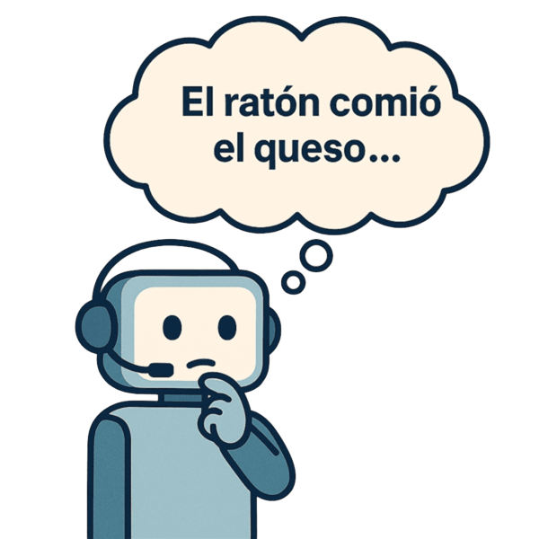
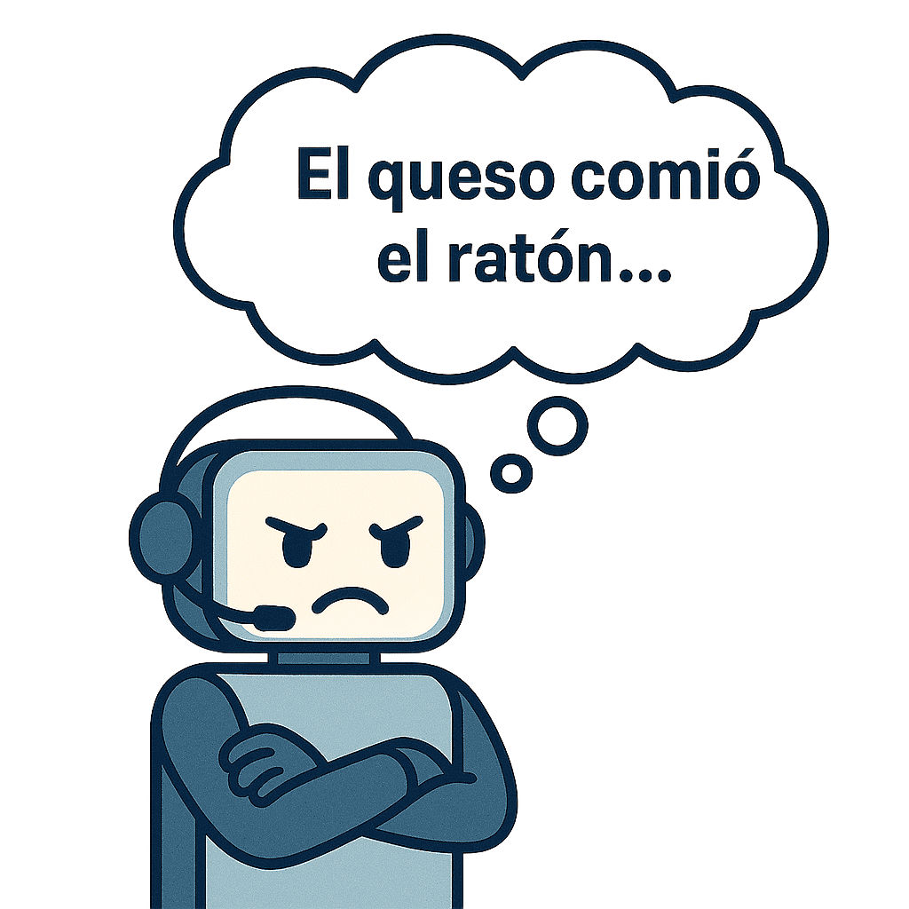
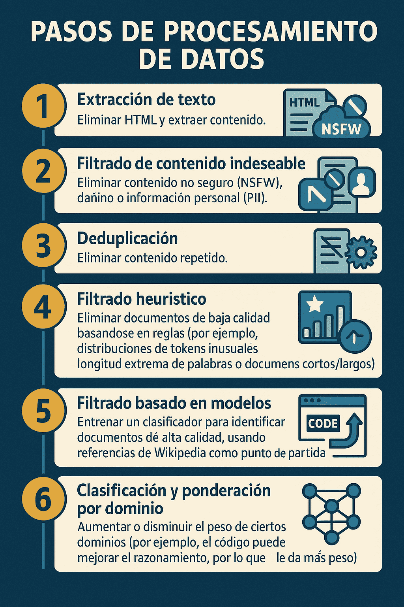

Todos conocemos los Modelos de Lenguaje Grandes (LLMs) como **ChatGPT de OpenAI, Claude de Anthropic, Gemini de Google** y otros modelos similares.

Son esos asistentes de IA con los que conversamos, que nos ayudan a escribir correos (Stanford Online 2024)electrónicos, a generar ideas e incluso a codificar.

Pero, ¿alguna vez te has preguntado cómo funcionan realmente estas herramientas?
¿Están pensando o simplemente están creando una **magnífica ilusión de razonamiento**?
En este blog, te mostraré cómo cobran vida estas maravillas tecnológicas, desde el vasto océano de datos hasta su afinada inteligencia, y exploraremos la naturaleza de esa “inteligencia” que tanto nos asombra.

Puedes ver la versión en vídeo de esta publicación aquí:



A continuación, te explico algunos elementos importantes para entender los Modelos de Lenguaje Grandes (LLMs), como se construyen, cómo se entrenan y predicen sus resultado.

## La Anatomía de un LLM: Redes Neuronales y Transformadores

En esencia, los LLMs son **redes neuronales**.
Lejos de simular el cerebro humano en un sentido biológico, se basan casi universalmente en una arquitectura particular conocida como **Transformadores**.

{} **Red neuronal artificial:** *“Una red neuronal artificial es un sistema de procesamiento paralelo y distribuido, compuesto por unidades simples de procesamiento que tienen la propensión natural de almacenar conocimiento experimental y hacerlo disponible para su uso”* (Haykin, n.d.).
{}

Estos Transformadores fueron propuestos por Vaswani et al. en 2017 y se destacaron por su capacidad para “dibujar dependencias globales entre la entrada y la salida” utilizando únicamente mecanismos de atención, sin necesidad de redes recurrentes o convolucionales.

Esta capacidad es clave para su éxito: permite que el modelo procese grandes cantidades de texto en paralelo y capte relaciones a larga distancia dentro de una secuencia.(Vaswani et al., n.d.)

Cuando hablamos de entrenar un LLM, hay varios componentes clave que entran en juego:

<!-- -   **Arquitectura**: Cómo se estructura la red neuronal (los Transformadores). -->

<!-- -   **Pérdida de entrenamiento y algoritmo**: Cómo se "aprende" el modelo. -->

<!-- -   **Datos**: En qué información se entrena el modelo. -->

<!-- -   **Evaluación**: Cómo sabemos si el modelo está mejorando. -->

<!-- -   **Componentes del sistema**: Cómo se ejecutan estos modelos gigantes en hardware moderno de manera eficiente. -->

<!-- A menudo, la academia se centra mucho en la arquitectura, pero en la práctica, lo que realmente importa es la **calidad de los datos, la evaluación y los sistemas**, ya que las pequeñas diferencias arquitectónicas son a menudo secundarias frente a la escala. -->

## La Primera Etapa: Pre-entrenamiento (Modelado del Lenguaje)

El viaje de un LLM comienza con el **pre-entrenamiento**, un paradigma clásico donde el modelo se entrena para **“modelar todo Internet”**.

En esta fase, un modelo de lenguaje es, a grandes rasgos, un modelo de **distribución de probabilidad sobre secuencias de tokens o palabras**.

{} **Tokens:** *“Un token es una instancia de una secuencia de caracteres en un documento, agrupada como una unidad semántica útil para el procesamiento automático de texto. Esta explicación se basa en una definición clara y rigurosa en el contexto del análisis de información y recuperación de documentos.”* {}

Imagina la frase **“El ratón comió el queso”**.

Un modelo de lenguaje te daría la probabilidad de que esta frase sea pronunciada por un humano o encontrada en línea.

Si la frase tuviera errores gramaticales como **“El el ratón queso”**, el modelo, con su conocimiento sintáctico, sabría que es menos **probable**.

Y si fuera **“El queso comió el ratón”**, su conocimiento semántico le indicaría que esto es **improbable**.

**Aquí es donde entra el primer matiz crítico**: este **“conocimiento sintáctico y semántico”** no implica que el modelo **entienda** realmente la gramática o que los quesos no comen ratones.

Más bien, ha aprendido, a partir de patrones en billones de textos, que ciertas secuencias de palabras son estadísticamente más probables o coherentes que otras.
Es una habilidad predictiva, no una comprensión conceptual.

Los LLMs son **modelos generativos**.

Esto significa que, una vez que tienen esta comprensión de las distribuciones de probabilidad, pueden **generar nuevas oraciones o datos** simplemente muestreando de esa distribución.

{} **Modelos generativos:** *“Son algoritmos diseñados para crear datos nuevos que parecen provenir de la misma distribución que los datos originales con los que fueron entrenados.”* {}

Es decir, *saben* cómo sonar convincentes y coherentes, pero no necesariamente *por qué* lo que dicen es correcto o verdadero.

## Modelos de Lenguaje Autorregresivos: Prediciendo la Siguiente Palabra

Vamos a adaptar el texto que proporcionaste para que se conecte con nuestro ejemplo del ratón y el queso.🐁🧀

## Modelos de Lenguaje Autorregresivos: Prediciendo la Siguiente Palabra

Los modelos de lenguaje más modernos, como Gemini, son **autorregresivos**.
Esto significa que predicen la **siguiente palabra basándose en todas las palabras que ya han visto** en la secuencia.

Piensa en ellos como un narrador que va construyendo una historia palabra por palabra.

## El Proceso con **“El ratón comió el queso”**

Imaginemos que el modelo está generando nuestra frase, “El ratón comió el queso.” Este es el fascinante proceso que ocurre:

1.  **Secuencia de palabras:** El modelo empieza con la primera palabra de la oración.
    Luego, toma las palabras que ya ha generado: **“El ratón”**.

2.  **Tokenización:** Las palabras se convierten en **tokens** (números o identificadores internos).
    Por ejemplo, “El” podría ser `143`, “ratón” `56`, y “comió” `25`.

3.  **El modelo predice:** Estos tokens numerados entran en el modelo (la “caja negra”).
    Basado en todo lo que ha aprendido de internet, el modelo calcula cuál es el próximo token más probable.

4.  **Distribución de probabilidad:** El modelo no solo predice una palabra, sino que le asigna una **probabilidad a cada palabra** en su vocabulario.
    Por ejemplo, después de **“El ratón comió el”**, la palabra **“queso”** podría tener una probabilidad del 85%, “pan” un 10%, y “semillas” un 5%.

5.  **Muestreo:** El modelo elige el token con la probabilidad más alta, que en este caso es el token para “queso”.
    A veces, para no sonar robótico, el modelo elige una palabra con una probabilidad un poco menor, pero en la mayoría de los casos elige la más probable.

6.  **Detokenización:** El token seleccionado se convierte de nuevo en la palabra “queso”, completando así la frase.

------------------------------------------------------------------------

## Aprendizaje del Modelo

Durante el **entrenamiento**, el modelo hace este mismo proceso, pero en lugar de generar una frase nueva, compara su predicción con la palabra real en un texto de entrenamiento.

- Si el modelo predice **“pan”** y la palabra correcta es **“queso”**, la **función de pérdida de entropía cruzada** le da un “castigo”.

- Ese castigo se usa para ajustar los pesos del modelo.
  El objetivo es que, la próxima vez que vea un contexto similar (“El ratón comió el…”), la probabilidad de que prediga “queso” sea mucho mayor.

Así, la “fluidez” del modelo para generar frases como “El ratón comió el queso” se basa en su capacidad para **predecir estadísticamente** la palabra más probable en cada paso, no en un razonamiento sobre los hábitos alimenticios de los roedores.

<!-- Los modelos más utilizados hoy en día son los **modelos de lenguaje autorregresivos**. -->

<!-- La idea central es descomponer la probabilidad de una secuencia de palabras en un producto de probabilidades condicionales: la probabilidad de la primera palabra, multiplicada por la probabilidad de la segunda palabra dada la primera, y así sucesivamente. -->

<!-- En términos más simples, el modelo predice la **siguiente palabra basándose en todo lo que ha ocurrido antes** en la secuencia. -->

<!-- El proceso es fascinante:  -->

<!-- 1. Tomas una secuencia de palabras (como "Ella probablemente prefiere"). -->

<!-- 2. La **tokenizas**, es decir, la divides en "tokens" (palabras o subpalabras) y les asignas un ID.  -->

<!-- 3. Estos tokens pasan por el modelo (la "caja negra" del Transformador). -->

<!-- 4. El modelo emite una **distribución de probabilidad** sobre la siguiente palabra o token posible. -->

<!-- 5. Se "muestrea" de esta distribución para obtener el siguiente token más probable. -->

<!-- 6. Finalmente, se "detokeniza" para obtener la palabra real. -->

<!-- Durante el entrenamiento, el objetivo es **predecir el token más probable** y ajustar los pesos del modelo para aumentar la probabilidad de generar el token correcto, utilizando la **función de pérdida de entropía cruzada (Cross-Entropy Loss)**, que es equivalente a maximizar la verosimilitud logarítmica del texto. -->

<!-- Esta es la base de su impresionante fluidez, pero recalca que su "razonamiento" es una sofisticada forma de predicción estadística. -->

## Los Tokenizadores: El Primer Paso Crucial para la “Coherencia”

Los **tokenizadores** son componentes extremadamente importantes pero a menudo poco valorados.

¿Por qué los necesitamos?

- **Más generales que las palabras**: Las palabras como tokens directos fallan con errores tipográficos o en idiomas que no usan espacios (como el tailandés).

- **Eficiencia de secuencia**: Tokenizar carácter por carácter haría las secuencias demasiado largas, lo que es ineficiente para los Transformadores (cuya complejidad crece cuadráticamente con la longitud de la secuencia).

Los tokenizadores buscan encontrar **subsecuencias comunes** y darles un token específico.
En promedio, un token suele representar alrededor de **tres o cuatro letras**.

Un algoritmo muy común es la **Codificación de Pares de Bytes (Byte Pair Encoding o BPE)**.
Es fundamental considerar cómo se tokeniza el texto, ya que el **tamaño del vocabulario afecta directamente la dimensionalidad de la salida** del modelo.

**Un punto crítico aquí**: Si bien son útiles, los tokenizadores tienen limitaciones, especialmente con números (matemáticas) y código.

Por ejemplo, un número como “327” puede tener su propio token, lo que significa que el modelo no lo ve como una composición de “3”, “2”, “7”, lo que dificulta su capacidad para razonar matemáticamente o con la estructura del código.

Esto nos recuerda que, a pesar de la fluidez, los LLMs operan sobre representaciones simbólicas (tokens) que no siempre se alinean con nuestra comprensión conceptual del lenguaje o las matemáticas.

## De Modelo de Lenguaje a Asistente de IA: El Post-entrenamiento (o la Ilusión de la Intencionalidad)

Un modelo pre-entrenado es un experto en **“hablar como Internet”**, pero no es un asistente de IA.

Si le preguntaras a **GPT-3** (un modelo puramente de lenguaje) “explícame el aterrizaje en la luna a un niño de seis años”, podría responder con “explícame la teoría de la gravedad a un niño de seis años” porque ha aprendido que en Internet, una pregunta a menudo es seguida por preguntas similares, no por una respuesta directa.

El **post-entrenamiento (alignment)** es el proceso que transforma estos modelos en asistentes útiles, asegurándose de que **sigan las instrucciones de los usuarios** y los deseos de los diseñadores (por ejemplo, evitar contenido tóxico).

**Este es el punto donde la ilusión de intencionalidad se vuelve más fuerte.**

## 1. Ajuste Fino Supervisado (Supervised Fine-Tuning - SFT)

El primer paso es el **Ajuste Fino Supervisado (SFT)**.

Aquí, el LLM pre-entrenado se afina con **respuestas deseadas recogidas de humanos**.
Es decir, se le dan ejemplos de preguntas y sus respuestas “correctas” o “ideales” escritas por humanos.

Este paso fue crucial para el salto de **GPT-3** a **ChatGPT**.

Curiosamente, no se necesita una cantidad masiva de datos para SFT; **unos pocos miles de ejemplos bien elegidos pueden ser suficientes**.

Esto sugiere que el SFT no enseña al modelo nuevo conocimiento, sino que le enseña **cómo formatear las respuestas** y optimizar para un “tipo de usuario” específico que ya había visto en sus datos de pre-entrenamiento.

En otras palabras, el modelo ya tenía el conocimiento latente; el SFT le enseña a *expresarlo* de la manera que un asistente de IA “debería” hacerlo.

No está aprendiendo a *pensar* como un asistente, sino a *simular* el comportamiento de uno.

## 2. Aprendizaje por Refuerzo a partir de Retroalimentación Humana (Reinforcement Learning from Human Feedback - RLHF)

El SFT tiene sus limitaciones: **Limitado por la habilidad humana**: Los humanos pueden juzgar mejor lo que es una buena respuesta de lo que pueden escribirla ellos mismos.

**Posibles alucinaciones**: Como el SFT se entrena con poca data, si un humano da una respuesta que el modelo no ha visto antes (y por tanto no sabe si es cierta), el modelo puede aprender a “inventar” información plausible pero falsa.

**Aquí el matiz crítico es fundamental**: la “alucinación” (generación de información falsa pero plausible) es una clara evidencia de que los LLMs no “saben” lo que es verdad o mentira, ni tienen un sentido de la realidad.

Simplemente generan secuencias de tokens que *parecen* correctas, basándose en los patrones que han aprendido, incluso si no tienen fundamento.

Es la culminación de la ilusión de razonamiento.
**Costo**: Generar respuestas ideales es muy caro.

Aquí es donde entra el **RLHF**.

En lugar de simplemente clonar el comportamiento humano, el objetivo es **maximizar la preferencia humana**.

El proceso es el siguiente:

1.  Para una instrucción dada, el modelo genera **dos respuestas diferentes**.

2.  Etiquetadores humanos seleccionan **cuál de las dos respuestas es mejor**.

3.  Con esta retroalimentación, el modelo se afina para generar más de las respuestas “buenas” y menos de las “malas”.

Para hacer esto, se entrena un **modelo de recompensa (Reward Model)**, un clasificador que aprende a predecir cuánto prefiere un humano una respuesta sobre otra, dando una señal de recompensa continua.

Posteriormente, métodos más simples como la **Optimización Directa por Preferencia (Direct Preference Optimization - DPO)** han demostrado ser igual de efectivos, evitando la complejidad del aprendizaje por refuerzo tradicional.

En definitiva, RLHF moldea el comportamiento del LLM para alinearse con lo que *deseamos* ver, no con lo que el modelo *sabe* o *piensa*.

Le enseña a ser complaciente y a evitar lo “tóxico” porque los humanos así lo prefieren, no por un juicio moral inherente.

## La Materia Prima: Datos Masivos y su Filtrado

El pre-entrenamiento de los LLMs se realiza sobre **“todo Internet”**.

Esto incluye vastas colecciones como Common Crawl, que contiene alrededor de **250 mil millones de páginas web y un petabyte de datos**.

Pero el Internet es “sucio” y no representativo.

Imagina una página web aleatoria: llena de HTML, publicidad, fragmentos sin terminar.

Para que estos datos sean útiles, se requieren pasos de procesamiento intensivos, que incluyen:

<!-- 1.  **Extracción de texto**: Eliminar HTML y extraer contenido. -->

<!-- 2.**Filtrado de contenido indeseable**: Eliminar contenido no seguro (NSFW), dañino o información personal (PII). -->

<!-- 3.  **Deduplicación**: Eliminar contenido repetido. -->

<!-- 4.  **Filtrado heurístico**: Eliminar documentos de baja calidad basándose en reglas (por ejemplo, distribuciones de tokens inusuales, longitud extrema de palabras o documentos muy cortos/largos). -->

<!-- 5.  **Filtrado basado en modelos**: Entrenar un clasificador para identificar documentos de alta calidad, usando referencias de Wikipedia como punto de partida. -->

<!-- 6.  **Clasificación y ponderación por dominio**: Aumentar o disminuir el peso de ciertos dominios (por ejemplo, el código puede mejorar el razonamiento, por lo que se le da más peso). -->

<!-- 7.  **Entrenamiento final con datos de alta calidad**: "Sobreajustar" el modelo con datos de muy alta calidad al final del pre-entrenamiento, reduciendo la tasa de aprendizaje. -->

La escala de estos conjuntos de datos es asombrosa, pasando de **150 mil millones de tokens (800 GB)** en benchmarks académicos anteriores, hasta **15 billones de tokens** para modelos de última generación como Llama 3 (equivalente a miles de terabytes).

La recopilación y curación de datos sigue siendo un desafío enorme y un área activa de investigación.

## Las Leyes de Escalado: El Poder de lo Grande (y sus Implicaciones en la “Inteligencia”)

Uno de los descubrimientos más sorprendentes en LLMs es que **cuantos más datos se entrenen los modelos y más grandes sean los modelos, mejor será su rendimiento**.

A diferencia de lo que se enseña en muchas clases de aprendizaje automático, el “sobreajuste” (overfitting) no parece ocurrir con los LLMs.

Las **leyes de escalado** nos muestran que si se aumenta la computación, los datos o el número de parámetros, la pérdida de validación del modelo disminuye de forma predecible y lineal en una escala logarítmica.

Esto es crucial porque permite a las compañías predecir cuánto mejorarán sus modelos en el futuro y cómo optimizar la asignación de recursos.

Por ejemplo, el famoso artículo Chinchilla de DeepMind mostró que la relación óptima es entrenar con **20 tokens por cada parámetro** del modelo para maximizar la eficiencia del entrenamiento.

**Un punto analítico aquí**: Que los modelos “mejoren” al escalar no significa que se vuelvan intrínsecamente “más inteligentes” en un sentido humano, o que estén más cerca de la conciencia.

Simplemente, son **máquinas de patrones increíblemente sofisticadas** que, con más datos y más capacidad computacional, son capaces de reconocer y generar patrones cada vez más complejos y coherentes, reduciendo su “pérdida” (es decir, volviéndose mejores en la predicción del siguiente token).

La “inteligencia” que percibimos es una propiedad emergente de esta capacidad de predicción a gran escala, no una mente.

<!-- ### El Precio de la Ilusión de Inteligencia: ¿Cuánto Cuesta un LLM? -->

<!-- Entrenar un LLM es una empresa monumental y costosa. -->

<!-- Tomemos como ejemplo el modelo **Llama 3 400B**, uno de los mejores modelos de código abierto actuales: **Tokens de entrenamiento**: 15.6 billones de tokens. -->

<!-- -   **Parámetros**: 45 mil millones. -->

<!-- -   **Cómputo (FLOPs)**: Aproximadamente 3.8 x 10\^25 FLOPs. -->

<!-- -   **Hardware y tiempo**: Se entrenó en **16.000 GPUs H100** durante unos 70 días (o 26 millones de horas de GPU). -->

<!-- -**Costo estimado**: El alquiler de estas GPUs costaría alrededor de **52 millones de dólares**, y sumando los salarios del equipo, el costo total de entrenamiento rondaría los **75 millones de dólares**. -->

<!-- - **Huella de carbono**: El entrenamiento de Llama 3 emitió unas 4.000 toneladas de CO2 equivalente. -->

<!-- Estos números son un testimonio de la inmensa inversión necesaria para crear estos modelos capaces de generar una ilusión tan convincente. -->

## Sistemas: El Cerebro Detrás de la Eficiencia

La computación es el cuello de botella más grande en el desarrollo de LLMs.
Comprar más GPUs es difícil por su alto costo y escasez, además de las limitaciones físicas en la comunicación entre ellas.

Es crucial optimizar cómo se asignan los recursos y el pipeline de entrenamiento.

Algunos trucos clave a nivel de sistemas incluyen: **Baja Precisión (Low Precision)**: Usar números de punto flotante de 16 bits en lugar de 32 bits.

Esto reduce la cantidad de datos que deben enviarse a las GPUs, acelerando la comunicación y disminuyendo el consumo de memoria.

**Fusión de Operadores (Operator Fusion)**: Las GPUs son muy lentas en la comunicación.
La fusión de operadores combina varias operaciones consecutivas en una sola llamada al kernel, lo que significa que los datos se envían a la GPU una sola vez, todas las operaciones se realizan y luego los resultados se devuelven, lo que acelera significativamente el proceso (por ejemplo, `torch.compile` en PyTorch puede duplicar la velocidad).

## Conclusión: Una Ilusión Poderosa, No un Pensamiento Consciente

Desde sus cimientos como redes neuronales Transformer, pasando por el pre-entrenamiento con datos masivos de Internet y el afinamiento con retroalimentación humana, hasta la optimización de sistemas y la gestión de costos astronómicos, la creación de un LLM es una hazaña de ingeniería y ciencia de datos.

La próxima vez que interactúes con un chatbot, recordarás que detrás de esa respuesta fluida hay billones de tokens procesados, complejos algoritmos de entrenamiento, ingeniosas técnicas de afinamiento y una infraestructura computacional masiva trabajando en conjunto.
**Estos modelos no “piensan” en el sentido humano de la palabra, ni poseen conciencia o una comprensión profunda y holística del mundo**.

Lo que hacen, y lo hacen de manera magistral, es **identificar y reproducir patrones estadísticos** en los datos con los que fueron entrenados.

Su habilidad para generar texto coherente, relevante y a menudo sorprendentemente “inteligente” es una testamentación de la **efectividad de la predicción a escala masiva**.
Es una **ilusión de razonamiento** tan convincente que a menudo nos hace cuestionar la naturaleza de la inteligencia misma.
Y es, sin duda, una de las maravillas tecnológicas más grandes de nuestro tiempo.

## Bibliografía

Haykin, Simon. n.d. “Neural Networks and Learning Machines.” <http://dni.dali.dartmouth.edu/9umv9yghhaoq/13-dayana-hermann-1/read-0131471392-neural-networks-and-learning-machines.pdf>.

Stanford Online. 2024. “Stanford CS229 i Machine Learning i Building Large Language Models (LLMs),” August. <https://www.youtube.com/watch?v=9vM4p9NN0Ts>.

Vaswani, Ashish, Noam Shazeer, Niki Parmar, Jakob Uszkoreit, Llion Jones, Aidan N. Gomez, Lukasz Kaiser, and Illia Polosukhin. n.d. “Attention Is All You Need.” <https://doi.org/10.48550/ARXIV.1706.03762>.

